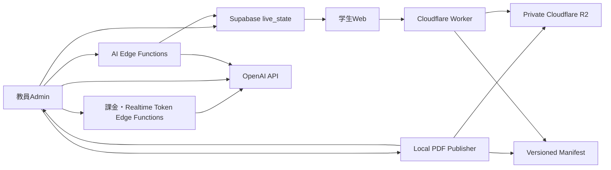
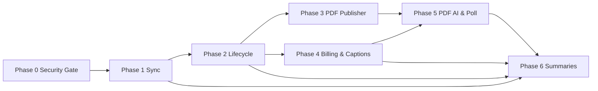

# COMPASS Interactive Project Guide

- 最終更新: 2026-07-18（Phase 6.7 documentation baseline）
- 対象リポジトリ: COMPASS Interactive repository root
- 対象範囲: Phase 0〜6.6の実装判断とDevelopment Production Reviewの履歴
- 状態: Phase 0〜6.6実装済み。現在の進捗・運用入口・Phase 6.7〜9はREADMEおよび`docs/ROADMAP.md`を正本とする

> [!IMPORTANT]
> 本書の`ADMIN_PIN`、`BILLING_PIN`、API利用PINに関するPhase 0〜6の記述は、当時の実装判断を保存するhistorical contractである。承認済みのPhase 7.30最終契約が優先し、MFAはGoogle Authenticator互換のSupabase標準TOTPだけを用いる。Phase 7.30Eは`ADMIN_PIN`の現行application経路を撤去し、独立して確認したHosted deployment evidence後のoperator cutoverだけがdatabase verifierを不可逆にfenceする。personal AI PINの証拠完了後は`BILLING_PIN`互換RPCも別境界でProduction前に撤去する。共有PINをrollback経路として温存せず、Google-only immutable revisionとoperator owner recoveryを使う。詳細は`docs/PHASE7_30_GOOGLE_ADMIN_IDENTITY_PLAN.md`、`docs/PHASE7_30E_GOOGLE_ONLY_CUTOVER.md`と`docs/ROADMAP.md`を正本とする。
>
> 2026-08-25に承認された講義UX修正では、`docs/LECTURE_UX_FINAL_REQUIREMENTS_AND_IMPLEMENTATION_PLAN.md`を正本とする。通常講義のAI有効化は有効なGoogle/TOTP AAL2 application sessionから一操作で行い、personal AI PINや追加TOTPを要求しない。Displayの別ブラウザ起動、講義終了時／最長90分の認可、事前Poll/AI準備、常設スライド操作、PDF回復、本番反映について本書のhistorical記述と矛盾する場合は同計画を優先する。

## 1. このガイドの位置付け

この文書は、現行コードとSupabaseの監査、OpenAI API実装計画、添付GPTレビュー、PDFアップロード／ダウンロード、AI Poll提案、5分要約、任意ニックネーム要件を統合したPhase 0〜6の詳細設計記録である。現在のリポジトリ入口は`README.md`、現行構成は`docs/architecture.md`、セキュリティ契約は`docs/SECURITY.md`、Phase 6.7以降の正本は`docs/ROADMAP.md`とする。

既存Project Guideに記載されていた古いPhase番号、未実装状況、ローカルPDFだけを前提としたロードマップは、この文書のPhase 1〜6については置き換える。既に実装済みのコメント、Poll、Display、Admin lifecycle、5秒snapshot、PDFページ同期は破棄せず、現在の基盤として段階的に拡張する。

Phase 0〜6.5のコード、migration、RPC、RLS、Edge Functions、Publisher、Cloudflare Worker、UIおよびテストはローカル実装済みである。2026-07-16の統合監査では、空DBからの全migration、既存Phase 6.5からのupgrade、pgTAP 613項目、DB lint、型検査、Lint、production build、20人／300人負荷モデルがPASSした。その後Phase 6.6で統合UX、参加人数概算、R2アーカイブ、日次運用メールおよびRealtime provider停止制御を実装し、Playwright／GitHub Actionsの非live CI基盤を追加した。

Phase 0〜6.5 Development Production Reviewの反映証跡は`docs/PRODUCTION_REVIEW_DEPLOYMENT_2026-07-16.md`に記録されている。以降の本番反映は`docs/RUNBOOK_INDEX.md`と対象Phaseのrunbookに従い、データベースとバックエンドをexpand-firstで準備し、flag OFFのfrontend、所有権試験、限定canaryの順に行う。

## 2. プロダクト目標

直近の目標は、20人規模のJournal Club／研究室セミナーMVPを安定させながら、同じ設計で週1回・90分・300人弱の講義にも拡張できることとする。

学生UXでは、次を重視する。

- 自分のコメント、いいね、Poll回答は操作直後に画面へ反映される。
- 他参加者の更新、字幕、PDFページ、AI要約は原則5秒以内に反映される。
- AI情報を増やすこと自体を目的にせず、教育的価値の低い出力は表示しない。
- AI生成、教員確認済み、教員修正済みを明確に区別する。
- AI Poll候補は学生へ自動配信しない。
- コメント動向を学生個人の評価、感情スコア、人気順位として表示しない。
- 講義終了後は同期を完全停止し、30日間の読み取り専用アーカイブだけを提供する。

コスト面では、次を固定目標とする。

- PDFバイナリのアップロード、保存、閲覧、ダウンロードはSupabaseを通さない。
- SupabaseにはPDFの資料ID、版、ページ番号など数百バイト以下の同期メタデータだけを持たせる。
- 学生クライアントからコメントPostgres ChangesのRealtime購読を廃止する。
- 公開状態は5秒ごとの一つの差分snapshotへ統合する。
- 5分要約、コメント動向、学術質問候補検出を一つのOpenAI呼び出しへ統合する。
- 90分講義のAI予算上限は初期値`$2.50`とする。
- Realtime字幕は最大90分、5分要約は最大18回、学術回答は将来Phaseで最大3件とする。

## 3. 現在の実装基盤

現在のアプリには次が存在する。

- Vite + React + TypeScript
- `/join`、`/lecture`、`/admin`、`/display`
- Supabase匿名キーを用いた参加、コメント、いいね、Poll回答
- Admin PINから発行する管理セッショントークン
- 講義の`draft/open/closed` lifecycle
- `lecture_live_state`と`get_lecture_live_snapshot`
- 前景5秒、背景30秒の適応的snapshot取得
- コメントINSERTのSupabase Realtime購読
- PDF.jsによるPDF表示
- `pdf_document_id`、`current_pdf_page`、`display_mode`の同期
- Adminからのページ送りと学生／Display側の追従
- 静的な`public/lecture-assets`と二重の資料カタログ
- 字幕、5分要約、資料要約のプレースホルダーUI
- 講義、Poll、Display操作用のSupabase Edge Functions

Phase 1〜6では、これらを全面的に作り直さない。特にページ番号同期、Poll作成、バージョン付きsnapshot、PDF.js viewerは再利用する。

## 4. 確定したアーキテクチャ判断

### 4.1 PDF配信

本番方式は、ローカルPublisher、Private Cloudflare R2、Cloudflare Worker、版管理されたマニフェストとする。

「Cloudflare自動deploy」は、PDF追加のたびにメインCOMPASS Pagesを再ビルドする処理ではなく、ローカルPublisherがR2へ資料を自動公開し、マニフェストを原子的に更新する処理として実装する。

メインWebアプリの`dist/`をPDFアップロード操作からデプロイしてはならない。公開して問題ない資料だけを扱う場合に限り、別の資産専用Pagesプロジェクトを比較用／非常用として許可する。

理由は次のとおりである。

- Pagesの過去デプロイURLにPDFが残る可能性がある。
- PDF追加のたびに資産全体のデプロイが必要になる。
- 古いローカルビルドでメインアプリを上書きする危険がある。
- 複数教員の同時デプロイ競合が起こり得る。
- Private R2なら短寿命URL、30日アクセス終了、削除保証を実装しやすい。

### 4.2 PDFとSupabaseの境界

Supabaseを通さないもの:

- PDFバイナリ
- PDFアップロード本文
- PDFダウンロード本文
- PDF配信Egress
- ページ単位の抽出テキストの永続保存

Supabaseに持たせるもの:

- `document_id`
- `document_version`またはSHA-256
- `current_page`
- `page_count`
- `pdf_manifest_version`
- `pdf_visible`
- `display_version`
- 講義と資料の論理的な紐付け

したがって「PDF機能のSupabase負荷ゼロ」は、PDFバイナリ、Storage、Egressについてゼロという意味であり、ページ同期用の小さなlive state更新は残る。

### 4.3 OpenAIへ渡すPDF情報

OpenAIへPDFファイルを直接渡さない。PDF File Inputはページ画像をモデルコンテキストへ含めるため、画像を読ませない要件と両立しない。

ローカルPublisherがPDFの埋め込みテキストレイヤーだけをページ単位で抽出する。OCRは画像読み取りなので実施しない。画像だけのスキャンPDFは拒否する。

### 4.4 PDF上限

初期上限は講義単位の合計値として扱う。

- 合計15MB以下
- 合計75ページ以下
- 抽出本文合計20,000文字以下
- MIME `application/pdf`
- 暗号化、破損、画像のみPDFは拒否

複数PDFを許可しても、合計上限を超えてはならない。

### 4.5 Realtime字幕

- `gpt-realtime-whisper`
- 教員ブラウザからWebRTC接続
- 通常のOpenAI APIキーはブラウザへ置かない
- deltaは教員React stateだけ
- 同一端末の画面共有は`BroadcastChannel`
- completed segmentは教員端末IndexedDB
- 音声ファイルは保存しない
- 学生へは5秒単位の確定字幕だけ
- Supabaseへ全文スクリプトを保存しない

### 4.6 AIモデル

- Realtime字幕: `gpt-realtime-whisper`
- PDF初回解析、Poll候補、5分要約、コメント動向: `gpt-5.6-luna`
- 一次文献に基づく学術回答: 将来Phaseで`gpt-5.6-terra`
- `gpt-5.6-sol`は通常運用で使用しない

モデルIDはフロントエンドへ散在させず、サーバー環境変数または管理設定で一元化する。

## 5. 全体データフロー



## 6. Phase 0開始ゲート

Phase 1〜6を実装する前に、次が完了しているかをCodexが再確認する。未完了ならPhase 1の最初の作業として安全化する。

- Supabase Anonymous Authを導入する。
- `auth.uid()`と講義メンバーシップを結び付ける。
- クライアント指定`participant_id`だけで所有権を判断しない。
- snapshotから任意の他参加者UUIDを指定できる引数を廃止する。
- `SECURITY DEFINER`関数の`search_path`を固定する。
- 全関数について`PUBLIC`のEXECUTEを再監査する。
- `REVOKE ALL FROM PUBLIC`後に必要ロールへ明示的GRANTを行う。
- RLS、GRANT、関数EXECUTEを別々に検証する。
- 現在のSupabase Advisor警告を再取得し、意図しない警告を解消する。
- 他参加者のいいね状態、Poll回答、参加情報を取得できない自動テストを作る。

このゲートを通過する前にOpenAI APIキー、Cloudflare管理トークン、課金PINを本番へ導入してはならない。

## 7. Phase 1: 同期プロトコルの改善

### 7.1 目的

5秒同期を、20人Freeプランと300人Proプランの双方で予測可能な負荷にする。字幕が5秒ごとに変化しても、コメント、Poll、PDF、AI要約を毎回全量取得しない。

### 7.2 主要タスク

#### P1-01 公開状態と参加者固有状態の分離

公開snapshotへ含めるもの:

- 講義statusと終了時刻
- 公開コメントの差分
- コメントいいね合計
- 公開中Pollと集計結果
- PDF資料ID、版、現在ページ、表示モード
- 最新の学生向け確定字幕
- 公開済みAI要約

参加者固有状態へ分離するもの:

- 自分がいいねしたコメント
- 自分のPoll回答
- 自分の投稿制限状態
- 自分の参加メンバーシップ

参加者固有状態は、join時と自分の投稿／いいね／投票操作後に取得する。全員共通の5秒snapshotへ毎回混在させない。

#### P1-02 セクション別version

`lecture_live_state`を次のversion群へ拡張する。

- `lecture_version`
- `caption_version`
- `comments_version`
- `likes_version`
- `polls_version`
- `summaries_version`
- `pdf_version`

クライアントは既知versionを送信し、変更されたsectionだけを受け取る。

```ts
{
  serverTime,
  versions: {
    lecture,
    caption,
    comments,
    likes,
    polls,
    summaries,
    pdf
  },
  changed: {
    caption?: {},
    comments?: {},
    likes?: {},
    polls?: {},
    summaries?: {},
    pdf?: {}
  }
}
```

#### P1-03 コメントRealtimeの廃止

- `CompassStateContext`のコメントINSERT購読を削除する。
- `comments`を`supabase_realtime` publicationから除外する。
- 自分の投稿はクライアントで楽観表示する。
- サーバー応答で正式ID、作成時刻、拒否状態を確定する。
- 他参加者の投稿は最大5秒で取得する。
- 失敗した楽観表示は明確に取り消す。

#### P1-04 前景・背景同期ポリシー

- 講義がopenで画面がvisibleなら、操作がなくても5秒同期を継続する。
- 現在の前景30分idle停止は撤廃する。
- hidden後は一度30秒間隔に落とし、60秒後に完全停止する。
- visible復帰時は即時snapshotを取得する。
- ネットワークエラーは指数backoffとjitterを使う。
- 講義closed後は同期を停止する。
- アーカイブ画面は一度だけ取得し、ポーリングしない。

#### P1-05 コメント／履歴上限

- 初回コメント最大100件を維持または明示設定する。
- 追加差分はcursor方式にする。
- 過去コメントはユーザー操作時だけページ取得する。
- 5秒snapshotで全コメント配列を再送しない。
- Poll結果といいね合計もversion不変時は返さない。

#### P1-06 API contractと型

- DB RPCのJSON contractを固定する。
- TypeScript型を手書きで重複させず、DB型生成または単一schemaから派生させる。
- 旧snapshotとの移行期間をfeature flagで管理する。
- 旧クライアントが残っても破壊的エラーにならない移行順を作る。

### 7.3 主な変更対象

- `src/lib/liveSync.ts`
- `src/hooks/useAdaptiveLiveSync.ts`
- `src/context/CompassStateContext.tsx`
- `src/repositories/supabaseLiveStateRepository.ts`
- `src/repositories/supabaseCommentRepository.ts`
- `src/types/database.ts`
- `supabase/migrations/*`
- snapshot関連SQLテスト

### 7.4 検証

- 20学生＋Admin＋Displayを90分相当で実行する。
- 300学生＋Admin＋Displayを90分相当で実行する。
- 字幕sectionだけが毎回変わる状態で、他sectionが再送されないことを確認する。
- 自分のコメントが即時表示され、失敗時に戻ることを確認する。
- hidden 60秒後に通信が止まり、復帰時に即時追いつくことを確認する。
- 他参加者固有状態を取得できないことを確認する。

### 7.5 Phase 1完了条件

- 学生クライアントのコメントRealtime接続が0件。
- 前景90分で同期が意図せず停止しない。
- version不変sectionを再送しない。
- snapshot p95目標500ms未満、エラー率0.1%未満。
- 既存コメント、いいね、Poll、PDF追従が回帰しない。
- DB migration、rollback手順、負荷試験結果が文書化されている。

## 8. Phase 2: 講義ライフサイクル、強制停止、アーカイブ基盤

### 8.1 目的

ブラウザの状態に依存せず90分で講義と全API機能を停止し、30日読み取り専用アーカイブの基盤を作る。

### 8.2 主要タスク

#### P2-01 時刻と状態

`lecture_sessions`へ次を追加または確定する。

- `started_at`
- `closed_at`
- `hard_stop_at`
- `archive_expires_at`
- `close_reason`

講義開始時に`hard_stop_at = started_at + 90 minutes`をサーバー時刻で確定する。クライアント時刻を信頼しない。90分延長機能は初期実装に含めない。

#### P2-02 原子的終了関数

一つのDB関数または保護されたサーバー処理で次を原子的に実行する。

- 講義を`closed`へ変更
- open Pollを全てclose
- AI制御状態を停止
- 新しいOpenAI token発行を拒否
- 学生向け字幕行を削除
- live state versionを更新
- `archive_expires_at`を設定
- 終了理由を記録

手動終了と自動終了は同じ処理を使い、複数回呼ばれても安全にする。

#### P2-03 Supabase Cron

- `pg_cron`を有効化する手順を作る。
- 1分ごとに期限切れ講義を検索する。
- `hard_stop_at <= now()`のopen講義を終了する。
- Cron失敗を監視できるログを残す。
- snapshot、Admin mutation、AI endpointも期限を再確認し、Cronだけに依存しない。

#### P2-04 AI制御テーブル

`lecture_ai_control`を作る。

```text
lecture_session_id
status
caption_enabled
summary_enabled
material_analysis_enabled
poll_generation_enabled
academic_enabled
hard_stop_at
budget_limit_usd
audio_seconds_limit
summary_call_limit
poll_generation_limit
academic_answer_limit
last_heartbeat_at
started_at
stopped_at
stop_reason
version
```

Phase 2では状態機械と権限制約まで作り、OpenAI接続はPhase 4以降で行う。

#### P2-05 30日アーカイブ認可

- Anonymous Authユーザーと講義メンバーシップを使う。
- open中はread/write、closed後30日はread-onlyとする。
- 30日後は学生アクセスを拒否する。
- アーカイブ取得は一回の専用RPCまたはendpointとする。
- コメント、公開済み要約、PDFメタデータだけを返す。
- 個別Poll回答、participant secret、非公開AI下書きは返さない。

#### P2-06 Cloudflare用lecture access token

PDF WorkerがPDF取得のたびにSupabaseへ問い合わせないよう、講義参加時に短寿命のlecture access tokenを発行する。

推奨は非対称署名である。

- Supabase Edge Functionが秘密鍵で署名
- Cloudflare Workerは公開鍵だけで検証
- claimは`lecture_public_id`、権限、発行時刻、有効期限、token versionに限定
- live中tokenは講義終了時刻を越えない
- archive tokenはメンバーシップ確認後に短時間だけ発行
- PDF用tokenへ氏名、学生番号、メールを含めない

### 8.3 検証

- 教員ブラウザを閉じた状態でも90分＋60秒以内に終了する。
- Cronが遅延しても、期限切れ後のAI token発行とAdmin mutationが拒否される。
- 手動closeとCron closeが競合しても状態が壊れない。
- closed後の書き込みが全て拒否される。
- 30日以内のメンバーだけarchiveを取得できる。
- 30日後に同じtokenを再利用できない。

### 8.4 Phase 2完了条件

- 90分強制終了がDB、Cron、ブラウザの三層で機能する。
- 終了後60秒以内に全API開始動作が拒否される。
- 停止操作に課金PINが不要な状態機械ができている。
- 30日read-only認可がRLS／endpointテストを通過する。
- Cloudflare WorkerがSupabaseへの毎回問い合わせなしでlecture tokenを検証できる設計が確定している。

## 9. Phase 3: ローカルPDF Publisher、Cloudflare配信、ページ同期

### 9.1 目的

教員がAdmin画面からPDFを選び、教員PCのローカルサービスを介してCloudflareへ安全に自動公開し、学生がWeb再読み込み後に閲覧・ダウンロードできるようにする。PDFバイナリはSupabaseを一切通さない。

### 9.2 実装方式

初期実装は、`127.0.0.1`だけで待ち受けるNode.jsローカルサービスとする。安定後にWindowsインストーラーまたはElectron/Tauriラッパーを検討する。

予定構成例:

```text
publisher/
  src/
    server/
    pdf/
    cloudflare/
    manifest/
    security/
  tests/
cloudflare/
  asset-worker/
```

### 9.3 主要タスク

#### P3-01 ローカルPublisherの安全な起動

- `127.0.0.1`だけでlistenする。
- `Host`と`Origin`をCOMPASS本番／許可開発originへ限定する。
- 起動時に一回限りのpairing codeまたは短寿命session tokenを発行する。
- CORSをallowlist方式にする。
- CSRFとDNS rebindingを考慮する。
- Publisherが起動していない場合のAdmin説明と再試行を作る。
- Cloudflare tokenをブラウザへ返さない。
- tokenはWindows Credential ManagerなどOS秘密領域へ保存する。
- R2対象bucketだけに権限を限定する。

#### P3-02 PDF検証

ブラウザ事前検証とPublisher側の正式検証を分離する。

Publisher側で必ず確認する。

- PDF magic bytes
- MIMEと拡張子
- 15MB合計上限
- 75ページ合計上限
- 暗号化有無
- 破損
- 埋め込みテキストの有無
- 20,000文字合計上限
- PDF SHA-256
- 抽出テキストSHA-256
- ページ別文字数

OCR、ページ画像レンダリング、画像からの文字認識は行わない。画像だけのPDFには「テキストレイヤーがないためAI解析対象外」と表示する。

#### P3-03 ページ別テキスト抽出

- PDF.jsまたは検証済みのローカルPDF parserを使う。
- ページ番号を保持する。
- 空白、改行、ハイフン分割を正規化する。
- 各excerptへ決定的IDを付ける。
- 抽出テキストをローカルPublisherのデータ領域へ保存する。
- 生テキストをSupabase、R2、Pagesへ公開しない。
- 講義終了後のローカル保持期間と削除操作を用意する。

#### P3-04 R2への自動公開

公開手順を次の順で行う。

1. PDFを検証
2. SHA-256ベースの不変object keyを生成
3. R2へアップロード
4. HEADまたは再取得でcontent length／hashを確認
5. 新しいmanifestを仮作成
6. ETagまたはmanifest versionで競合検出
7. manifestを原子的に更新
8. Cloudflare側の取得を確認
9. Adminへ公開成功を返す
10. Supabase live stateへ小さな資料メタデータを反映

途中で失敗した場合、現在のmanifestと現在表示中PDFを維持する。孤立objectは後続cleanup対象とする。

同一SHA-256の重複アップロードは再利用し、同じ講義のpublish処理は直列化する。

#### P3-05 マニフェスト

```json
{
  "schema_version": 1,
  "lecture_public_id": "lecture_xxx",
  "manifest_version": 4,
  "updated_at": "2026-07-13T12:00:00Z",
  "documents": [
    {
      "document_id": "doc_xxx",
      "document_version": "sha256",
      "display_name": "Lecture material",
      "page_count": 42,
      "text_char_count": 18320,
      "download_enabled": true,
      "archive_expires_at": "2026-08-12T12:00:00Z"
    }
  ]
}
```

manifestはprivate R2に置き、Worker経由でlecture access tokenを検証して返す。manifestは`no-cache`、PDF objectはSHA-256を含む不変URLとして扱う。

#### P3-06 Cloudflare Worker

- lecture access tokenをローカル検証する。
- 対象lectureとdocumentの対応をmanifestで検証する。
- 5〜10分の短寿命GET URLまたはWorker streaming responseを返す。
- download permissionを検証する。
- `Content-Disposition`を閲覧／ダウンロードで切り替える。
- expired、revoked、lecture mismatchを拒否する。
- tokenや署名URLをログへそのまま残さない。
- PDF取得時にSupabaseへ問い合わせない。

署名URLは有効期限中に再利用可能なbearer tokenとして扱い、短時間に限定する。

#### P3-07 Webリロード時反映

- ページロード時にlive stateを取得する。
- `document_id`と`pdf_manifest_version`からmanifestを取得する。
- manifest versionが変わった場合だけ再取得する。
- PDF.jsへCloudflare URLを渡す。
- PDF取得失敗時に再試行とダウンロードボタンを表示する。
- service workerの古いcacheが資料版を混同しないようにする。

#### P3-08 既存ページ同期の拡張

既存の`pdf_document_id`、`current_pdf_page`、`display_mode`を再利用し、次を追加する。

- `pdf_document_version`
- `pdf_manifest_version`
- `pdf_page_count`
- `pdf_visible`

ページ変更時だけ`display_version/pdf_version`を増やす。同じページを5秒ごとに書き直さない。

Admin側では、Publisher公開成功後だけ資料選択可能にする。Displayは常に教員ページへ追従する。学生は既存どおりローカル閲覧へ外れ、任意に「発表者へ戻る」を選べる。

#### P3-09 既存静的カタログの移行

- `src/pdf/lectureAssets.ts`からmanifest resolverへ移行する。
- Edge Function側の固定`pdfAssets`カタログを廃止またはfallback化する。
- 既存サンプルPDFはmanifestへ登録する。
- 移行中は旧IDを新document IDへ対応付ける。
- main PagesへPDFを含める方式を最終的に停止する。

#### P3-10 30日アクセス終了と削除

- 30日目にWorkerが学生アクセスを拒否する。
- 37日目にCloudflare Cron Workerで期限切れobjectを削除する。
- R2 Lifecycle Ruleは最終安全網としてより長い期限で設定する。
- manifestから削除対象を除外する。
- 削除完了のcontent-free監査情報だけを残す。

object作成日だけに基づくLifecycleでは講義終了日とずれるため、`archive_expires_at/delete_after`を読むCron Workerを主とする。

### 9.4 Admin UX

- 「Publisher接続済み／未接続」
- 「検証中」
- 「Cloudflareへ公開中」
- 「manifest更新中」
- 「公開完了」
- 「公開失敗・現在資料を維持」
- 15MB、75ページ、20,000文字の各使用量
- 「ファイル容量は配信量、文字数はAI費用へ影響」
- PDFダウンロード許可toggle
- PDF削除予約

### 9.5 Phase 3完了条件

- PDFバイナリがSupabase network、Storage、Edge bodyを通らない。
- 教員がAdminからPDFを公開できる。
- 学生がWeb再読み込み後にPDFを閲覧・ダウンロードできる。
- ページ番号だけが既存5秒snapshotで同期される。
- 失敗時に直前のPDFが維持される。
- 画像のみ、暗号化、破損、上限超過PDFが拒否される。
- Publisher停止、R2障害、manifest競合、重複uploadをテストしている。
- 30日後にアクセス不可、37日後にobject削除となる。
- メインWebアプリがPDF追加操作で再デプロイされない。

## 10. Phase 4: 課金制御とRealtime字幕

> [!NOTE]
> この節以下の`BILLING_PIN`/課金PINはPhase 4当時の実装記録である。Phase 7.30C以降の通常経路では、Google＋Supabase TOTP AAL2の継続Admin session内でpersonal AI PINを講義masterごとに一度だけ確認する。個別AI callでは再入力せず、5分fresh TOTPも要求しない。新しい講義または明示的なscope/cost拡張だけが新しいAI-unlock proofを必要とし、stopと緊急停止は無償・factor不要である。

### 10.1 目的

Adminだけが明示的に課金機能を開始でき、教員端末内では低遅延字幕、学生には5秒確定字幕を提供する。音声ファイルと全文字幕をサーバーへ保存しない。

### 10.2 主要タスク

#### P4-01 BILLING_PIN

通常の`ADMIN_PIN`と別の`BILLING_PIN`をSupabase Edge Secretへ置く。

次のOFFからONの操作で毎回要求する。

- Realtime字幕開始
- 5分要約開始
- PDF資料AI解析開始
- Poll候補追加生成
- 学術文献検索開始
- 停止後の再開

停止には要求しない。

PIN検証はrate limit、失敗回数、短時間lockoutを持たせる。PINをDB、ログ、ブラウザstorageへ保存しない。

#### P4-02 一回限りの開始許可

- lecture ID、action、nonce、有効期限へscopeする。
- 数分以内に一度だけ使用できる。
- 字幕＋要約の同時開始は一つの確認transactionを許可する。
- 使用後または期限後は再利用できない。
- 停止後の再開は新しいPIN認証を要求する。

#### P4-03 Realtime client secret発行

- 標準OpenAI APIキーはSupabase Edge Secretだけに置く。
- Edge Functionが短寿命Realtime client secretを発行する。
- 講義status、hard stop、AI control、残予算を検証する。
- browserへ通常APIキーを返さない。
- 発行回数を監査する。

#### P4-04 WebRTC字幕

- 教員マイク許可
- transcription session
- 24kHz mono PCM
- `gpt-realtime-whisper`
- delta event
- completed event
- reconnect制御
- item IDとlocal sequenceによる並べ替え
- 日本語、英語、日英混在
- 専門用語、薬剤名、数値の評価

#### P4-05 教員ローカル表示

- deltaはReact stateだけに保持する。
- 同一端末のAdmin／Displayタブ間は`BroadcastChannel`を使う。
- 別端末Displayの場合は学生と同じ5秒字幕とする。
- microphone、WebRTC、BroadcastChannelの状態をAdminへ明示する。

#### P4-06 IndexedDBスクリプト

- completed segmentだけを保存する。
- item ID、sequence、開始時刻、終了時刻、本文、言語を持つ。
- 音声blobを保存しない。
- local retry queueを持つ。
- 講義終了時にTXT／JSONLとして出力できる。
- ローカル削除操作を用意する。

#### P4-07 学生向け5秒字幕

- 直近30〜45秒、最大600〜1,000文字に制限する。
- completed segmentだけを公開する。
- 内容が変わったときだけ`caption_version`を増やす。
- deltaごとにDB更新しない。
- 講義終了時に公開字幕を削除する。
- 学生は字幕を折りたたみ／非表示にできる。

#### P4-08 利用量台帳とhard limit

`ai_usage_ledger`にはcontentを保存せず、次だけを持つ。

- lecture ID
- feature
- model ID
- request ID
- audio seconds
- input tokens
- output tokens
- estimated cost
- final cost if available
- status
- created at

上限:

- 音声90分
- summary 18回
- Poll解析回数
- 入出力token
- lecture hard stop
- 初期予算`$2.50`

API usageが返る前に完全なドル単位停止はできないため、時間、回数、token、予算の複合上限を使う。

#### P4-09 プライバシー表示

- 音声がOpenAIへ送信されることを開始前に表示する。
- COMPASS自身は音声ファイルを保存しないことを表示する。
- API事業者側のabuse monitoring保持と、組織のデータ保持設定を別問題として説明する。
- `store:false`を使えるAPIでは明示する。

### 10.3 障害時挙動

- OpenAI接続失敗でもコメント、Poll、PDFを継続する。
- WebRTC切断時に勝手な無限再接続をしない。
- 再開にはhard stopと残予算を再確認する。
- マイク拒否時に分かりやすい説明を出す。
- ブラウザsleep後に古いtokenを再利用しない。
- 停止ボタンはローカルtrackを即時停止し、サーバー停止失敗時も課金継続を防ぐ。

### 10.4 Phase 4完了条件

- 通常APIキーがfrontend bundle、browser storage、ログに存在しない。
- 課金PINなしで開始／再開できない。
- 停止は課金PINなしで実行できる。
- 教員端末に低遅延deltaが表示される。
- 学生はcompleted字幕だけを最大5秒差で受信する。
- 音声ファイルと全文字幕がSupabaseへ保存されない。
- 90分終了後60秒以内にマイク、WebRTC、token発行が停止する。
- 1講義の予算／時間／回数上限を超えられない。

## 11. Phase 5: PDF AI解析とAI Poll提案

### 11.1 目的

教員が公開済みPDFを明示的にAI解析し、資料アウトライン、資料概要、重要概念、教育価値の高いPoll候補をAdmin限定の下書きとして得られるようにする。

PDF公開だけではOpenAI課金を発生させない。

### 11.2 実行フロー

1. PublisherでPDF検証とCloudflare公開を完了
2. Adminが「AI資料解析を開始」を選択
3. BILLING_PINを検証
4. Admin frontendがlocalhost Publisherから抽出テキストを取得
5. 保護されたSupabase Edge Functionへテキストとhashを送る
6. Edge Functionが上限、manifest、document hash、予算を検証
7. `gpt-5.6-luna`へ一回の構造化出力を要求
8. 資料アウトラインとPoll候補をAdmin限定で保存
9. 抽出本文はDBへ保存しない

### 11.3 初回解析の統合出力

- `material_outline`
- 3〜5行の`material_summary`
- `key_terms`
- `important_pages`
- 5分要約で使うsection境界
- `poll_proposals` 3〜5件

Pollだけの独立した初回APIを呼ばない。

### 11.4 Poll候補schema

```ts
type PollProposal = {
  questionType: 'single_choice' | 'multiple_choice' | 'discussion'
  stem: string
  options: Array<{ id: string; text: string }>
  correctOptionIds: string[]
  explanation: string
  learningObjective: string
  misconceptionTarget: string | null
  difficulty: 'basic' | 'intermediate' | 'advanced'
  evidencePages: number[]
  evidenceExcerptIds: string[]
  educationalValue: string
}
```

候補は次の観点を分散させる。

- 重要概念の理解確認
- 典型的誤概念
- 方法論／実験デザイン
- 結果解釈
- 正解のない議論促進

### 11.5 サーバー品質ゲート

- 参照ページが実在する。
- evidence excerpt IDが入力に存在する。
- 正解型Pollの正解が本文から根拠付けられる。
- 選択肢が重複しない。
- 複数解釈できる曖昧な正解を除外する。
- 問題文が単独で理解できる。
- 誤答が冗談や不自然な文章でない。
- 資料にない固有名詞、因果関係を追加しない。
- 既存Pollと高類似でない。
- 医療上の個別助言を求めない。
- 学生の能力や属性を推定しない。
- 教育目的と狙う誤概念が説明できる。

モデルの自己申告confidenceだけで公開可否を決めない。

### 11.6 `ai_poll_proposals`

```text
id
lecture_session_id
source_document_id
source_document_sha256
prompt_version
model_id
question_type
stem
options_json
correct_option_ids
explanation
learning_objective
misconception_target
difficulty
evidence_pages
evidence_excerpt_ids
quality_score
status
adopted_poll_id
created_at
reviewed_at
```

status:

- `draft`
- `adopted`
- `rejected`
- `expired`
- `superseded`

学生ロールにSELECT権限を与えない。

### 11.7 Admin UXと採用フロー

各カードに次を表示する。

- 問題文
- 選択肢
- 想定正解
- 解説
- 学習目標
- 狙う誤概念
- 難易度
- 根拠ページ
- AI生成・未確認

操作:

- 編集してPoll下書きへ追加
- そのままPoll下書きへ追加
- 保留
- 却下

採用時はproposalを既存`polls/poll_options`へコピーし、通常のPoll編集画面へ移す。採用と配信を分離し、既存の「Poll開始」操作を別に要求する。

AI proposalからstudent-visible Pollへの直接mutationを作ってはならない。

### 11.8 講義中の追加提案

初回解析後、毎5分Poll候補を生成しない。追加提案が必要な場合のみ、Adminが現在ページ範囲を指定し、BILLING_PINを再確認して生成する。

`poll_generation_limit`で回数を制限する。

### 11.9 Phase 5完了条件

- PDF公開だけではOpenAI呼び出しが起きない。
- AI解析開始にBILLING_PINが必要。
- 一回の解析でoutlineとPoll候補が得られる。
- 抽出PDF本文がSupabaseへ永続保存されない。
- 根拠ページのない正解型候補がAdminにも表示されない。
- 学生がproposal tableを読めない。
- proposal採用後もPollはdraftであり、自動配信されない。
- 既存Poll作成／開始フローが再利用される。

## 12. Phase 6: 5分要約、コメント動向、修正・固定

### 12.1 目的

講義中に最大18回、直近5分の教員発話、現在のPDF文脈、コメント活動から、教育価値のある短い要約を生成する。低価値、重複、根拠不足の出力は表示しない。

### 12.2 5分window

- `started_at`を基準に5分境界を決める。
- window IDは決定的に生成する。
- Admin browserがcompleted transcriptをwindow単位で送る。
- Publisherから現在ページと前後1ページの抽出テキストを取得する。
- Edge Functionは`lecture_id + window_start + prompt_version`でidempotencyを保証する。
- browser sleepや一時切断後はIndexedDB queueから未処理windowを再送する。
- raw transcriptはDBへ保存しない。

### 12.3 一回のLuna呼び出しへ統合

入力:

- 直近5分のcompleted transcript
- 前回までの短い累積メモ
- 現在ページと前後1ページのPDFテキスト
- Phase 5で作成した資料outline
- 直近5分の公開コメント最大20件
- いいね増分
- 前回公開要約

出力:

- `lecture_recap`
- `comment_pulse`
- `academic_question_candidate`
- `display_recommendation`
- `evidence_segment_ids`
- `evidence_page_ids`
- `source_coverage`

学術質問候補の検出まではPhase 6に含めるが、文献検索とTerra回答は将来Phase 7とする。

### 12.4 コメント動向の事前計算

AIへ生の全コメントを渡さない。DBで次を計算する。

- 直近5分のコメント数
- ユニーク参加者数
- コメントごとの5分いいね増分
- 前の5分との増加率
- 管理者固定コメント
- 既に要約済みか

急増判定の初期条件例:

- 5分で3件以上のいいね増加
- 小標本時は表示しない
- 同じコメントを連続して急増扱いしない

学生には「温度スコア」や個人ランキングを出さず、中立的な文章だけを表示する。

### 12.5 品質ゲート

- transcriptまたはPDF文脈が最低量を満たす。
- 3〜5項目、最大5行相当。
- 各重要主張に実在するsegment/page IDがある。
- 前回要約との重複率が閾値以下。
- inputにない固有名詞や数値を不必要に追加しない。
- コメント参加者を評価・診断しない。
- 医療上の個別助言をしない。
- 新規の教育価値がなければ`display_recommendation=false`。
- JSON schema不一致は公開せず、最大回数内で一度だけ再試行する。

### 12.6 保存モデル

`lecture_ai_summaries`:

- lecture ID
- type
- window start/end
- model ID
- prompt version
- AI原文
- evidence IDs
- quality result
- status
- created at

`lecture_ai_summary_revisions`:

- summary ID
- revision number
- body
- author type `ai/admin`
- supersedes ID
- reason
- created at

`summary_publications`:

- active revision
- published at
- pinned order
- pinned until
- visibility

AI原文を上書きしない。Admin訂正は新しいrevisionを作る。

### 12.7 Admin UX

- 字幕開始／停止
- 要約開始／停止
- 最終生成時刻
- 次回windowまでの時間
- 使用回数／18
- 予算残量
- 公開、非表示、固定、固定解除
- 修正して公開
- AI原文と教員revisionの比較
- 生成失敗理由
- PDF Publisher未接続時の「PDF文脈なし」表示

### 12.8 学生UX

デスクトップ:

- PDFを主領域とする。
- 「今の字幕」と「5分の要点」を隣接させる。
- コメント動向はコメント欄見出し下の小さなカードにする。
- 学術質問候補自体は表示しない。

モバイル:

- 字幕は1〜2行の折りたたみstrip。
- 新しい要約があるときだけ`5分の要点 NEW`を表示する。
- 要約到着時に自動スクロールしない。
- AI支援表示を学生が非表示にできる。

ラベル:

- `AI生成・教員未確認`
- `教員確認済み`
- `教員修正済み`

低品質時は空カードを追加せず、前回要約を維持する。

### 12.9 障害時挙動

- OpenAI失敗時も前回公開要約を維持する。
- Publisher未接続時はtranscript＋commentsだけで処理するか、Admin設定によりskipする。
- transcript不足時はAPIを呼ばずskipする。
- duplicate requestは既存結果を返す。
- 429/5xxの自動retryは回数、window、残予算内に限定する。
- 講義終了後は未処理windowを新規生成しない。

### 12.10 Phase 6完了条件

- 90分で生成回数が18回を超えない。
- 講義要約、コメント動向、学術候補検出が一回のcallに統合されている。
- raw transcriptとPDF全文がDBへ保存されない。
- duplicate windowが重複保存されない。
- 低価値・根拠不足・重複要約が学生へ表示されない。
- いいね急増がDBの時間差分から計算される。
- Adminが固定、非表示、訂正できる。
- AI原文と教員revisionの履歴が保持される。
- 講義終了後のOpenAI呼び出しが0件。

## 13. Phase依存関係



Phase 3とPhase 4は、Phase 2完了後なら一部並行実装可能である。ただしCodexがまとめて実施する場合も、migrationと本番反映はPhase単位で分け、各Phaseのacceptance gateを通過してから次へ進む。

## 14. Codexの作業ルール

### 14.1 変更単位

各Phaseで次を一組として作成する。

- 設計差分
- DB migration
- Edge Function／Cloudflare Worker
- frontend integration
- 型
- unit test
- integration test
- security test
- load／failure test
- runbook
- rollback手順
- documentation update

### 14.2 本番変更

- migrationを作成しても、適用前に内容と影響をユーザーへ提示する。
- 本番Supabaseへのmutation、secret設定、Cloudflare deploy、R2作成、Worker deployは明示的な実行段階として扱う。
- secret値をチャット、ログ、commit、frontendへ露出しない。
- 既存のユーザー変更とdirty worktreeを保持する。
- destructive migrationは作らず、expand／migrate／contract順で移行する。

### 14.3 Git

- Phaseごとに論理的なcommit境界を作る。
- unrelated changeをcommitへ含めない。
- push、PR、releaseはユーザー指示なしに実行しない。
- PDFアップロード操作からGit commitやメインアプリdeployを発生させない。

### 14.4 Feature flag

最低限次をlecture単位またはserver settingで無効化できるようにする。

- new snapshot
- Cloudflare PDF manifest
- Realtime caption
- material analysis
- Poll proposal
- five-minute summary
- automatic summary publication

障害時はAI／PDF新機能だけを無効化し、コメント、Poll、既存Displayを継続できるようにする。

## 15. 予算・負荷の基準

### Supabase

- 学生Realtime connection: 原則0
- Admin／DisplayのRealtime connection: 原則0、必要時最大2
- 公開状態: 5秒snapshot一つ
- 参加者固有状態: join時と本人操作後
- PDF binary経由: 0 bytes
- 20人＋Admin＋Display、90分
- 300人＋Admin＋Display、90分
- snapshot p95: 500ms未満を初期目標
- API error rate: 0.1%未満
- 学生表示遅延p95: 10秒未満
- DB CPUが継続的に高止まりしない

### OpenAI

- Realtime Whisper: 最大90分
- 5分要約: 最大18回
- PDF初回解析: 原則1回／資料版
- Poll追加生成: 明示操作、回数制限
- 学術回答: 将来Phase、最大3件
- 初期lecture budget: `$2.50`
- `gpt-5.6-sol`: 使用しない

### Cloudflare

- PDF object keyはSHA-256を含む不変key
- manifestはversionと競合制御を持つ
- signed accessは5〜10分
- 30日目に学生アクセス停止
- 37日目に削除
- local Publisher tokenは対象bucketだけ
- PDF追加でメインPagesを再デプロイしない

## 16. 横断テスト一覧

- 他参加者UUIDを指定したsnapshot攻撃
- expired lecture token
- expired R2 signed URL
- lecture A tokenでlecture BのPDF取得
- duplicate PDF upload
- manifest同時更新
- R2 upload成功／manifest失敗
- manifest成功／Supabase metadata反映失敗
- Publisher停止
- Publisher偽origin
- DNS rebinding／localhost不正操作
- PDF破損、暗号化、画像のみ、上限超過
- PDF hash不一致
- Webリロード後の新資料反映
- 古い資料cache混同
- 20人・90分
- 300人・90分
- 字幕だけが5秒ごとに変化する最悪snapshot
- 大量コメントといいね急増
- browser sleep／resume
- OpenAI 429／5xx
- Realtime completion event順序逆転
- 日本語、英語、日英混在字幕
- 専門用語、薬剤名、数値
- duplicate summary window
- 根拠外要約
- 根拠不在の正解型Poll
- AI proposalからの自動Poll配信が起きないこと
- 90分終了後の全API停止
- 30日後のarchive拒否
- 37日後のPDF取得不可

## 17. Phase 1〜6全体の完了定義

Phase 1〜6は、次をすべて満たした時点で完了とする。

- 認証、RPC、RLS、関数権限の重大な既知問題が解消している。
- コメントRealtimeと5秒snapshotの二重同期がない。
- 300人負荷試験で同期基準を満たす。
- 90分後に全API機能がサーバー側で停止する。
- 教員がローカルPublisherからPDFをCloudflareへ自動公開できる。
- PDF binaryがSupabaseを通らない。
- 学生がWebリロード後に資料を閲覧・ダウンロードできる。
- 既存のページ番号追従と学生ローカル閲覧が維持される。
- 音声ファイルが保存されない。
- Realtime deltaが教員端末だけに表示される。
- 学生字幕が5秒単位のcompleted textだけである。
- PDF解析から教育価値の高いPoll候補が得られる。
- Poll候補はAdmin専用で、自動配信されない。
- 5分要約とコメント動向が最大18回の統合callで生成される。
- 低価値、根拠不足、重複AI出力が学生へ表示されない。
- Adminが要約を固定、非表示、訂正でき、履歴が残る。
- 通常APIキー、課金PIN、Cloudflare tokenがfrontendに存在しない。
- 既存コメント、いいね、Poll、Display機能に重大な回帰がない。
- 各Phaseのrunbook、rollback、test resultが揃っている。

## 18. Phase 6以降の予約範囲

次はPhase 1〜6の外だが、schemaと認可を妨げないよう予約する。2026-07-18以降の詳細な要件、順序、G0〜G7の停止条件は`docs/ROADMAP.md`を正本とする。

- Phase 6.7: READMEを中心とする現行文書・履歴・runbook・roadmap整備
- Phase 6.8: Admin PIN rate limit、個別失効session、CSP、resume token、timeout
- Phase 6.9: 巨大module分割、DB型生成CI、供給網防御、WebKit／a11y／視覚回帰
- Phase 7.1: 要約言語、自分のコメント、講義QR
- Phase 7.2: 一次文献取得、PMID／DOI検証、Luna参考回答、教員承認
- Phase 7 Production Gate: 上記をまとめた次回本番反映判定
- Phase 8: コメント・要約・ローカルtranscriptのZIP export、削除証跡、AI review統合
- Phase 8.1: 教員が明示選択するTerra高度解析
- Phase 8.2: 時系列／直近5分の注目順を選択できるcomment表示
- Phase 9: 長時間負荷試験、教育評価、運用訓練、最終本番移行判定

Phase 6では学術質問候補を保存できるところまで実装し、学生向け回答を自動生成・公開しない。

## 19. 主要公式資料

- OpenAI Realtime transcription: https://developers.openai.com/api/docs/guides/realtime-transcription
- OpenAI Realtime WebRTC: https://developers.openai.com/api/docs/guides/realtime-webrtc
- OpenAI File Inputs: https://developers.openai.com/api/docs/guides/file-inputs
- OpenAI GPT-5.6 Luna: https://developers.openai.com/api/docs/models/gpt-5.6-luna
- OpenAI API Pricing: https://openai.com/api/pricing/
- Supabase API security: https://supabase.com/docs/guides/api/securing-your-api
- Supabase Realtime usage: https://supabase.com/docs/guides/platform/manage-your-usage/realtime-messages
- Supabase Cron: https://supabase.com/docs/guides/cron
- Cloudflare R2 presigned URLs: https://developers.cloudflare.com/r2/api/s3/presigned-urls/
- Cloudflare R2 lifecycle: https://developers.cloudflare.com/r2/buckets/object-lifecycles/
- Cloudflare Worker Cron Triggers: https://developers.cloudflare.com/workers/configuration/cron-triggers/
- Cloudflare Pages Direct Upload: https://developers.cloudflare.com/pages/get-started/direct-upload/
- Cloudflare Pages limits: https://developers.cloudflare.com/pages/platform/limits/
