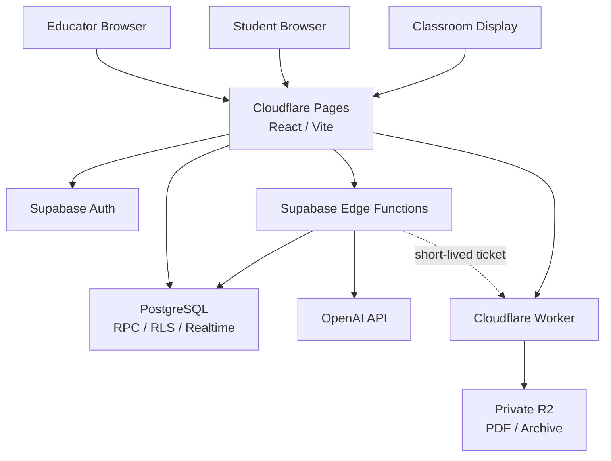

<div align="center">

# COMPASS Interactive

### LET EVERYTHING MOVE.

**講義資料、参加、教室表示、教育AIを一つの講義状態で動かすリアルタイム講義基盤**

[プロダクト紹介](https://compass-official.pages.dev/INTRO_Interactive/) ·
[デモ](https://compass-interactive.pages.dev/demo) ·
[開発者向け解説](https://compass-official.pages.dev/INTRO_Interactive/developers/)

</div>

---

## COMPASS Interactiveとは

COMPASS Interactiveは、大学講義や研究会で扱うPDF資料、学生コメント、投票、字幕、要約、教室ディスプレイを、共通の講義ライフサイクルへ接続するWebアプリケーションです。

教員は資料の公開から講義開始、スライド進行、参加機能、AI支援、終了までを一つのワークスペースで操作します。学生は講義コードで参加し、アカウントを作成せずに資料、コメント、投票、字幕、教員が公開した学習支援情報へアクセスできます。教室ディスプレイと講義後のReviewも、同じ講義状態を参照します。

```text
資料を公開 → 講義を開始 → 学生が参加 → 資料・コメント・投票・字幕を同期
             → 教員がAI支援を選択 → 講義を終了 → 読み取り専用Review
```

## 一つの講義、四つの体験

| Surface      | 対象           | 主な体験                                                                    |
| ------------ | -------------- | --------------------------------------------------------------------------- |
| **Educator** | 教員           | 講義作成、PDF公開、スライド操作、コメント・投票管理、字幕・AI支援、講義終了 |
| **Student**  | 学生           | 講義コード参加、資料追従、コメント・リアクション、投票、字幕、要点確認      |
| **Display**  | 教室           | 資料、講義タイトル、参加QR、字幕の全画面表示と低遅延同期                    |
| **Review**   | 講義後の参加者 | 終了済み講義の資料と公開済み学習情報の読み取り専用閲覧                      |

各Surfaceは別々の状態を持たず、サーバーが管理する講義、表示ページ、公開範囲、終了時刻を共有します。一方、Educator、Student、Displayには異なる認証主体と権限を与え、UI上の役割分担をデータアクセス境界にも反映しています。

## 技術的な特徴

### Server-authoritative lecture lifecycle

講義の所有者、状態、終了期限、投稿可否、AI実行可否はPostgreSQLとEdge Functionsが判定します。ブラウザ時刻や画面上の表示だけを根拠に重要操作を許可しません。作成、開始、終了、緊急停止は冪等な状態遷移として扱い、終了後の投稿、投票、資料更新、AI開始をサーバー側で拒否します。

### Versioned snapshotと選択的Realtime

学生画面は、コメント、リアクション、投票、表示中の資料、字幕、要点をversioned snapshotから差分取得します。講義中のコメント伝播は5秒以内を目標とするforeground cadenceを用い、非表示タブでは周期を延長します。Displayと字幕など低遅延が必要な経路だけにprivate Realtimeを使用し、購読障害時はsnapshotへ戻ります。

この構成により、機能ごと・学生ごとにRealtimeチャネルを増やさず、同期速度と参加人数に対する負荷の予測可能性を両立します。

### Private PDF publication

PDF本体はPrivate Cloudflare R2へ保存し、Supabaseには講義とのbinding、SHA-256、byte数、ページ数、publication state、access versionなどのメタデータを保持します。ブラウザ公開は、事前検証、短命署名ticket、immutable upload、DB上の表示状態更新を経て完了します。

学生とDisplayは同じdocument versionとpage stateを参照します。未完了objectや失効したticketを公開せず、PDF本文と認証・講義状態の保存境界を分離しています。

### Explicit and budgeted AI execution

AI支援は、リアルタイム字幕、資料分析、投票案、講義要約、学術情報を参照した回答を対象とします。教員がGoogleアカウントとTOTPによるAAL2認証を完了した後、講義単位のAI利用を一つのCTAで許可できます。通常の講義操作でTOTPや個人PINを繰り返し要求しません。

講義単位の許可だけでは有料APIを呼び出しません。各処理の開始時に、講義所有権、open状態、許可scope、policy version、call数、token量、費用、同時実行数、冪等request IDをサーバー側で再検証します。停止、講義終了、管理者session失効、権限変更は、実行中・待機中のauthorityを失効させます。

### Identity and data boundaries

- 学生はSupabase Anonymous Authを使用し、管理者sessionと分離
- 教員はGoogle OAuth、TOTP AAL2、追跡可能なapplication sessionを使用
- PostgreSQL RLSと最小GRANTで行単位・RPC単位の権限を制御
- API key、service-role key、署名鍵をブラウザへ配布しない
- 音声ファイル、PDF本文、認証secretをapplication databaseへ保存しない
- 管理操作、AI operation、費用精算、失効理由を監査可能な形で記録

## アーキテクチャ



| Layer                     | Technology                                        | Responsibility                           |
| ------------------------- | ------------------------------------------------- | ---------------------------------------- |
| **Frontend**              | React 19 · TypeScript 6 · Vite 8 · React Router   | Educator、Student、Display、Review、Demo |
| **Identity**              | Supabase Auth · Google OAuth · TOTP AAL2          | Surface別sessionと教員本人確認           |
| **Data**                  | Supabase PostgreSQL · RPC · RLS · Realtime        | 講義状態、所有権、同期version、監査      |
| **Server operations**     | Supabase Edge Functions · Deno                    | 管理操作、AI認可、外部API調整            |
| **Documents**             | Cloudflare Workers · Private R2 · PDF.js          | PDF検証、公開、Range配信、Archive        |
| **AI**                    | OpenAI Realtime API · text generation             | 字幕、分析、要約、学術回答               |
| **Presenter integration** | Node.js Publisher · .NET/C# bridge                | PDF公開の復旧経路と任意のPowerPoint連携  |
| **Quality**               | Playwright · axe-core · pgTAP · oxlint · Prettier | ブラウザ、DB、accessibility、静的品質    |

## リポジトリ構成

```text
src/                    React application、状態管理、repository境界
supabase/
├─ migrations/         Additive PostgreSQL migrations
├─ functions/          Supabase Edge Functions
└─ tests/              pgTAP、RLS、権限、競合テスト
cloudflare/            PDF / Archive Worker、Presenter Gateway
publisher/             Local PDF Publisher
presenter-bridge/       Windows PowerPoint integration source
e2e/                   Demo / Local Supabase Playwright E2E
scripts/               品質、負荷、セキュリティ、リリース検証
docs/                  アーキテクチャ、セキュリティ、運用資料
```

本番の認証情報、API key、個人情報、講義データ、PDF、バックアップはリポジトリに含めません。COMPASS公式Webとは、アプリケーション、データベース、認証情報、デプロイ先を分離しています。

## 開発を始める

Node.js `>=22.22.0` と、commit済みの`package-lock.json`を使用します。

```bash
npm ci
npm run dev
```

バックエンドやsecretを使わずに主要UXを確認する場合は、`http://127.0.0.1:5173/demo`を開きます。完全なローカルSupabase環境とCloud workspaceの手順は[`docs/CLOUD_DEVELOPMENT.md`](docs/CLOUD_DEVELOPMENT.md)にまとめています。

| Route               | Purpose                |
| ------------------- | ---------------------- |
| `/join`             | 講義コード入力         |
| `/lecture`          | Student講義画面        |
| `/lecture/comments` | コメント履歴           |
| `/lecture/archive`  | 終了講義のReview       |
| `/admin`            | Educator workspace     |
| `/display`          | Classroom Display      |
| `/demo`             | 外部サービス非依存Demo |

## 品質確認

基本的な変更確認は次のコマンドで実行できます。

```bash
npm run typecheck
npm run typecheck:e2e
npm run lint
npm run test:ci:nonlive
npm run build
```

主要なブラウザ体験はChromiumとWebKitで検証します。

```bash
npm run test:e2e:demo:triple
npm run test:e2e:local:triple
```

Local Supabase E2Eでは、PostgreSQL、Auth、RPC、RLS、Edge Functionsを使用し、講義作成、資料公開、学生参加、コメント、投票、Display、AI許可、停止、講義終了をブラウザから通して確認します。

## ドキュメント

- [`docs/architecture.md`](docs/architecture.md) — システム構成とservice boundary
- [`docs/SECURITY.md`](docs/SECURITY.md) — 認証、認可、secret、停止条件
- [`docs/data_policy.md`](docs/data_policy.md) — データ分類、保存、保持、削除
- [`docs/database_schema.md`](docs/database_schema.md) — DatabaseとRPCの責務
- [`docs/CI_AND_BROWSER_E2E.md`](docs/CI_AND_BROWSER_E2E.md) — CIと実ブラウザ検証
- [`docs/CLOUD_DEVELOPMENT.md`](docs/CLOUD_DEVELOPMENT.md) — Cloud / Dev Container setup
- [`docs/RUNBOOK_INDEX.md`](docs/RUNBOOK_INDEX.md) — 運用手順の索引

## COMPASSにおける位置づけ

COMPASS Interactiveは、[COMPASS](https://github.com/genellect/compass)が展開する教育・テクノロジープロダクトの一つです。COMPASSは学生有志による独立した教育活動であり、北里大学、北里大学薬学部、各研究室、その他の関連機関が運営する公式サービスではありません。

<div align="center">

**すべてがつながると、講義は動き出す。**

</div>
