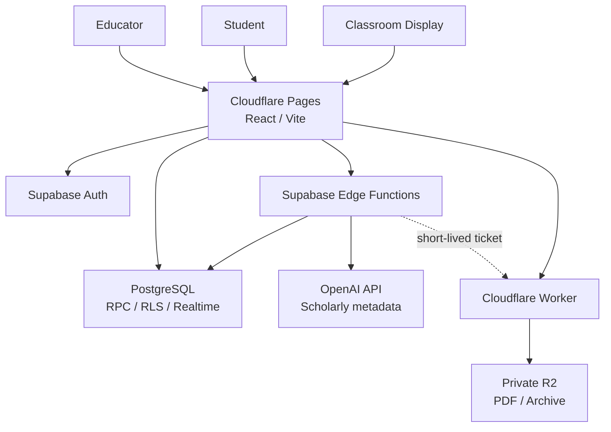

<div align="center">

# COMPASS Interactive

### LET EVERYTHING MOVE.

****リアルタイム×AIが、講義を次の次元へ。****

[プロダクトLP](https://compass-official.pages.dev/INTRO_Interactive/) ·
[公開デモ](https://compass-interactive.pages.dev/demo) ·
[開発者向け技術情報](https://compass-official.pages.dev/INTRO_Interactive/developers/)

</div>

---

## 概要

COMPASS Interactiveは、大学講義や学会、研究室セミナー、企業研修において、全参加者のインタラクティブな講義・議論参加を促進するため、参加者コメント、ライブ投票、リアルタイム字幕、AI要約、スクリーン表示を、一つの講義状態へ接続するWebアプリケーションです。

教員/講演者はPDFの公開から講義開始、スライド進行、投票機能、コメント機能、AI支援、パワーポイント連携、講義終了までを一つのワークスペースで操作できます。学生はアカウント登録をせずに講義コードまたはQRコードから参加し、資料、コメント、投票、字幕、教員が公開した学習支援情報へアクセスできます。講義終了後でも一定期間の間講義アーカイブを参照することができます。

## アーキテクチャ



| 区分                 | 採用スタック                                                       | 役割                           |
| --------------------- | ---------------------------------------------------------------- | ---------------------------------------- |
| **フロントエンド**          | React 19 · TypeScript 6 · Vite 8 · React Router 8                | 教員画面、学生画面、画面共有ディスプレイ、講義後アーカイブ、デモ画面 |
| **認証・認可**          | Supabase Auth · Google OAuth · TOTP AAL2                         | ユーザー認証、セッション管理、教員本人確認   |
| **データベース**              | Supabase PostgreSQL · RPC · RLS · Realtime                       | 講義状態、所有権、状態同期・バージョン管理、監査      |
| **バックエンド** | Supabase Edge Functions · Deno                                   | 管理操作、AI認可、外部API連携            |
| **PDF配信**         | Cloudflare Workers · Private R2 · PDF.js                         | PDF検証、公開、Range配信、アーカイブ        |
| **AI**                | OpenAI Realtime / OpenAI Responses API · PubMed · Crossref · OpenAlex | 字幕、分析、要約、根拠付き回答           |
| **PowerPoint連携**         | Node.js Publisher · .NET/C# bridge                               | PDF公開の復旧経路とPowerPoint連携        |
| **品質保証**           | Playwright · axe-core · pgTAP · oxlint · Prettier                |  ブラウザ動作、データベーステスト、アクセシビリティ、コード品質   |

## リポジトリ構成

```text
.
├─ src/                  React application、状態管理、repository境界
├─ supabase/
│  ├─ migrations/       Additive PostgreSQL migrations
│  ├─ functions/        Supabase Edge Functions
│  └─ tests/            pgTAP、RLS、権限、競合テスト
├─ cloudflare/           PDF / Archive Worker、Presenter Gateway
├─ publisher/            Local PDF Publisher
├─ presenter-bridge/     Windows PowerPoint integration source
├─ e2e/                  Demo / Local Supabase Playwright E2E
├─ scripts/              品質、負荷、セキュリティ、リリース検証
└─ docs/                 アーキテクチャ、セキュリティ、運用資料
```

COMPASS公式Webとは、アプリケーション、データベース、認証情報、デプロイ先を分離しています。

## ローカル実行

Node.js `>=22.22.0` と、commit済みの`package-lock.json`を使用します。

```bash
npm ci
npm run dev
```

バックエンドやsecretを使わずに主要UXを確認する場合は、`http://127.0.0.1:5173/demo`を開きます。Local SupabaseとCloud workspaceの構築手順は[`docs/CLOUD_DEVELOPMENT.md`](docs/CLOUD_DEVELOPMENT.md)を参照してください。

| Route               | Purpose                |
| ------------------- | ---------------------- |
| `/join`             | 講義コード入力         |
| `/lecture`          | Student講義画面        |
| `/lecture/comments` | コメント履歴           |
| `/lecture/archive`  | 終了講義のReview       |
| `/admin`            | Educator workspace     |
| `/display`          | Classroom Display      |
| `/demo`             | 外部サービス非依存     |
| `/demo/display`     | Demo Classroom Display |

## 品質確認

```bash
npm run typecheck
npm run typecheck:e2e
npm run lint
npm run test:ci:nonlive
npm run build
```

主要なブラウザ体験はChromiumとWebKitで検証します。

```bash
npm run test:e2e:demo:triple
npm run test:e2e:local:triple
```

Local Supabase E2EはPostgreSQL、Auth、RPC、RLS、Edge Functionsを起動し、講義作成、資料公開、学生参加、コメント、投票、Display、AI許可、停止、講義終了をブラウザから確認します。

## ドキュメント

- [`docs/architecture.md`](docs/architecture.md) — システム構成とservice boundary
- [`docs/SECURITY.md`](docs/SECURITY.md) — 認証、認可、secret、停止条件
- [`docs/data_policy.md`](docs/data_policy.md) — データ分類、保存、保持、削除
- [`docs/database_schema.md`](docs/database_schema.md) — DatabaseとRPCの責務
- [`docs/CI_AND_BROWSER_E2E.md`](docs/CI_AND_BROWSER_E2E.md) — CIと実ブラウザ検証
- [`docs/CLOUD_DEVELOPMENT.md`](docs/CLOUD_DEVELOPMENT.md) — Cloud / Dev Container setup
- [`docs/RUNBOOK_INDEX.md`](docs/RUNBOOK_INDEX.md) — 運用手順の索引

## プロジェクトと権利

COMPASS Interactiveは、学生支援団体[COMPASS](https://github.com/genellect/compass)が展開する大学講義支援システムです。COMPASSは学生有志による独立した教育活動であり、北里大学、北里大学薬学部、各研究室、その他の関連機関が運営する公式サービスではありません。

本リポジトリの変更には、プロダクトオーナー（Yuto Matsui）の明示承認が必要です。ソースコードは公開後もsource-availableであり、open sourceではありません。閲覧、評価、修正提案、商用利用、SaaS運用、再配布などの条件は[`LICENSE`](LICENSE)と[`NOTICE`](NOTICE)に従います。外部Contributionには[`CLA.md`](CLA.md)への同意が必要です。

善意の脆弱性報告は[`.github/SECURITY.md`](.github/SECURITY.md)の非公開窓口で受け付けます。追跡済み画像、PDF、ロゴ等の公開可否と第三者権利は[`docs/ASSET_PROVENANCE.md`](docs/ASSET_PROVENANCE.md)で管理します。本番の認証情報、API key、個人情報、講義データ、非公開PDF、バックアップはリポジトリに含めません。
