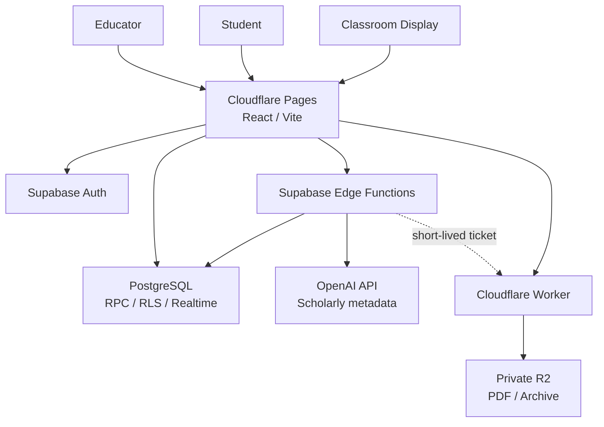

<div align="center">

# COMPASS Interactive

### LET EVERYTHING MOVE.

****リアルタイム×AIが、講義を次の次元へ。****

[プロダクト紹介](https://compass-official.pages.dev/INTRO_Interactive/) ·
[デモ](https://compass-interactive.pages.dev/demo) ·
[開発者向けポートフォリオ](https://compass-official.pages.dev/INTRO_Interactive/developers/)

</div>

---

## 概要

COMPASS Interactiveは、大学講義や学会、研究室セミナー、企業研修において、全参加者のインタラクティブな講義・議論参加を促進するため、参加者コメント、ライブ投票、リアルタイム字幕、AI要約、スクリーン表示を、一つの講義状態へ接続するWebアプリケーションです。

教員/講演者はPDFの公開から講義開始、スライド進行、投票機能、コメント機能、AI支援、パワーポイント連携、講義終了までを一つのワークスペースで操作できます。学生はアカウント登録をせずに講義コードまたはQRコードから参加し、資料、コメント、投票、字幕、教員が公開した学習支援情報へアクセスできます。講義終了後でも一定期間の間講義アーカイブを参照することができます。
```

## 一つの講義、四つの体験

| Surface      | 対象           | 主な体験                                                                    |
| ------------ | -------------- | --------------------------------------------------------------------------- |
| **Educator** | 教員           | 講義作成、PDF公開、スライド操作、コメント・投票管理、字幕・AI支援、講義終了 |
| **Student**  | 学生           | 講義コード参加、資料追従、コメント・リアクション、投票、字幕、要点確認      |
| **Display**  | 教室           | 資料、講義タイトル、参加QR、字幕の全画面表示と低遅延同期                    |
| **Review**   | 講義後の参加者 | 終了済み講義の資料と公開済み学習情報の読み取り専用閲覧                      |

各Surfaceは講義、表示ページ、公開範囲、終了時刻を共有します。Educator、Student、Displayには別々の認証主体と権限を与え、画面上の役割分担をデータアクセス境界にも反映しています。

## 設計

### Server-authoritative lecture lifecycle

講義の所有者、状態、終了期限、投稿可否、AI実行可否はPostgreSQLとEdge Functionsが判定します。作成、開始、終了、緊急停止は冪等な状態遷移として扱い、終了後の投稿、投票、資料更新、AI開始をデータ層で制限します。

### Versioned snapshot and selective Realtime

学生画面はコメント、リアクション、投票、表示中の資料、字幕、要点をversioned snapshotから差分取得します。講義中は短いforeground cadenceを用い、非表示タブでは周期を延長します。Displayと字幕など低遅延が必要な経路にはprivate Realtimeを併用し、購読障害時はsnapshotへ戻ります。

### Private PDF publication

PDF本体はPrivate Cloudflare R2へ保存し、Supabaseには講義とのbinding、SHA-256、byte数、ページ数、publication state、access versionを保持します。公開処理はブラウザでの事前検証、短命署名ticket、immutable upload、表示状態の更新を経て完了します。学生とDisplayは同じdocument versionとpage stateを参照します。

### Explicit, budgeted AI execution

AI支援は、リアルタイム字幕、資料分析、投票案、講義要約、学術情報に基づく回答を対象とします。Google OAuthとTOTP AAL2で認証した教員は、講義単位のAI利用を一つの操作で許可できます。通常の講義操作でTOTPや個人PINを繰り返し要求しません。

各処理の開始時には、講義所有権、open状態、許可scope、policy version、呼び出し数、token量、費用、同時実行数、冪等request IDをサーバー側で検証します。停止、講義終了、管理者session失効、権限変更は実行権限を失効させます。

### Segregated identity and data

- 学生はSupabase Anonymous Authを使用し、教員sessionと分離
- 教員はGoogle OAuth、TOTP AAL2、追跡可能なapplication sessionを使用
- PostgreSQL RLSと最小GRANTで行単位・RPC単位の権限を制御
- service-role key、API key、署名鍵をブラウザへ配布しない
- 音声ファイル、PDF本文、認証secretをapplication databaseへ保存しない
- 管理操作、AI operation、費用精算、失効理由を監査可能な形で記録

## アーキテクチャ



| Layer                 | Technology                                                       | Responsibility                           |
| --------------------- | ---------------------------------------------------------------- | ---------------------------------------- |
| **Frontend**          | React 19 · TypeScript 6 · Vite 8 · React Router 8                | Educator、Student、Display、Review、Demo |
| **Identity**          | Supabase Auth · Google OAuth · TOTP AAL2                         | Surface別sessionと教員本人確認           |
| **Data**              | Supabase PostgreSQL · RPC · RLS · Realtime                       | 講義状態、所有権、同期version、監査      |
| **Server operations** | Supabase Edge Functions · Deno                                   | 管理操作、AI認可、外部API調整            |
| **Documents**         | Cloudflare Workers · Private R2 · PDF.js                         | PDF検証、公開、Range配信、Archive        |
| **AI**                | OpenAI Realtime / text generation · PubMed · Crossref · OpenAlex | 字幕、分析、要約、根拠付き回答           |
| **Presenter**         | Node.js Publisher · .NET/C# bridge                               | PDF公開の復旧経路とPowerPoint連携        |
| **Quality**           | Playwright · axe-core · pgTAP · oxlint · Prettier                | ブラウザ、DB、accessibility、静的品質    |

## リポジトリ構成

```text
src/                    React application、状態管理、repository境界
supabase/
├─ migrations/         Additive PostgreSQL migrations
├─ functions/          Supabase Edge Functions
└─ tests/              pgTAP、RLS、権限、競合テスト
cloudflare/            PDF / Archive Worker、Presenter Gateway
publisher/             Local PDF Publisher
presenter-bridge/       Windows PowerPoint integration source
e2e/                   Demo / Local Supabase Playwright E2E
scripts/               品質、負荷、セキュリティ、リリース検証
docs/                  アーキテクチャ、セキュリティ、運用資料
```

COMPASS公式Webとは、アプリケーション、データベース、認証情報、デプロイ先を分離しています。

## ローカル実行

Node.js `>=22.22.0` と、commit済みの`package-lock.json`を使用します。

```bash
npm ci
npm run dev
```

バックエンドやsecretを使わずに主要UXを確認する場合は、`http://127.0.0.1:5173/demo`を開きます。Local SupabaseとCloud workspaceの構築手順は[`docs/CLOUD_DEVELOPMENT.md`](docs/CLOUD_DEVELOPMENT.md)を参照してください。

| Route               | Purpose            |
| ------------------- | ------------------ |
| `/join`             | 講義コード入力     |
| `/lecture`          | Student講義画面    |
| `/lecture/comments` | コメント履歴       |
| `/lecture/archive`  | 終了講義のReview   |
| `/admin`            | Educator workspace |
| `/display`          | Classroom Display  |
| `/demo`             | 外部サービス非依存 |

## 品質確認

```bash
npm run typecheck
npm run typecheck:e2e
npm run lint
npm run test:ci:nonlive
npm run build
```

主要なブラウザ体験はChromiumとWebKitで検証します。

```bash
npm run test:e2e:demo:triple
npm run test:e2e:local:triple
```

Local Supabase E2EはPostgreSQL、Auth、RPC、RLS、Edge Functionsを起動し、講義作成、資料公開、学生参加、コメント、投票、Display、AI許可、停止、講義終了をブラウザから確認します。

## ドキュメント

- [`docs/architecture.md`](docs/architecture.md) — システム構成とservice boundary
- [`docs/SECURITY.md`](docs/SECURITY.md) — 認証、認可、secret、停止条件
- [`docs/data_policy.md`](docs/data_policy.md) — データ分類、保存、保持、削除
- [`docs/database_schema.md`](docs/database_schema.md) — DatabaseとRPCの責務
- [`docs/CI_AND_BROWSER_E2E.md`](docs/CI_AND_BROWSER_E2E.md) — CIと実ブラウザ検証
- [`docs/CLOUD_DEVELOPMENT.md`](docs/CLOUD_DEVELOPMENT.md) — Cloud / Dev Container setup
- [`docs/RUNBOOK_INDEX.md`](docs/RUNBOOK_INDEX.md) — 運用手順の索引

## プロジェクトと権利

COMPASS Interactiveは、学生支援団体[COMPASS](https://github.com/genellect/compass)が展開する大学講義支援システムです。。COMPASSは学生有志による独立した教育活動であり、北里大学、北里大学薬学部、各研究室、その他の関連機関が運営する公式サービスではありません。

本リポジトリの変更にはプロダクトオーナー（Yuto Matsui）明示承認が必要です。ソースコードは公開後もsource-availableであり、open sourceではありません。閲覧、評価、修正提案、商用利用、SaaS運用、再配布などの条件は[`LICENSE`](LICENSE)と[`NOTICE`](NOTICE)に従います。外部Contributionには[`CLA.md`](CLA.md)への同意が必要です。

善意の脆弱性報告は[`.github/SECURITY.md`](.github/SECURITY.md)の非公開窓口で受け付けます。追跡済み画像、PDF、ロゴ等の公開可否と第三者権利は[`docs/ASSET_PROVENANCE.md`](docs/ASSET_PROVENANCE.md)で管理します。本番の認証情報、API key、個人情報、講義データ、非公開PDF、バックアップはリポジトリに含めません。
