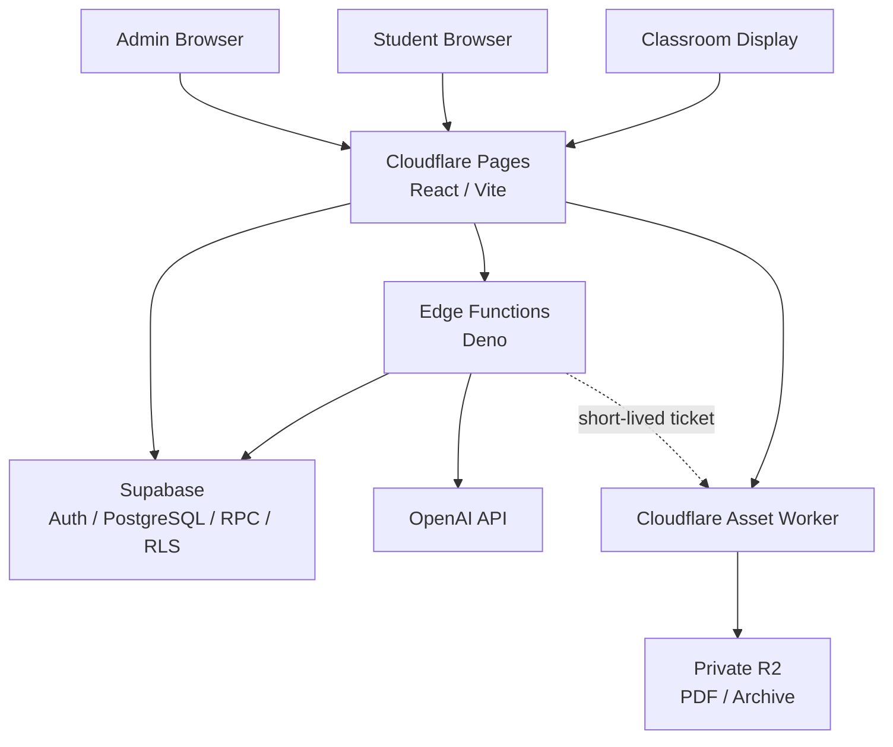

<div align="center">

# COMPASS Interactive

### LET EVERYTHING MOVE.

**リアルタイム講義参加・資料同期・教育AI支援プラットフォーム**

COMPASS Interactiveは、講義資料、コメント、投票、字幕、AI支援、教室ディスプレイを、単一の講義ライフサイクルへ統合する講義支援システムです。

[](https://react.dev/)
[](https://www.typescriptlang.org/)
[](https://vite.dev/)
[](https://supabase.com/)
[](https://www.cloudflare.com/)
[](https://playwright.dev/)

[プロダクト紹介](https://compass-official.pages.dev/INTRO_Interactive/) ·
[デモ](https://compass-interactive.pages.dev/demo) ·
[開発者向け解説](https://compass-official.pages.dev/INTRO_Interactive/developers/) ·
[アーキテクチャ](#アーキテクチャ) ·
[ローカル開発](#ローカル開発) ·
[品質保証](#品質保証)

</div>

---

## 概要

講義中の情報は、スライド、PDF、口頭説明、質問、投票、字幕、生成AIといった複数の経路へ分散します。COMPASS Interactiveは、それらを共通の講義状態に接続し、教員・学生・教室ディスプレイ・講義後の復習までを、切れ目のない一つの体験として設計します。

学生は6桁の講義コードで参加し、教員が提示する資料ページを追いながら、コメント、投票、字幕、要点整理へアクセスできます。教員は、講義進行、参加機能、資料公開、AI処理を単一の管理画面から制御し、終了後の学習内容を読み取り専用のReviewへ引き継ぎます。

既存の授業へ機能を積み重ねただけのツールではありません。**教員・学生・教室・講義後の学習を、共通のライフサイクルと明確な信頼境界の上で再設計したプロダクト**です。

本リポジトリでは、次の実装・検証・運用資産を、一つの変更単位として一貫して管理します。

- React / TypeScriptによるStudent・Admin・Display・Archiveの各Surface
- Supabase Auth、PostgreSQL、RPC、Row Level Security
- Supabase Edge Functionsによる管理操作と外部APIオーケストレーション
- Cloudflare WorkersとPrivate R2による資料・Archive配信
- OpenAI APIによる字幕、資料分析、要約、参考回答
- ローカルPublisherによるPDF公開の互換・復旧経路
- Database migration、CI、E2E、セキュリティ検証、運用ドキュメント

COMPASS公式Webとは、デプロイ、データベース、秘密情報のいずれも共有しない、独立したプロダクトです。

---

## 現在のリリース契約

- Application version: `0.11.0`
- Phase 0 through Phase 7.2を基礎契約とし、Phase 7.25〜7.28の追加機能をmainへexpand-firstで統合しています。
- Phase 6.7で、README、Architecture、Security、Data Policy、Roadmap、Runbookを正本文書として整備しました。
- Phase 7 Production Gateの判定は、コードの存在やLocal Gateとは分離し、最新のGate記録を正とします。
- すべての追加機能はdefault-OFFを基本とし、Database、Edge、Worker、Frontend、Human E2Eを段階的に検証します。

詳細なPhase履歴は[`docs/CHANGELOG.md`](docs/CHANGELOG.md)、現在の計画と合格基準は[`docs/ROADMAP.md`](docs/ROADMAP.md)を参照してください。

---

## 一つの講義、四つの体験

| Surface              | 対象           | 体験と責務                                                                        |
| -------------------- | -------------- | --------------------------------------------------------------------------------- |
| **Student**          | 学生           | 講義コード参加、PDFページ同期、コメント、リアクション、投票、字幕、AI要点、Review |
| **Admin**            | 教員           | 講義作成、進行制御、資料公開、コメント・投票・字幕管理、AI実行と承認、Archive管理 |
| **Display**          | 教室           | PDF、講義タイトル、QRコード、字幕の全画面表示と低遅延同期                         |
| **Archive / Review** | 講義後の参加者 | 終了済み講義の資料と学習情報を、安全な読み取り専用状態で再閲覧                    |

四つのSurfaceは独立したアプリケーションではなく、同一の講義ライフサイクルと権限モデルを共有します。そのうえで、Admin、Student、Displayには個別の実行主体と資格情報を割り当て、UI上の役割分担をそのままセキュリティ境界として成立させています。

### Student

- 6桁の講義コードによる参加
- 教員が提示しているPDFページとの自動同期
- 匿名または任意のニックネームによるコメント
- コメントへのリアクション
- ライブ投票への回答
- 配信中のみ表示されるリアルタイム字幕
- 資料ガイド、講義要点、重要ページ、重要語、理解を深める問い
- 5分単位の要点とクラス全体の動き
- 終了講義の読み取り専用Review

### Admin

- Admin PINによる管理セッション
- 講義の作成、開始、終了、再利用
- PDF公開と表示ページ制御
- コメント管理とライブ投票の作成・進行
- 字幕配信の明示的な開始・停止
- 資料分析、投票案、講義要約、参考回答の生成
- AI出力の承認、訂正、非表示
- 参加状況と講義進行の概算指標
- 講義終了後のArchive管理

### Classroom Display

- Adminセッションから分離されたDisplay専用セッション
- PDF、講義タイトル、参加用QRコード、字幕の全画面表示
- 対象Displayだけに限定した低遅延更新
- Realtime障害時のsnapshot復旧
- 学生同期の負荷を増やさない独立した更新経路

### Independent Demo

`/demo`はSupabase、OpenAI、Cloudflare R2へ接続せず、主要な講義体験を再現します。外部サービスへの書き込みや有料API呼び出しを伴わずに、デザインレビュー、導入説明、ブラウザE2Eを実行できます。

---

## アーキテクチャ



### 実行境界

| Boundary               | 主な責務                                    | 設計上の制約                               |
| ---------------------- | ------------------------------------------- | ------------------------------------------ |
| **React / Vite**       | UI、routing、楽観表示、ローカル状態         | ブラウザを認可主体にしない                 |
| **Supabase Auth**      | Student・Admin・Displayの実行主体           | role名だけで操作を許可しない               |
| **PostgreSQL / RPC**   | 所有権、講義状態、同期version、利用量、監査 | `auth.uid()`とサーバー時刻を正とする       |
| **Row Level Security** | 行単位の読み書き境界                        | UI上の非表示を認可の代替にしない           |
| **Edge Functions**     | Admin操作、AI認可、外部API調整              | PIN、API key、service roleを公開しない     |
| **Asset Worker / R2**  | PDFとArchiveの保存・配信                    | protected objectをpublic bucketへ置かない  |
| **OpenAI API**         | 字幕、分析、要約、参考回答                  | 明示操作、予算、同時実行、冪等性を検証する |
| **Local Publisher**    | PDF公開の互換・復旧経路                     | ブラウザ公開経路との同時書き込みを避ける   |
| **Demo**               | バックエンド不要のUX再現                    | 外部通信を行わない                         |

---

## 設計上の核心

### 1. 講義ライフサイクルをサーバーが統治する

講義状態、終了期限、所有権、有料処理の可否は、ブラウザへ委ねません。PostgreSQLとEdge Functionsを正とし、すべてサーバー側で判定します。

```text
講義作成 → ライブ開始 → 終了確定 → Archive公開
```

- 講義開始時にサーバー時刻を基準とするhard stopを設定
- 規定時間への到達時に自動終了
- 手動終了と自動終了は同じ冪等な状態遷移を使用
- 終了済み講義への投稿、投票、資料更新、AI開始を拒否
- 各mutationが期限を再検証し、scheduler障害時も期限切れ状態を継続させない
- クライアントは終了検出後、polling、購読、送信待ち処理を停止

クライアント時刻、画面上の表示状態、ブラウザ内のparticipant IDだけを根拠として、重要な操作を許可することはありません。

### 2. 数百人規模を想定したversioned snapshot

学生画面の状態同期に、機能数と参加者数に比例してRealtime購読を増やす構成は採りません。コメント、投票、表示中の資料ページ、字幕、要点、参加指標は、原則として一つのversioned snapshot RPCから取得します。

- 前景では約5秒間隔、backgroundでは周期を延長
- 変更されたsectionだけをversionで識別
- 一時障害には上限付きbackoffを適用
- コメント履歴は専用画面を開いた場合のみcursor paginationで取得
- 低遅延が必要なDisplayと字幕には、対象を限定したRealtime経路を使用
- Realtimeが利用できない場合はsnapshotから復旧

この構成により、参加者数に応じて購読チャネルが無制限に増えることを防ぎながら、講義中の操作感と障害時の復旧性を両立します。

### 3. 教材をアプリケーションデータから分離する

PDF本体はPrivate R2へ保存し、Supabaseにはdocument ID、講義とのbinding、SHA-256、byte数、ページ数、publication state、access version、保持・監査metadataだけを保持します。

資料配信は単一レイヤーの判定に依存しません。Edge Function、PostgreSQL、Asset Workerが、それぞれ次の条件を検証します。

- 講義とdocumentのbinding
- 短寿命の署名付きticket
- Originとrequest scope
- PDF magic、実byte数、ページ数、SHA-256
- 有効期限、nonce、ticket再利用
- immutable uploadとpublication state

commitされていないobjectは学生へ公開しません。PDF本文、PDF byte列、画像、OCR結果をSupabaseへ保存せず、認証・状態管理と大容量資料配信の責務を明確に分離します。

### 4. AIを「機能」ではなく、統制された実行として扱う

生成品質だけをAI機能の完成条件にはしません。**誰が、いつ、どの講義に対して、どの予算内で実行できるか**までを、システムの責務として設計しています。

有料処理は、原則として次の条件をすべて満たした場合にのみ開始します。

- 教員による明示操作
- 有効なAdminセッション
- API利用PINまたは許可されたlecture-wide authorization
- openかつ期限内の講義
- server-side feature flag
- 利用回数と費用の上限
- RealtimeまたはBatchの同時実行枠
- 一意なoperation ID

実行後は利用量を記録し、出力形式と出典を検証したうえで、未確認ラベルによる限定表示、または教員による承認・訂正・非表示を通して学生へ公開します。停止操作はPINなしで実行でき、音声ファイルは保存しません。

OpenAI API keyはEdge secretからのみ参照し、ブラウザ、Gitリポジトリ、Asset Worker、application logのいずれにも出力しません。

### 5. 教室運用を例外ではなく、設計対象にする

講義システムは、ブラウザ上で正しく動くだけでは完成しません。教員端末、教室Display、学生のモバイル端末、ネットワーク障害、手動fallbackまでを、同じ運用境界の内側に置いて設計します。

- Display資格情報をAdminから分離
- 資料ページは常に手動で変更可能
- Realtime障害時はsnapshotへfallback
- 外部サービス障害時はAIや資料公開だけを局所的に停止
- feature flag、kill switch、以前のapplication versionで段階的に復旧

---

## セキュリティと信頼性

| Principle                | Implementation                                                    |
| ------------------------ | ----------------------------------------------------------------- |
| **Server-authoritative** | 認証、所有権、期限、講義状態、予算をDBとEdgeで再検証              |
| **Least privilege**      | RLS、最小GRANT、Surface別session、secret、実行主体                |
| **Secret isolation**     | service role、PIN、API key、signing keyを公開clientから隔離       |
| **Idempotency**          | 講義終了、PDF公開、AI、Archive、外部副作用の重複実行を抑止        |
| **Fail-closed**          | flag、secret、binding、認証、署名が不完全な場合は処理を開始しない |
| **Auditability**         | 講義状態、Admin操作、AI operation、利用量を追跡可能に記録         |
| **Data minimization**    | PDF、音声、全文transcriptをSupabaseへ保存しない                   |
| **Recovery**             | backoff、lease、snapshot復旧、manual fallback、kill switch        |
| **Cost control**         | 予算、call上限、同時実行枠、明示的な有料開始をサーバー側で強制    |

次の事象を検出した場合は、機能継続より安全な停止を優先します。

- 他の参加者または他の講義へのデータ漏洩
- Admin認証を経ない管理操作
- 無認可または重複した有料API呼び出し
- protected R2 objectの公開
- 講義終了後の書き込み
- secret、PIN、tokenのブラウザ、ログ、Gitへの露出

---

## 技術構成

| Layer                 | Technology                                                            |
| --------------------- | --------------------------------------------------------------------- |
| **Frontend**          | React 19 · TypeScript 6 · Vite 8 · React Router                       |
| **Authentication**    | Supabase Auth · Anonymous Sign-In                                     |
| **Database**          | Supabase PostgreSQL · RPC · Row Level Security · pgTAP                |
| **Server Functions**  | Supabase Edge Functions · Deno                                        |
| **PDF / Archive**     | Cloudflare Workers · Private Cloudflare R2                            |
| **AI**                | OpenAI Realtime API · OpenAI text generation                          |
| **Local Integration** | Node.js Publisher                                                     |
| **Testing**           | Node test scripts · pgTAP · Playwright · axe-core                     |
| **CI / Security**     | GitHub Actions · immutable Action refs · secret scan · SBOM           |
| **Deployment**        | Cloudflare Pages · Cloudflare Workers · Supabase migrations/functions |

---

## 品質保証

READMEに記載する技術的な主張は、コードの存在だけでは成立しません。Database policy、ブラウザ、外部通信境界、運用Gateまで含めて検証します。

| Gate                    | 検証対象                                                                      |
| ----------------------- | ----------------------------------------------------------------------------- |
| **Static Quality**      | TypeScript、oxlint、build、repository整合性                                   |
| **Database**            | migration、RPC、RLS、GRANT、所有権分離、競合、冪等性                          |
| **Non-live Regression** | 外部サービスを使わないunit・integration回帰                                   |
| **Demo E2E**            | Desktop / Mobile、Chromium / WebKit、主要UX、accessibility、visual regression |
| **Local Supabase E2E**  | 実PostgreSQL、Auth、RPC、RLS、Edge Functionsを用いた講義workflow              |
| **Security**            | secret、public-source boundary、依存関係、Action参照、権限設定                |
| **Release**             | feature flag、migration順序、canary、rollback、human verification             |

### 開発者向けGate

```bash
npm run security:secrets
npm run typecheck
npm run typecheck:phase3
npm run typecheck:e2e
npm run lint
npm run test:phase6-7-docs
npm run test:ci:nonlive
npm run build
git diff --check
```

### Demo E2E

```bash
npm run test:e2e:demo:triple
```

Demo E2Eでは外部HTTP通信を拒否し、Desktop / Mobile ChromiumとWebKitを対象に、主要UX、console error、page error、horizontal overflow、accessibility、visual regressionを検査します。

### Local Supabase E2E

```bash
npm run test:e2e:local:triple
```

Local Supabase E2Eでは、ローカル環境上のPostgreSQL、Auth、RPC、RLS、Edge Functionsを実際に使用し、教員と学生の分離から、講義開始、参加、コメント、投票、講義終了までのworkflowを検証します。

CIでは、OpenAIの有料呼び出し、実マイク入力、Hosted Supabaseへのmigration、R2への実file upload、Cloudflare deploy、本番secretの参照を行いません。**Automated、Hosted、Human、ProductionのPASSは、相互に代替できない別個の検証結果として扱います。**

---

## ローカル開発

### 必要環境

| Runtime           | Version / Tooling                   |
| ----------------- | ----------------------------------- |
| Node.js           | `>=22.22.0`                         |
| Package manager   | npm + committed `package-lock.json` |
| Container runtime | Docker Desktop / WSL2 backend       |
| Local backend     | Supabase CLI + Docker               |

### Frontend

依存関係をcommitted lockfileどおりに再現し、開発サーバーを起動します。

```bash
npm ci
npm run dev
```

主要なローカルrouteは次のとおりです。

| Route                                    | 用途                         |
| ---------------------------------------- | ---------------------------- |
| `http://127.0.0.1:5173/join`             | 講義・Archiveへの参加        |
| `http://127.0.0.1:5173/lecture`          | Student講義画面              |
| `http://127.0.0.1:5173/lecture/comments` | コメント履歴                 |
| `http://127.0.0.1:5173/lecture/archive`  | 終了講義の読み取り専用Review |
| `http://127.0.0.1:5173/admin`            | Admin workspace              |
| `http://127.0.0.1:5173/display`          | Classroom Display            |
| `http://127.0.0.1:5173/demo`             | 外部通信を行わない独立Demo   |

Supabase環境変数が未設定でもFrontendは起動できます。バックエンドへ接続せずに体験を確認する場合は、`/demo`を使用してください。

Windows PowerShellでは、必要に応じて`npm`を`npm.cmd`へ読み替えます。

### 環境変数

必要な実行経路に対応するexampleだけをコピーします。

```text
.env.local.example
  → .env.local

.env.publisher.example
  → .env.publisher.local

cloudflare/asset-worker/.dev.vars.example
  → cloudflare/asset-worker/.dev.vars
```

`*.local`と`.dev.vars`の実値はcommitしません。`VITE_`prefixを許可するのは、ブラウザへ公開してよい値だけです。

次の値には、`VITE_`prefixを付与してはいけません。

- Admin PIN、API利用PIN
- OpenAI API key
- Supabase service-role key
- Turnstile secret
- R2 credential
- signing key
- Archive ingest secret
- Email provider key

Feature flagはdefault-OFFかつfail-closedです。対応するmigration、Edge Function、Worker binding、secret、RLS、所有権テスト、rollback gateがすべて揃った後にのみ有効化します。

<details>
<summary>Frontend feature flag一覧</summary>

- `VITE_PHASE1_SYNC_PROTOCOL`
- `VITE_PHASE2_LECTURE_LIFECYCLE`
- `VITE_PHASE3_PRIVATE_PDF`
- `VITE_PHASE4_REALTIME_CAPTIONS`
- `VITE_PHASE5_MATERIAL_ANALYSIS`
- `VITE_PHASE6_SUMMARIES`
- `VITE_PHASE6_5_COMMENT_NICKNAMES`
- `VITE_PHASE6_6_UX_INTEGRATION`
- `VITE_PHASE6_8_SECURITY`
- `VITE_PHASE7_1_CLASSROOM_EXTENSIONS`
- `VITE_PHASE7_2_ACADEMIC_ANSWERS`
- `VITE_PHASE7_25_AUTO_ACADEMIC_ANSWERS`
- `VITE_PHASE7_26_BROWSER_PDF_PUBLISHING`
- `VITE_PHASE7_27_JOURNAL_CLUB`
- `VITE_PHASE7_28_JOURNAL_CLUB_PRESET_CREATION`
- `VITE_PHASE7_28_DISPLAY_REALTIME`
- `VITE_PHASE7_28_AI_MASTER_AUTH`

</details>

### Local Supabase

Docker Desktopを起動し、すべてのmigrationをローカルstackへ適用します。

```bash
npx supabase start
npx supabase db reset --local --no-seed
npx supabase test db --local
npx supabase db lint --local --fail-on error
npm run db:types:check
```

ローカル検証の過程で、Hosted Projectへの`link`、`db push`、migration適用は行いません。Edge Functionsと実ブラウザE2Eの設定は、[`docs/CI_AND_BROWSER_E2E.md`](docs/CI_AND_BROWSER_E2E.md)を参照してください。

---

## データベース変更契約

Database変更は、`supabase/migrations/`へadditive migrationとして導入します。

1. 空Databaseへ全migrationを適用する
2. 既存データを保持したupgrade pathを検証する
3. pgTAP、DB lint、RLS、GRANT、所有権分離を再検証する
4. 競合と冪等性を確認する
5. TypeScriptのDatabase型を再生成する
6. Frontend、Edge、Workerをfeature flag OFFで検証する
7. 後方互換が不要になるまで破壊的変更を行わない

公開RPCには、原則として`SECURITY INVOKER`を使用します。`SECURITY DEFINER`が不可避な処理では、非公開schema、固定`search_path`、明示的な主体検証、最小GRANT、`PUBLIC EXECUTE`の剥奪を必須要件とします。

---

## ディレクトリ構成

```text
src/
├─ pages/                  Join / Lecture / Admin / Display / Archive
├─ components/             共通UIとAdmin workspace
├─ context/                Application state
├─ repositories/           Supabase・Demoのdata access boundary
├─ services/               UIから呼び出すapplication action
├─ lib/                    Auth、lifecycle、snapshot、feature flag
├─ caption/                Realtime字幕と公開caption window
├─ pdf/                    PDF検証・公開・配信client
├─ display/                Display低遅延更新
├─ demo/                   Supabase非依存Demo
└─ types/                  Domain型・生成済みDatabase型

supabase/
├─ migrations/             Expand-first SQL migrations
├─ functions/              Edge Functions
├─ tests/                  pgTAP・RLS・所有権・競合テスト
├─ validation/             Upgrade・migration検証
└─ config.toml             Local Supabase構成

cloudflare/
└─ asset-worker/           Private PDF・Archive Worker

publisher/                 Local PDF Publisher / recovery path
e2e/                       Playwright Demo / Local Supabase E2E
scripts/                   CI・load・security・release検証
docs/                      Architecture・Security・Runbook・Gate記録
.github/workflows/ci.yml    GitHub Actions
```

---

## デプロイメント

| Component         | Deployment                           |
| ----------------- | ------------------------------------ |
| Frontend          | Cloudflare Pages                     |
| Auth / Database   | Supabase Auth · PostgreSQL           |
| Server Operations | Supabase Edge Functions              |
| PDF / Archive     | Cloudflare Asset Worker · Private R2 |
| AI                | OpenAI API via Edge Functions        |
| Migration         | Supabase migration pipeline          |

本番反映を、Database、Edge Functions、Worker、Frontendへ同時に不可逆変更を加える操作にはしません。expand-first migration、default-OFFのserver flag、application deploy、canary、段階的なflag activationの順に進めます。

rollbackでは、まずruntimeまたはfeature flagを停止し、直前のapplication versionへ戻します。運用中のデータを失うschema dropを、rollback手段として使用することはありません。

---

## ドキュメント

READMEは、現行システムの全体像と開発の入口を示します。詳細設計、運用手順、検証記録、変更履歴は、それぞれの正本文書で管理します。

| Document                                                   | Responsibility                           |
| ---------------------------------------------------------- | ---------------------------------------- |
| [`docs/architecture.md`](docs/architecture.md)             | 現行アーキテクチャとservice boundary     |
| [`docs/SECURITY.md`](docs/SECURITY.md)                     | 認証、認可、secret、停止条件             |
| [`docs/data_policy.md`](docs/data_policy.md)               | データ分類、保存、保持、削除             |
| [`docs/database_schema.md`](docs/database_schema.md)       | DatabaseとRPCの責務                      |
| [`docs/CI_AND_BROWSER_E2E.md`](docs/CI_AND_BROWSER_E2E.md) | CI、browser E2E、local live test         |
| [`docs/RUNBOOK_INDEX.md`](docs/RUNBOOK_INDEX.md)           | 運用・障害対応の入口                     |
| [`docs/ROADMAP.md`](docs/ROADMAP.md)                       | 今後の開発計画                           |
| [`docs/CHANGELOG.md`](docs/CHANGELOG.md)                   | release単位の変更履歴                    |
| [`PROJECT_GUIDE.md`](PROJECT_GUIDE.md)                     | 原設計、product contract、意思決定の背景 |

過去のPhase文書は、該当commit時点における設計判断と検証証跡です。現在の挙動を確認する際は、現行コード、migration、上記の正本文書、最新のGate記録を優先してください。

---

## 開発原則

1. **講義の正本を一つにする。** UI、Display、Archiveごとに別の状態を持たない。
2. **ブラウザを認可主体にしない。** 所有権、期限、予算、権限は、必ずサーバー側で再検証する。
3. **同期経路を機能数だけ増やさない。** versioned snapshotを基本とし、Realtimeは必要な経路に限定する。
4. **有料AI処理を暗黙に開始しない。** 明示操作、認可、上限、冪等性、記録を開始条件とする。
5. **教材と認証状態を分離する。** PDF、音声、全文transcriptをSupabaseへ保存しない。
6. **変更を安全に展開する。** expand-first、default-OFF、後方互換、canary、rollbackを一つの契約として扱う。
7. **検証範囲を明示する。** Automated、Local、Hosted、Human、ProductionのPASSを混同しない。
8. **実装と運用を切り離さない。** Code、migration、test、runbookを同じ変更単位で更新する。
9. **技術的主張を証拠で支える。** Architecture、test、Gate記録を伴わない完成宣言は行わない。

---

## COMPASSにおける位置づけ

COMPASS Interactiveは、COMPASSが展開する教育・テクノロジープロダクトの一つです。COMPASS公式Webおよび未来戦略ライブラリとは、ソースコード、データ、認証情報、デプロイ境界を分離しています。

COMPASSは、学生有志が運営する独立した教育活動です。北里大学、北里大学薬学部、各研究室、その他の関連機関が運営する公式サービスではありません。

---

<div align="center">

**すべてがつながると、講義は動き出す。**

[プロダクト紹介](https://compass-official.pages.dev/INTRO_Interactive/) ·
[デモを試す](https://compass-interactive.pages.dev/demo) ·
[技術設計を読む](https://compass-official.pages.dev/INTRO_Interactive/developers/)

</div>
