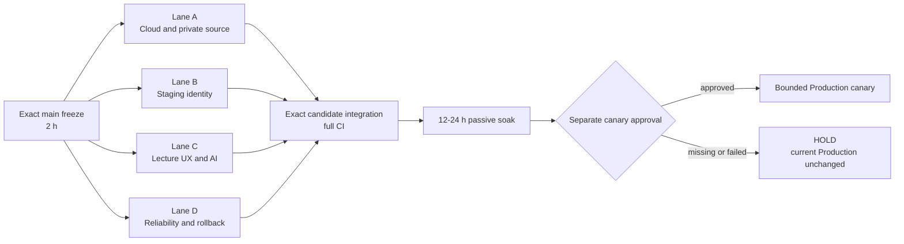

# Lecture Cycle Production Candidate Plan

Status: Planned
Scope: private-source contest submission, lecture-cycle reliability, bounded Production candidate and cloud-first execution
Last verified: 2026-08-14

## 1. Decision and status vocabulary

This document defines the shortest safe path to a **Lecture Cycle Production
Candidate** within approximately 50 active engineering hours. It prioritizes
the current Admin, Student, Display, Review, PDF and AI lecture experience and
does not redefine or weaken the formal Phase 7.33 Production Gate.

The allowed outcomes are:

- `LECTURE_CYCLE_SOURCE_READY`: the exact private source candidate and its
  reproducible non-live/local evidence are complete;
- `READY_FOR_BOUNDED_PRODUCTION_CANARY`: staging, Human and rollback evidence
  are complete and a separately approved Production canary may be requested;
- `HOLD`: one or more required evidence streams or approvals are missing;
- `PASS`: a separately approved bounded canary completed without a stop
  condition. This is a Lecture Cycle Candidate result, not Phase 7.33 PASS or
  commercial GA.

No document, CI result or agent may convert these words into Phase 7.33,
commercial, multi-tenant, Presenter-device or legal approval.

## 2. Included and deferred scope

### Included now

- preserve the existing teacher lecture workflow from sign-in through create,
  start, operate, stop, close, Archive and Review;
- preserve student join, PDF follow, comments, reactions, Poll, captions,
  summaries and post-lecture Review;
- preserve one-use Display links, replacement/revoke and realtime page state;
- preserve existing AI material analysis, Poll proposals, academic answers,
  summary scheduling/provider dispatch and captions, including server-side
  cost, scope, concurrency, idempotency and 90-minute lifecycle checks;
- complete the Phase 7.30F staging/Human identity and rollback evidence needed
  by the exact candidate, without calling it the formal Production Gate;
- provide a private, exact-SHA source submission package instead of changing
  repository visibility;
- make routine source, test and CI work independent of the local PC after a
  verified cloud handoff.

### Explicitly deferred

- formal Phase 7.33 unified Production Gate PASS;
- a commercial 300-person SLA or general availability commitment;
- multiple-university multi-tenant readiness;
- Presenter native binary, physical PowerPoint/device and venue Production
  readiness;
- GitHub public-source readiness or a repository visibility change;
- legal/DPA, procurement, general support and commercial GA;
- retrospective Copilot review of private PRs #37, #38, #39 and #42.

GitHub remains private. Source submission is satisfied by the private package
in section 10. A Copilot response that refuses an exact-head review because the
diff exceeds its line limit is non-blocking for this gate; actionable review
threads and Critical/High findings remain blocking.

## 3. Non-negotiable product invariants

1. Existing Production stays on its current immutable revision until the new
   candidate passes staging and a separate canary approval is recorded.
2. Database changes are expand-first. New Frontend, Edge and database gates are
   default OFF. A rollout never depends on a destructive down migration.
3. No open lecture, active legacy Admin session, pending AI child/usage/summary
   descendant or in-flight PDF publication is force-terminated for cutover.
4. A provider outage may disable a new paid start, but it must not stop join,
   PDF viewing, comments, Poll, Display, close, stop, revoke or Review.
5. Paid stop, downgrade and revoke remain available without PIN or a new TOTP
   prompt. Normal lecture work never adds periodic TOTP challenges.
6. No browser receives a service-role key, OpenAI key, R2 credential, signing
   key, PIN verifier or recovery material.
7. Student, instructor, lecture and environment boundaries remain
   server-authoritative through RLS, Edge verification and transactional
   checks; feature flags and tests never replace authorization.
8. No real `.env`, Phase 7.30F evidence file, database dump, student data,
   protected material or credential is placed in Git, CI artifacts or the
   source submission.

## 4. Acceptance matrix

| Surface          | Required success evidence                                                                                                                                       | Automatic HOLD                                                                      |
| ---------------- | --------------------------------------------------------------------------------------------------------------------------------------------------------------- | ----------------------------------------------------------------------------------- |
| Source and cloud | exact candidate SHA, canonical main ancestry, clean pushed branch, `cloud:check`, private-source manifest and handoff check                                     | dirty/unpushed work, stale main base, tracked evidence/env, non-reproducible setup  |
| Database         | fresh reset, all migrations, pgTAP, generated-type drift, DB lint, populated upgrade and concurrency probes                                                     | RLS/grant drift, destructive migration, ownership ambiguity, post-close write       |
| Admin identity   | personal Google account, TOTP AAL2, two active owners, AI-enabled and standard instructor, suspended instructor, session/factor/recovery/revoke matrix          | owner lockout, shared credential, AAL2 bypass, repeated lecture TOTP prompt         |
| Teacher UX       | sign in once, create/open lecture, publish/control PDF, comments/Poll/captions/summary/academic/material AI, safe stop, close, Archive/Review                   | auth loop, feature disappearance, developer wording, stop/revoke failure            |
| Student UX       | join, nickname, reload, page follow, PDF, comments/reactions, Poll, captions/summary and Review                                                                 | join regression, cross-lecture data, horizontal overflow, forced refresh loop       |
| Display          | first one-use claim, separately issued second link, replacement/revoke and realtime page/caption state                                                          | token replay accepted, stale display after revoke, private data leak                |
| AI               | master activation is provider/grant free; each actual provider dispatch has one bounded child reservation; budgets, concurrency and idempotency remain enforced | duplicate/unbounded provider work, unexpected paid call, secret/prompt leakage      |
| PDF and Archive  | private R2 path, committed manifest, authorized download, close/archive retention and cleanup                                                                   | public object, wrong-lecture access, orphaned publication, closed lecture mutation  |
| Browser/UX       | desktop Chromium/WebKit, mobile Chromium/WebKit or 390px equivalent, keyboard, no Critical/Serious accessibility issue, no console/page error or overflow       | existing lecture path visually or functionally regresses                            |
| Reliability      | previous immutable revision, backup/restore identifiers, owner recovery, feature stop and forward-repair rehearsal                                              | rollback depends on shared PIN, backup/restore unproved, recovery owner unavailable |

## 5. Fifty-hour implementation budget

The budget is 50 active person-hours. CI queues, a 12–24 hour passive soak and
waiting for Human/OAuth approvals are elapsed time but not counted as active
engineering hours.

| Lane                    | Work package                                                                                                             | Active hours | Primary output                                                      |
| ----------------------- | ------------------------------------------------------------------------------------------------------------------------ | -----------: | ------------------------------------------------------------------- |
| Controller              | exact-main freeze, dependency graph, evidence ledger, final GO/HOLD                                                      |            6 | immutable candidate and integrated decision record                  |
| A — Cloud/source        | cloud environment, private source package, source/static checks, exact-head CI orchestration                             |            8 | reproducible private submission and disconnected execution handoff  |
| B — Identity/staging    | staging deploy with all activation OFF, provider/callback inventory, two-owner/TOTP/recovery, pre/post cutover rehearsal |           13 | Phase 7.30F staging/Human dossier and Google-only rollback evidence |
| C — Lecture UX/AI       | full teacher/student/display/review cycles, paid/free AI matrix, browsers, mobile and accessibility                      |           15 | no-regression lecture-cycle evidence with real bounded AI paths     |
| D — Reliability/release | backup/restore, load smoke, failure injection, stop/rollback, bounded canary runbook                                     |            8 | release/rollback packet and stop thresholds                         |
| **Total**               |                                                                                                                          |       **50** |                                                                     |

The expected elapsed critical path is 28–40 hours plus passive soak when the
four lanes prepare evidence in parallel. Gate decisions remain ordered even
when preparation is parallel.

## 6. Ordered execution plan

### Stage 0 — freeze and cloud admission (2 hours)

1. Fetch canonical `origin/main`; record its 40-character SHA and current CI.
2. Create one branch/worktree per write-capable lane. Never share a write
   worktree.
3. Run `npm run cloud:doctor`; record toolchain and repository scope.
4. Define the exact candidate dependency graph and stop thresholds.
5. Record the current Production revision, rollback owner and change window
   without reading or printing secret values.

### Stage 1 — parallel preparation (20 hours active across lanes)

- Lane A completes non-live/static checks, private submission design and
  disconnected cloud handoff.
- Lane B performs read-only Hosted inventory first. Any staging mutation,
  OAuth/provider configuration, Human run or cutover requires its own approval
  from the Phase 7.30F matrix.
- Lane C runs Demo/local browser contracts and fixes only demonstrated source
  or test defects; it never disables an existing feature to make a test green.
- Lane D validates backup, restore, failure isolation and rollback in a
  non-Production environment.

### Stage 2 — isolated staging rehearsal (14 hours)

1. Deploy the exact candidate to a separate staging environment with every new
   activation flag OFF.
2. Confirm exact Supabase migration/function inventory, Cloudflare revision,
   Private R2 binding and OpenAI project/budget metadata without recording raw
   identifiers or values in Git.
3. Run the required Admin identity matrix with two owners, AI-enabled and
   standard instructors and a suspended instructor.
4. Run the complete lecture cycle for Admin, Student, Display and Review on
   desktop and mobile browser projects.
5. Execute AI scope, cost, idempotency, concurrency, failure and free-stop
   cases. Provider calls occur only within the approved bounded budget.
6. Rehearse the immutable Google-only rollback and operator owner recovery.

### Stage 3 — exact candidate gate (10 hours)

1. Freeze the head. No opportunistic cleanup follows this point.
2. Run source/static/type/lint/build/secret checks once at the frozen head.
3. Delegate Docker-backed migrations, pgTAP, upgrades and browser integrations
   to required GitHub Actions or the locked Codespace Dev Container.
4. Require every configured exact-head check to be green. A retry is allowed
   only after classifying the first failure; source failures receive a new
   commit, while a proven runner transient may receive one job-only rerun.
5. Perform an independent read-only security/UX review. Critical/High findings
   block; actionable lower-severity findings need a fix or explicit deferred
   disposition.

### Stage 4 — bounded release decision (4 hours)

1. Verify there are zero open lectures and zero prohibited active descendants
   in the chosen change window. Do not manufacture the window by ending a live
   class.
2. Present exact candidate, staging evidence, rollback revision, stop
   thresholds and expected cost for a separate canary approval.
3. If approved, deploy expand migration, Edge/Worker and Frontend in that order
   with gates OFF, then enable only the approved owner/cohort canary.
4. Observe one complete lecture cycle and rollback drill. Expansion to another
   cohort is a new decision, not implied by the first canary.

## 7. Zero-downtime rollout and rollback

The current Production revision continues serving all existing UX during
preparation and staging. No production flag is changed for source validation.

For an approved canary:

1. create and verify backup/restore and immutable rollback identifiers;
2. apply additive schema only;
3. deploy Edge/Worker capability with admission OFF;
4. deploy Frontend with exposure OFF;
5. run read-only health and cross-service checks;
6. enable one owner or bounded cohort;
7. preserve status/close/stop/revoke/downgrade even when new admission is OFF;
8. on any stop condition, disable the narrow admission gate and route traffic
   to the previous immutable revision; repair forward instead of dropping
   schema.

If a natural drain window does not occur within the week, the canary remains
`HOLD`. That is schedule variance, not permission to interrupt a lecture.

## 8. Stop conditions

Stop immediately for any of the following:

- source/head/environment drift or a missing exact-head check;
- owner recovery failure, fewer than two active owners or AAL2 bypass;
- cross-user, cross-lecture or cross-environment access;
- secret, project identifier, personal data or protected material exposure;
- unexpected or duplicated provider call, ledger mismatch or budget escape;
- Student join/PDF/comment/Poll/caption/summary/Review regression;
- teacher authentication loop, periodic TOTP prompt or inability to stop;
- Display one-use/replacement/revoke failure;
- post-close writes, cleanup non-convergence or rollback failure;
- browser console/page errors, 390px overflow or Critical/Serious a11y issue;
- any staging operation performed without its exact separate approval.

## 9. Cloud execution and local-PC disconnect

The local PC is not a runtime dependency after a verified handoff:

| Work                                                    | Continues after local PC disconnects?     | Requirement                                                                   |
| ------------------------------------------------------- | ----------------------------------------- | ----------------------------------------------------------------------------- |
| Codex Cloud source/docs/non-live task                   | Yes                                       | task already started from the pushed private branch; `.codex/setup.sh` passed |
| GitHub Actions                                          | Yes                                       | workflow already queued from an exact pushed SHA                              |
| Codespace files                                         | Persist, but active processes may suspend | branch pushed; reopen the same Codespace later                                |
| Interactive local Supabase/browser on this PC           | No                                        | hand off to GitHub Actions or a running Codespace Dev Container first         |
| Codex Remote controlling this PC                        | No                                        | host must remain awake and online                                             |
| Hosted OAuth, MFA, secret deletion or Production canary | No autonomous continuation                | an authenticated operator and the separate approval must be present           |

Before disconnecting, run `npm run cloud:handoff`. The command must prove a
non-main branch, clean worktree, canonical origin, current `origin/main`
ancestry, exact pushed upstream and absence of tracked private evidence/env
files. `READY_FOR_DISCONNECTED_CLOUD_EXECUTION` authorizes only source and test
continuation; it never authorizes Hosted or Production action.

## 10. Private source submission contract

The submission is created from one reviewed exact Git tree and is delivered
through a private contest upload or another owner-approved private channel.
GitHub visibility stays private.

Required package members:

- tracked source archive produced from the exact candidate commit, not the
  mutable worktree;
- `SOURCE_MANIFEST.json` with commit SHA, archive SHA-256, build/runtime
  versions, migration range, entry commands and CI run URLs;
- dependency inventory/SBOM and third-party notice already permitted for
  private review;
- README, architecture, security/data-policy summaries and this plan;
- redacted test summary and exact gate outcomes;
- separate checksum file generated after the archive is complete.

Forbidden package members:

- `.git`, untracked files, `.env*` except tracked examples, `.dev.vars`, actual
  `.phase7-30f-evidence*.json`, dumps, logs, screenshots with identifiers,
  student/teacher data, protected PDFs/media, API keys, service-role values,
  OAuth secrets, PINs, tokens, recovery material and raw Hosted inventory;
- CI artifacts unless their private visibility, retention and contents were
  separately reviewed;
- any claim that private source delivery is public-source or commercial
  readiness.

The recipient verifies the archive checksum and exact commit locally. Source
submission does not grant repository access or change repository visibility.

## 11. Completion definition

`READY_FOR_BOUNDED_PRODUCTION_CANARY` requires every row of section 4, the
private source package, exact-head CI, staging/Human evidence, rollback and an
independent review. A Production canary still requires a separate approval.

The task is complete only when the selected endpoint is stated truthfully:

- `LECTURE_CYCLE_SOURCE_READY` when source/cloud/local evidence is complete;
- `READY_FOR_BOUNDED_PRODUCTION_CANARY` when staging/Human/rollback evidence is
  also complete;
- `PASS` only after the separately approved canary; or
- `HOLD` with exact missing evidence and no degraded Production state.

Phase 7.33, public-source, multi-tenant, Presenter-device, commercial SLA and
legal/GA work remain on the later roadmap.
