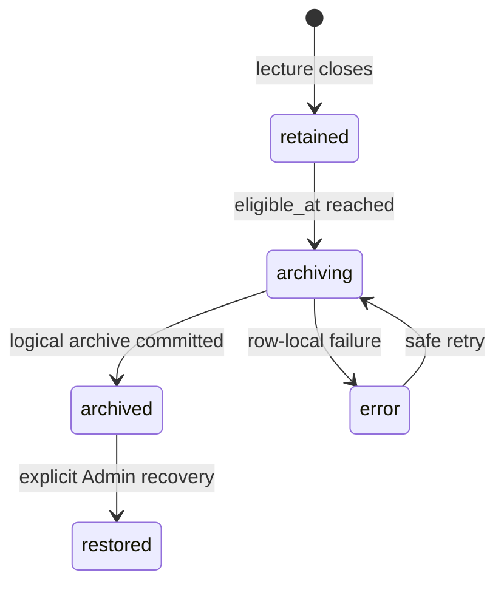
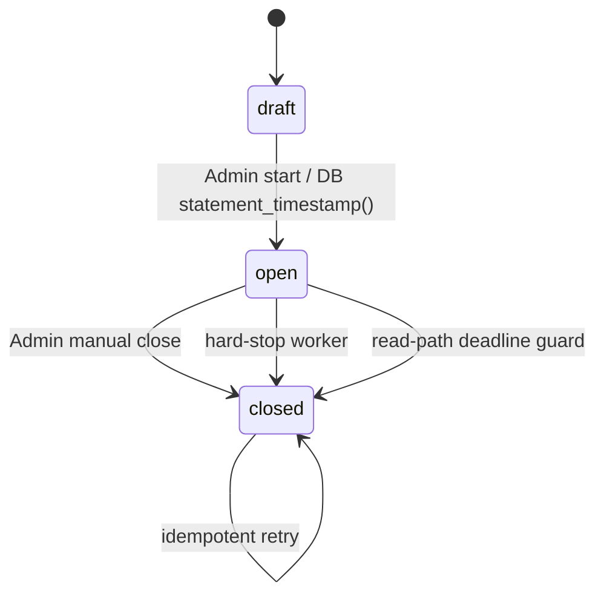
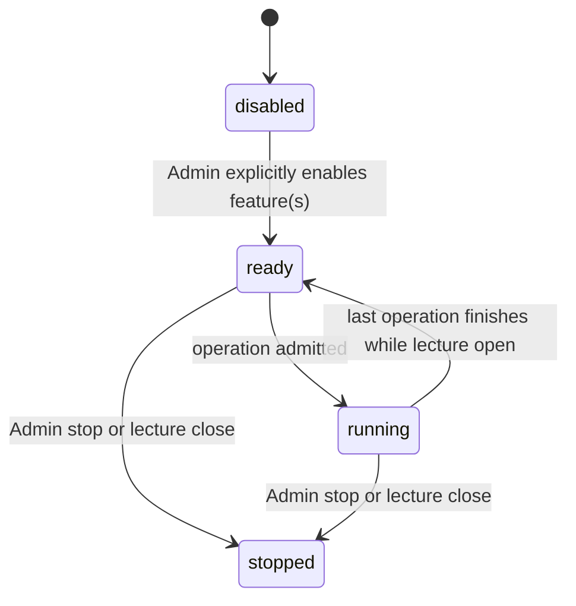

# Phase 2 — server-authoritative lecture lifecycle

Date: 2026-07-14 (JST)

Implementation scope: local only

Production/Hosted/Cloudflare state: unchanged
Client flag: `VITE_PHASE2_LECTURE_LIFECYCLE=false`

## 1. Outcome and boundaries

Phase 2 adds the server-side lifecycle foundation required before any paid AI
feature is connected:

- a canonical 90-minute deadline calculated by PostgreSQL;
- one idempotent terminal transition for manual close, deadline guard, and
  background maintenance;
- hard rejection of student/admin live writes after the deadline;
- content-free AI admission, usage reservation, concurrency, and stop state;
- a 30-day member preview followed by reversible logical archival;
- client convergence that stops polling and ignores requests completed after
  close.

Phase 2 does **not** enable or call OpenAI, store any API credential, enable
`pg_cron` on Hosted, schedule a production job, deploy an Edge Function, change
Cloudflare, publish the Web app, enable a feature flag, or physically delete
lecture content.

The pre-implementation audit and code evidence are in
`docs/PHASE2_REQUIREMENTS_MATRIX.md`.

## 2. Data model

### 2.1 Canonical lecture fields

`lecture_sessions` is expanded with:

| Field | Meaning |
| --- | --- |
| `started_at` | DB time at the successful draft-to-open transition |
| `hard_stop_at` | immutable upper bound, at most `started_at + 90 minutes` |
| `closed_at` | logical terminal time; deadline closes use `hard_stop_at` |
| `close_reason` | `manual`, `hard_stop`, `deadline_guard`, `legacy`, or `system` |
| `close_actor_type` | `admin`, worker/guard, migration, or system |
| `close_actor_id` | bounded audit label; currently `admin-session` for Admin actions |
| `archive_expires_at` | exactly `closed_at + 30 days` |
| `lifecycle_version` | monotonic lifecycle transition version |

`starts_at` and `ends_at` remain available for old clients. For a Phase 2 start,
they project `started_at` and `hard_stop_at`. A caller-provided `transition_at`
argument remains in the old Admin RPC signature but is deliberately ignored.

A compatibility trigger safely fills lifecycle fields for trusted old writers
which insert an already-open row. Even that path cannot set a deadline more than
90 minutes after its start.

### 2.2 Audit and archive state

`lecture_lifecycle_events` is append-only from the browser perspective. The
unique `(lecture_session_id, event_key)` constraint guarantees one start, close,
and archive event when an operation is retried.

`lecture_archive_state` separates retention processing from the lecture status:



`restored` is an operational recovery hold. It does not reopen the lecture or
restore student access after the 30-day boundary.

### 2.3 AI control and usage ledger

`lecture_ai_control` has one row per lecture and contains only control and usage
numbers. `ai_usage_ledger` contains one row per attempted provider operation,
with no prompt, transcript, PDF text, answer, or key.

Both tables have RLS enabled, no browser policy, no `anon`/`authenticated` table
grant, and explicit service-role read access for protected Edge code.

## 3. Lecture state transitions



### Start

The row is locked. Only `draft` can become `open`. The same DB statement sets:

- `started_at = statement_timestamp()`;
- `hard_stop_at = started_at + 90 minutes`;
- compatibility `starts_at`/`ends_at`;
- a start audit event;
- the AI control hard stop.

The Edge/browser clock is not consulted.

### Unified close

`private.close_lecture_core` locks the lecture row and performs one transaction:

1. persist terminal status, reason, actor, effective close time, and 30-day expiry;
2. close every open Poll for that lecture;
3. cancel running AI ledger entries and mark them non-publishable;
4. stop the AI control row and clear its active count;
5. create/update the retained archive state;
6. append the unique close audit event;
7. let the existing lecture trigger increment Phase 1 live versions.

If another request already closed the row, the function returns the persisted
terminal state with `changed=false`. It does not rewrite the first reason/actor,
duplicate events, or repeat side effects. The compatibility Admin RPC treats an
already-closed target as an idempotent success.

Manual and automatic close therefore serialize on the same row lock. Whichever
valid transition holds the lock first becomes the auditable terminal reason.

### Deadline semantics

Effective open means:

```text
status = open
AND started_at <= DB statement time
AND hard_stop_at > DB statement time
```

At exact equality the lecture is closed for authorization purposes. A deadline
worker may persist the transition milliseconds later, but no guarded mutation
can use that gap.

## 4. Independent failure layers

| Failure | Remaining protection |
| --- | --- |
| Teacher closes the browser | minute maintenance closes the lecture |
| Maintenance/Cron is delayed or stopped | RLS and every live mutation RPC use effective-open checks; writes and AI starts fail |
| Both browser and Cron are stopped | no client can write; the indexed worker closes the row when service resumes |
| Manual and automatic close race | row lock plus idempotent unified transition |
| Snapshot observes an expired stored-open row | private deadline guard reconciles it before returning data |
| Cron already closed a non-member Admin/display session | minimal terminal-state fallback returns no comments/private data and stops polling |
| Network response completes after client learned of close | lifecycle epoch discards the response; optimistic pending comments are removed |
| AI provider completes after close | ledger result remains cancelled/discarded and `result_accepted=false` |
| Archive row fails | per-row subtransaction records `error`; no child row or FK is deleted; next run retries |
| Archive worker is run twice | eligible status filter and unique archive event make the second run a no-op |

## 5. Mutation enforcement

### Student paths

Phase 0 ownership is preserved:

- comment insert: owned participant plus effective-open lecture;
- like insert: owned participant, visible same-lecture comment, effective-open lecture;
- Poll response: owned participant, same-lecture open Poll, effective-open lecture.

The caller role alone never grants ownership. The predicate still derives the
participant from `auth.uid()`.

### Admin/server paths

- PDF/display changes allow draft preparation or an effectively open lecture;
- Poll creation allows draft preparation or an effectively open lecture;
- opening a Poll requires an effectively open lecture;
- AI admission requires an effectively open lecture;
- closed/overdue live writes return no changed row or a controlled rejection.

Public RPCs remain `SECURITY INVOKER`. Internal mutating primitives are in
`private`, use `SECURITY DEFINER`, fix `search_path = ''`, schema-qualify every
object, and have minimal execute grants.

## 6. AI admission and usage specification

### 6.1 Control state



Stopping is always allowed by the protected Admin route. Starting a later paid
provider operation will additionally require the Phase 4 billing-PIN grant; no
billing authorization is invented in Phase 2.

### 6.2 Admission order

The control row is locked and checked consistently:

1. lecture exists and is effectively open;
2. idempotency key is new, or the exact existing operation is returned;
3. control is `ready`/`running`;
4. requested feature was explicitly enabled;
5. active operations are below the concurrency limit;
6. reserved micro-USD, audio seconds, input tokens, and output tokens fit limits;
7. feature call count fits its hard limit.

Default ceilings are deliberately conservative and can only be changed by the
protected Admin RPC:

- 2,500,000 micro-USD (`$2.50`) budget;
- 5,400 audio seconds;
- 200,000 input and 30,000 output tokens;
- 18 summaries;
- 1 material analysis;
- 5 Poll-suggestion calls;
- 3 academic answers;
- 1 concurrent operation.

Reservations are charged conservatively when admitted and are not refunded on
failure. If actual usage exceeds a reservation, the positive difference is
added. This can overstate spend but cannot create a false remaining budget.
Later provider integration must reserve a worst-case amount before making the
external request.

### 6.3 Failure and late results

- same idempotency key: return the existing operation without double usage;
- limit/concurrency/feature rejection: create no ledger row and reserve no usage;
- explicit stop/lecture close: cancel every running ledger row;
- successful completion after terminal state: record as discarded/non-accepted;
- provider failure: finish the ledger as failed; reservation remains consumed;
- Phase 2 never stores generated content in the ledger.

The local `manage-ai-control` Edge Function is an Admin-token protected control
surface only. It reads the service-role key from Edge secrets and never returns
that key. It does not import or call an OpenAI SDK.

## 7. Thirty-day archive contract

### Retention origin

The clock starts at canonical `closed_at`, including the logical hard-stop time
when a worker detects expiry late. Student/member preview is allowed only while:

```text
lecture.status = closed
AND DB statement time < archive_expires_at
AND participants.auth_user_id = auth.uid()
```

At exact 30-day equality, access ends.

### Preview payload

`get_lecture_archive_v2` is a one-shot authenticated RPC containing:

- lecture terminal metadata;
- up to 500 newest visible public comments and aggregate like counts;
- current PDF document/page/display metadata only;
- a summaries array (empty until a later summary-table expand migration).

It excludes participant IDs, participant Poll responses, personal likes,
private drafts, admin codes, AI ledger records, prompts, and transcript data.
`comments_has_more` makes the response cap explicit.

### Logical archive, restoration, and deletion

At 30 days the worker marks the row `archived` but deletes nothing. This is the
recoverable Phase 2 step. Admin restoration marks it `restored` and places it on
hold; it does not reopen the lecture or student preview.

Physical deletion is out of Phase 2. A later approved retention workflow must:

1. export/verify the intended local review artifact;
2. apply the Cloudflare/R2 37-day policy and manifest cleanup;
3. delete dependent Supabase content in an explicit FK-safe order;
4. retain only approved content-free audit metadata;
5. provide a dry-run, item count, recovery window, and separate authorization.

## 8. Client behavior

Phase 1 foreground polling remains one shared snapshot every five seconds. Phase
2 adds no Realtime subscription and no per-student maintenance request.

When a terminal snapshot is received, the client:

- persists the closed lecture metadata;
- changes the sync pause reason to `lectureClosed`;
- disables comment/like/Poll actions;
- stops adaptive polling through its existing `enabled=false` cleanup;
- removes pending optimistic comments;
- increments a lifecycle epoch so late send completions are ignored;
- performs at most one member archive fetch when the Phase 2 flag is enabled.

The optional deadline wake-up uses the last DB `server_time` and
`performance.now()` rather than `Date.now()`. Its only action is to request an
authoritative snapshot. Five-second polling and server guards remain the safety
mechanisms if that timer is throttled or absent.

## 9. Background maintenance and production scheduling

The migration installs, but does not schedule:

```sql
select private.run_lecture_lifecycle_maintenance(50, 25);
```

It runs two indexed, bounded, `FOR UPDATE SKIP LOCKED` batches: overdue open
lectures and due archive rows. A one-minute job is sufficient; it adds one DB
request per minute regardless of 20 or 300 students.

At Phase 6 production rollout, after extension and ownership checks, schedule a
database function call rather than editing `cron.job` directly. The intended
shape is:

```sql
select cron.schedule(
  'compass-phase2-lifecycle-minute',
  '* * * * *',
  $$select private.run_lecture_lifecycle_maintenance(50, 25);$$
);
```

Before doing so, inspect for an existing job with the same purpose, record the
job ID/owner, run the maintenance function manually on an empty due set, and
verify `cron.job_run_details`. This scheduling action was **not** run locally or
against Hosted in Phase 2.

## 10. Migration and rollback strategy

### Apply order at Phase 6

1. back up and record rollback thresholds;
2. confirm Phase 0/1 production gates and Phase 1 flag OFF;
3. apply `20260714080706_phase2_lecture_lifecycle.sql`;
4. run DB lint, Advisor, grants, RLS, and function-security checks;
5. verify old v1/v2 RPC calls while both client flags remain OFF;
6. deploy protected Edge Functions;
7. deploy frontend with Phase 1/2 flags still OFF;
8. enable/schedule Cron and inspect initial job runs;
9. run two-user ownership and deadline canary tests;
10. enable flags only in the later coordinated rollout approved after Phase 6.

### Failure rollback

The migration is transactional. A migration-time error rolls back the entire
file. After successful apply, rollback is roll-forward:

- keep both feature flags OFF;
- revert Edge/frontend artifacts if needed;
- unschedule only the recorded Phase 2 Cron job;
- leave additive columns/tables/RPCs in place for old-client compatibility;
- preserve deadline/RLS enforcement unless a separately reviewed security
  migration replaces it.

Dropping lifecycle columns/tables is not an operational rollback because it can
lose audit/usage state and re-enable expired writes. No down migration is
provided.

## 11. Cost and load characteristics

For both modeled sizes, Phase 2 adds zero student requests during the 90-minute
lecture. Maintenance is 90 calls total (0.0167 requests/second). At most one
archive preview is fetched per returning member; it is not polled. No new
Realtime subscription/publication is added.

The close path is constant per lecture plus indexed updates to that lecture's
open Polls and running AI operations. Deadline and archive scans use partial
indexes and bounded batches. The Phase 1 snapshot request counts remain 21,600
for 20 students and 324,000 for 300 students.

## 12. Open production decisions

1. The current Admin token identifies an Admin session, not an individual
   teacher account. `close_actor_id='admin-session'` is adequate for the present
   single-Admin MVP but must be accepted or replaced before the production gate.
2. Hosted `pg_cron` availability, job owner, and duplicate-job policy must be
   confirmed during Phase 6; no migration assumes the extension exists.
3. AI default budgets are control defaults, not pricing approval. Phase 4 must
   validate them against current official model pricing and add billing PIN.
4. The later summary table must extend the archive payload without exposing
   drafts or participant-private data.
5. Cloudflare PDF access expiry/37-day deletion is Phase 3/8 work and remains
   outside this database migration.
6. Physical Supabase deletion requires a separately approved data-retention and
   recovery design.
