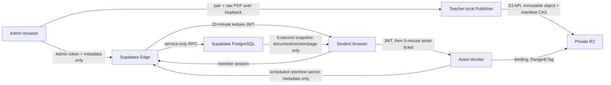

# Phase 3 private PDF delivery design

Date: 2026-07-14 (JST)

Status: local implementation complete; production rollout is deferred until the
Phase 6 production gate. No hosted Supabase setting, Cloudflare resource,
public Web deployment, feature flag or remote migration was changed in Phase 3.

## Outcome and responsibility boundary

Phase 3 removes future lecture PDF bytes from the Supabase and main-Web deploy
paths. Supabase remains the authority for lecture membership, lifecycle and the
small synchronized display pointer. A loopback Publisher validates and uploads
bytes to private R2. A Worker authorizes and streams those bytes. PDF text is
kept only on the teacher computer for later review/AI preparation.

| Data or operation                  | Authoritative location                                       | Explicitly excluded from                                   |
| ---------------------------------- | ------------------------------------------------------------ | ---------------------------------------------------------- |
| Lecture/member ownership           | Supabase PostgreSQL                                          | R2 manifest and browser claims                             |
| PDF bytes                          | Private R2                                                   | Supabase Storage/DB/Edge, Pages build, browser persistence |
| Extracted page text                | Teacher-local Publisher directory                            | R2, Worker, Supabase, public Web                           |
| PDF metadata and live page pointer | Supabase PostgreSQL                                          | Realtime row stream and PDF object body                    |
| Private object key and hashes      | Private R2 manifest; hashes also in service-only DB metadata | Public manifest and student live state                     |
| R2 write credentials               | Publisher process environment/OS secret launcher             | Vite, browser, Git, Supabase and Worker response           |
| Lecture JWT signing key            | Supabase Edge secret                                         | browser, Publisher and Worker                              |
| Asset-ticket HMAC key              | Worker secret                                                | browser source, Publisher and Supabase                     |

The Worker validates the short lecture JWT locally and does not query Supabase
for each manifest, ticket or byte range. R2 binding reads support ranged access
and `httpEtag`; R2 conditional writes return no object on a failed condition.
These contracts match Cloudflare's current Workers API documentation. R2 is
strongly consistent for reads, writes, deletes and listings, so a successful
manifest CAS is immediately authoritative.

## Feature gate

`VITE_PHASE3_PRIVATE_PDF=false` is the committed default. With the flag off:

- the Publisher is never contacted;
- existing fixed assets and old PDF RPC signatures continue to work;
- no new Worker token or manifest request is made;
- Phase 0 ownership, Phase 1 polling and Phase 2 lifecycle behavior are
  unchanged.

The flag is build-time and must remain off in every public build until the
Phase 6 rollout sequence and canary have passed.

## Upload and publication state machine

1. Admin is already authenticated by Supabase and the existing Admin token.
2. The browser checks `http://127.0.0.1:43123/v1/health` and exchanges the
   process-displayed one-time eight-digit code for an in-memory session.
3. The Edge function issues an admin-scoped, ten-minute ES256 lecture JWT after
   the existing Admin-token check. No R2 credential is returned.
4. Browser sends the raw PDF only to the loopback Publisher. The Publisher
   checks exact `Host`, allowlisted `Origin`, method, MIME and body size before
   reading/parsing the body, then verifies the lecture JWT.
5. The Publisher validates the PDF and writes page-preserving text locally.
6. The PDF is stored under
   `pdf/{lecturePublicId}/{documentId}/{sha256}.pdf` with create-only semantics.
   A HEAD plus complete re-read verifies byte count and SHA-256 metadata.
7. The private manifest is updated using its observed ETag (`If-Match`) or
   create-only (`If-None-Match`). A CAS conflict leaves the prior manifest
   authoritative.
8. Only after manifest success does the browser register bounded metadata
   through `manage-pdf-documents` and the service-only invoker RPC.
9. Publication does not automatically change the live document. Admin reviews
   the new entry and explicitly selects “この資料を表示”.

The browser retains the generated document ID while a publication attempt is
pending. If R2 succeeds but metadata registration fails, retry uses the same ID
and content hash. It cannot accidentally create a second visible document.

### Authoritative validation

The Publisher rejects before publication when any rule fails:

- filename does not end in `.pdf`, MIME is not `application/pdf`, or `%PDF-`
  magic is absent;
- the aggregate visible material exceeds 15 MiB, 75 pages or 20,000 extracted
  characters;
- PDF.js reports encrypted/password-protected or corrupt input;
- no embedded text layer exists.

Only `getTextContent()` is used. No page render, canvas, image analysis or OCR
path exists. Extracted text is normalized by page and stored with PDF, text and
page-excerpt SHA-256 identifiers. The upload UI explains the cost/size limit and
recommends compression.

## Publisher security

- Binds to `127.0.0.1`, never `0.0.0.0`.
- Requires exact expected `Host` and allowlisted `Origin`; rejects before body
  consumption.
- Pairing code is one-time, short-lived, compared in constant time and becomes
  invalid on first use. Session tokens are random, short-lived, Origin-bound
  and memory-only; process restart revokes all of them.
- Enforces `Content-Length` and streaming byte ceilings; malformed JSON and
  encoded filenames fail closed.
- R2 mode reads bucket-scoped Object Read & Write credentials only from process
  environment. The committed example contains placeholders only.
- Filesystem object storage is the local-test default. Production R2 mode must
  be launched through an OS secret provider. Windows Credential Manager
  launcher integration remains a production-gate task.

## Manifest and access protocol

The private schema-version-1 manifest contains the lecture public ID, monotonic
manifest/access versions and documents with immutable content version, object
key, size, pages, text count, permissions and retention timestamps. Every read
parses and revalidates aggregate limits and identifiers.

The public manifest strips object keys and PDF/text hashes. A student flow is:

1. Authenticated browser invokes `issue-pdf-access-token` as `member`.
2. The private PostgreSQL function checks `auth.uid()` participant ownership,
   closes an expired lecture if required, and permits only open or retained
   (less than 30-day) lectures.
3. Edge signs an ES256 token scoped to lecture public ID, access version,
   observed manifest version, issuer, audience and the earlier of ten minutes
   or archive expiry.
4. Worker verifies the signature/claims locally, requires lecture and access
   version match, and rejects a manifest older than the DB-observed version.
5. Worker mints a five-minute HMAC ticket scoped to lecture, document, content
   version and inline/download mode.
6. Every asset request rechecks ticket, current manifest, access version,
   document expiry and download permission, then streams via the private R2
   binding with Range, ETag and safe Content-Disposition headers.

Tickets and lecture tokens are bearer credentials. They are never application
logged and are kept out of local/session storage. A 401 causes one session
refresh; a stale manifest causes a visible retry state rather than falling back
to an unprotected URL.

PDF.js uses 1 MiB range chunks. A maximum-size 15 MiB material therefore needs
roughly 15–16 asset requests instead of the library's much smaller default
chunks, materially reducing Worker and R2 operation counts without loading PDF
bytes into Supabase.

## PostgreSQL design and compatibility

Migration `20260714104032_phase3_private_pdf_delivery.sql` is expand-first.

### Added state

- `lecture_sessions.pdf_public_id`: random, non-null, unique opaque ID.
- `lecture_sessions.pdf_access_version`: revocation/version counter.
- `lecture_live_state.pdf_document_version`, `pdf_manifest_version`,
  `pdf_page_count`, `pdf_visible`: bounded pointer fields only.
- `lecture_pdf_documents`: service-only metadata table; no PDF or text body.

`lecture_pdf_documents` has RLS enabled, explicit revoke from `public`, `anon`
and `authenticated`, and only service-role select/insert/update grants. It has
composite primary/foreign keys, a unique visible version per document, manifest
lookup index and retention index. No table is added to Realtime.

### RPCs and authorization

- `admin_register_pdf_document`: `SECURITY INVOKER`; callable only by
  `service_role`; validates lecture state, scalar and aggregate limits,
  immutable metadata, monotonic manifest version and idempotent retry.
- `admin_update_pdf_display_v3`: `SECURITY INVOKER`; service-only; accepts only
  a registered visible version and authoritative page bounds; draft/open only;
  no-op input does not bump versions.
- public PDF-claim wrappers: `SECURITY INVOKER`; the unavoidable private claim
  function is `SECURITY DEFINER`, fixed `search_path=''`, explicitly checks
  `auth.uid()` and participant ownership, and is not executable by clients.
- admin PDF claims are service-only and reuse the existing Admin Edge boundary.

The Phase 2 public snapshot/live/archive functions were preserved as private
cores and wrapped to add fields. Old public names and argument lists remain.
The old PDF update RPC routes registered Phase 3 documents to v3 and preserves
legacy static IDs. It does not write any metadata if the Phase 2 core rejects a
closed lecture. Existing legacy selections are backfilled with known page
counts, null content version and manifest version zero.

## Live-state and student UX

Only document ID/version, manifest version, authoritative page count, visibility
and page number travel in the existing five-second Phase 1 snapshot. Page
navigation remains a small DB no-op-aware write; PDF bytes never enter that
poll. The viewer resolves a runtime document only when the selected version
changes, obtains a short ticket, follows page changes, and offers:

- a clear loading/retry state without breaking comments or Polls;
- protected download only when the teacher enabled it;
- current page/total pages from registered metadata;
- a legacy static fallback while Phase 3 is off.

A newly uploaded PDF is never forced onto students. The teacher first reviews
the publication and explicitly activates it, avoiding disruptive or low-value
material changes.

## Thirty-day access and day-37 deletion

Phase 2 `closed_at` remains the only retention origin:

- `archive_expires_at = closed_at + 30 days`: Worker and token issuer reject at
  the exact boundary even if cleanup is down.
- `delete_after = archive_expires_at + 7 days`: recoverability buffer; physical
  R2 deletion is eligible at day 37.

Closing a lecture propagates canonical timestamps to PDF metadata. The Worker
scheduled handler first calls `get-pdf-retention-feed`. This machine-to-machine
Edge function deliberately disables Supabase JWT verification and instead
requires a separate, timing-safe-compared secret of at least 32 bytes. It uses
the service role only inside Edge and returns bounded metadata pages—never PDF
bytes, extracted text, participant data or object keys. The Worker applies exact
canonical timestamps to matching manifest versions using ETag CAS. Repeating
the feed is a no-op.

After reconciliation, cleanup is bounded, idempotent and replayable:

1. write a durable `cleanup-pending` intent;
2. remove due manifest entries using ETag CAS;
3. on CAS conflict, remove the intent and keep the object;
4. after CAS, delete the now-unreferenced object, write a content-free audit and
   remove the intent;
5. on a later run, process pending intents first and delete only after confirming
   the current manifest no longer references the exact object/version.

An interruption can leave an unreachable orphan, but cannot leave an accessible
manifest pointing to deleted bytes. The local code contains the scheduled
handler, but no production Cron Trigger or bucket lifecycle rule was created.
The Publisher consumes the same metadata-only feed hourly, updates matching
local extraction records and deletes them at the exact `delete_after` boundary.
R2 mode refuses to start without a configured feed URL and 32-byte secret, so a
production Publisher cannot silently retain extracted text forever.

## Failure behavior

| Failure point                                         | Observable result                                                  | Recovery                                    |
| ----------------------------------------------------- | ------------------------------------------------------------------ | ------------------------------------------- |
| Publisher absent/pairing expired                      | Admin-only connection guidance                                     | Start/pair again; lecture/comments continue |
| Validation fails                                      | Specific safe reason; no R2 write                                  | Compress/fix text layer/PDF and retry       |
| Immutable object upload fails                         | Old manifest/live PDF remains                                      | Retry same draft ID                         |
| Manifest CAS conflicts                                | 409-equivalent failure; old manifest remains                       | Reload metadata and retry                   |
| DB metadata registration fails after manifest success | Published but not live/selectable                                  | Retry same draft ID idempotently            |
| Worker/R2 outage                                      | PDF retry UI; comments/Polls remain usable                         | Retry; no public/static bypass              |
| Lecture token expires                                 | One silent refresh, then explicit failure                          | Rejoin/re-authenticate if ownership expired |
| Lecture closes                                        | New tokens, posts and display writes rejected; archive access only | Existing Phase 2 terminal convergence       |
| Cleanup CAS conflicts                                 | Object and manifest both remain                                    | Later scheduled run                         |
| Cleanup stops after manifest CAS                      | Pending intent and unreachable object remain                       | Next run verifies reference and completes   |

## Cost and load model

The executable model covers a 90-minute lecture, three material versions and 60
teacher page changes.

| Scenario     | Added Supabase token invocations | Metadata writes | Live writes | Worker requests | R2 PDF reads | Supabase PDF bytes |
| ------------ | -------------------------------: | --------------: | ----------: | --------------: | -----------: | -----------------: |
| 20 students  |                               60 |               3 |          63 |           1,080 |          960 |                  0 |
| 300 students |                              900 |               3 |          63 |          16,200 |       14,400 |                  0 |

The existing five-second polling remains 21,600/324,000 requests respectively;
Phase 3 adds no Realtime subscription and no extra student poll. For the
300-person weekly case, the modeled 16,200 Worker requests are below the current
Workers Free limit of 100,000 requests/day. R2 Standard currently includes 10 GB
storage, one million Class A and ten million Class B monthly operations, with
free Internet egress. These prices/limits were checked on 2026-07-14 and must be
rechecked at the production gate. The model is deliberately request-based;
actual browser Range traces must be captured during the 20-person canary.
The model also budgets four retention-feed Edge invocations during a 90-minute
lecture (Worker plus one teacher Publisher); that fixed background cost does not
scale with student count.

## Migration and rollback policy

Clean reset and Phase-2-data upgrade are both required gates. Migration order is
Phase 0, Phase 1, Phase 2, then Phase 3. The migration does not drop old RPCs,
columns, catalogs or assets.

Before any production use, rollback is simply: keep Phase 3 flag off, do not
route traffic to the Worker, and leave additive schema idle. After the first
publication, do not run a destructive down migration. Roll back the client flag
and Worker route, preserve private objects/metadata, and repair forward. A later
contract migration may remove legacy fields/assets only after the retention and
compatibility window.

## Deferred production sequence after Phase 6

1. Recheck current Cloudflare/Supabase pricing and limits; take DB backup and R2
   inventory; record rollback thresholds.
2. Create a private **R2 Standard** bucket. Do not enable public bucket access.
3. Create a bucket-scoped Object Read & Write token for the teacher Publisher;
   install it through the approved OS secret launcher.
4. Generate an ES256 key pair and a random Worker HMAC secret. Put only the
   private JWK in Supabase Edge secrets; put only public JWK/HMAC in Worker
   configuration. Record rotation owners.
5. Apply the expand migration, run Advisor/DB lint and two-user ownership tests.
6. Deploy Edge functions and Worker with exact production origins, private R2
   binding, fail-closed routing, CPU limits and no Cron initially.
7. Deploy the frontend with Phase 3 still off; verify old clients and Phase 1/2.
8. Run Admin/member/unrelated-user canary, Range/CORS/download/expiry tests and
   verify logs contain no token query strings.
9. Enable only for a 20-person lecture. Monitor Worker requests, R2 Class A/B,
   Edge invocations, RPC failures, manifest conflicts and PDF load latency.
10. Expand to the 300-person condition only after measured request counts fit
    the budget. Enable bounded Cron after deletion inventory/dry-run approval.

## Remaining production-gate decisions

- Windows Credential Manager/approved secret-launcher implementation.
- Worker custom domain versus `workers.dev`, fail-closed route and log redaction.
- Key rotation/revocation runbook and whether `pdf_access_version` is exposed as
  an Admin emergency control.
- Hosted R2 CORS/Range verification and actual PDF.js request trace.
- Cron owner, alert, maximum deletion batch, inventory/dry-run and restore drill.
- Hosted retention-feed secret rotation, exact Cron cadence and hard-stop/manual
  close reconciliation observation. The code and local retry tests exist, but
  production archive access must remain off until the hosted Cron canary passes.
- Legal/teaching policy for download-disabled PDFs and day-37 destruction.

## Reference basis

- Cloudflare R2 Workers API and conditional operations:
  <https://developers.cloudflare.com/r2/api/workers/workers-api-reference/>
- Cloudflare R2 S3 compatibility:
  <https://developers.cloudflare.com/r2/api/s3/api/>
- Cloudflare R2 consistency:
  <https://developers.cloudflare.com/r2/reference/consistency/>
- Cloudflare R2 pricing:
  <https://developers.cloudflare.com/r2/pricing/>
- Cloudflare Workers pricing and limits:
  <https://developers.cloudflare.com/workers/platform/pricing/>
- Supabase migration workflow:
  <https://supabase.com/docs/guides/deployment/database-migrations>
- Supabase API/RLS/grant guidance:
  <https://supabase.com/docs/guides/api/securing-your-api>
