# Phase 4 billing gate and Realtime caption design

Date: 2026-07-15 (JST)

Status: local implementation complete; production rollout is deferred until the
combined Phase 6 production gate. All committed feature flags are OFF.

## Outcome

Phase 4 introduces the paid-API control plane and the first paid feature:
OpenAI Realtime transcription. It deliberately separates three experiences:

1. the teacher sees low-latency partial text on the local Admin screen;
2. a same-device classroom display receives local deltas over
   `BroadcastChannel`, without Supabase;
3. students receive only completed, bounded text through the existing
   five-second live snapshot.

The selected transcription model is `gpt-realtime-whisper`. The official model
page listed audio input at **$0.017/minute** on 2026-07-15. A full 90-minute
lecture is therefore about **$1.53**, below the existing $2.50 lecture budget.
The server stores the model and price snapshot with each operation. Price and
availability must be rechecked at the Phase 6 gate. Model selection for Phase 5
summaries is intentionally not decided here.

### Local validation boundary

The local gate verified the complete browser/DB control flow, mocked WebRTC
events and one real OpenAI client-secret issuance. The real request used the
ignored standard key only inside the local Edge runtime, returned an ephemeral
secret, created no WebRTC connection and sent no microphone audio. The
developer explicitly deferred the real microphone/WebRTC canary to a later
phase, so live audio accuracy, vocabulary and latency are rollout measurements,
not unresolved Phase 4 implementation work.

## Start, run and stop protocol

```mermaid
stateDiagram-v2
  [*] --> Off
  Off --> Authorizing: Admin enters separate billing PIN
  Authorizing --> Locked: fifth failed attempt
  Authorizing --> Granted: success / two-minute one-use grant
  Granted --> Reserved: atomic consume + DB admission
  Reserved --> Connecting: Edge mints ephemeral Realtime secret
  Connecting --> Running: WebRTC connected
  Running --> Running: 4s commit / 5s completed-window publish / 15s heartbeat
  Running --> Stopping: Admin stop, close, deadline, network or provider failure
  Stopping --> Off: local tracks closed + idempotent server finish
  Connecting --> Error: failure refunds reservation
  Running --> Error: fail closed; no automatic reconnect
  Error --> Authorizing: explicit restart requires PIN again
```

### Authorization

- `ADMIN_PIN` authenticates the Admin session; `BILLING_PIN` authorizes paid
  starts and must be a different secret.
- A successful attempt creates a random nonce. PostgreSQL stores only its
  SHA-256 hash, exact action list, lecture, Admin session actor and expiry.
- The raw `grantId.nonce` is returned once to that Admin browser. It expires at
  the earlier of two minutes or lecture hard stop.
- Grant consumption locks the row and atomically enables exact actions, calls
  the existing Phase 2 admission primitive, reserves use and marks the grant
  consumed. Retry cannot create another operation.
- The existing ungranted `startOperation` Edge route now rejects paid starts.
  Configuration may turn features off but cannot turn an `*_enabled` field on.

### Realtime connection

- Only `issue-realtime-client-secret` reads the standard `OPENAI_API_KEY`.
- After DB admission it requests a transcription client secret from
  `/v1/realtime/client_secrets`, sending a hashed safety identifier.
- The browser uses only the ephemeral value to POST its SDP to
  `/v1/realtime/calls`; audio is 24 kHz mono PCM and turn detection is disabled.
- The client sends `input_audio_buffer.commit` every four seconds. Delta events
  update only the local view. Completed events are keyed by `item_id` and
  ordered by first-seen local sequence because completion events may arrive out
  of order.
- Failure to mint the client secret immediately cancels the reserved operation
  without charge. After a client secret is issued, the server conservatively
  meters elapsed time from issuance until stop and refunds the unused
  reservation. This prevents an untrusted client from avoiding the lecture
  budget by omitting a connection acknowledgement. Consequently, the internal
  budget ledger may be a few seconds higher than provider audio usage when
  WebRTC never connects. The no-audio provider-boundary test recorded two
  seconds / 567 microUSD in the isolated ledger while sending no audio.

### Stop and failure behavior

The client stops tracks before waiting for a network response. A manual stop
needs no PIN. Heartbeat, publish, WebRTC, network, lecture close and deadline
failures all close audio and do not reconnect. Any restart is a fresh OFF→ON
transition and needs a fresh billing PIN grant.

Unmount sends a best-effort stop after closing local tracks. If the browser or
computer disappears before that request arrives, a 45-second server heartbeat
timeout cancels the content-free operation and refunds its remaining
reservation. Grant issue/consumption invokes this bounded reaper; the same
service-only RPC is available to a production scheduled worker. Repeating it is
safe.

The authoritative server checks remain effective if the client is stale:

- Phase 2 `close_lecture_if_expired` runs before grant consumption, heartbeat
  and caption publish;
- closed/expired lectures reject new grants and writes;
- the unified close transition cancels AI operations;
- a close trigger deletes the current public caption and bumps caption version;
- finish and stop are idempotent.

## Data minimization and privacy

| Data                      | Location                                      | Retention / limit                                                       |
| ------------------------- | --------------------------------------------- | ----------------------------------------------------------------------- |
| Raw microphone audio      | live browser→OpenAI WebRTC                    | never saved by COMPASS                                                  |
| Partial/delta transcript  | Admin memory and same-device BroadcastChannel | until next event/stop                                                   |
| Completed review segments | teacher IndexedDB                             | manual delete and 30-day automatic purge                                |
| Student caption           | one PostgreSQL row per lecture                | latest changed 45-second window, max 1,000 chars; deleted on stop/close |
| Usage/accounting          | PostgreSQL service-only tables                | content-free model, price, reservation, actuals, status and timestamps  |
| Realtime token audit      | PostgreSQL service-only table                 | outcome/request ID only; no key, token, transcript or audio             |

The Admin UI shows a notice before microphone access. OpenAI states that API
data is not used for model training unless the organization opts in. Default
abuse-monitoring logs may be retained for up to 30 days; the Realtime endpoint
does not retain application state and is eligible for Zero Data Retention.
These provider settings and the institution's consent notice must be verified
before production use.

## PostgreSQL design

Migration `20260715032806_phase4_billing_and_realtime_captions.sql` is
expand-first.

### Added tables

- `ai_billing_rate_limits`: one row per lecture, failed-attempt window and
  lockout.
- `ai_billing_grants`: hashed nonce, exact scope, two-minute expiry, state and
  operation IDs.
- `lecture_public_captions`: one bounded completed window per lecture.
- `ai_realtime_token_audit`: content-free client-secret issuance audit.

`ai_usage_ledger` gains additive `model_id`, `pricing_unit`,
`pricing_rate_microusd` and `last_heartbeat_at` columns. All new tables have RLS
enabled, revoke `public`/`anon`/`authenticated`, and grant only the minimum
service-role reads required by Edge. No new table joins `supabase_realtime`.

Public admin wrappers are `SECURITY INVOKER` and executable only by
`service_role`. Private state-changing primitives are `SECURITY DEFINER`, live
in `private`, use `search_path=''`, fully qualify objects, explicitly validate
the actor/lecture and have minimum grants. The public v3 snapshot wrapper is
`SECURITY INVOKER`; its private primitive additionally requires an exact
`auth.uid()` participant membership before calling the compatible v2 core.

The old v1/v2 snapshot and Admin/AI RPC signatures remain. With the Phase 4
flag OFF, the client continues to call v2. With it ON, only the snapshot name
changes to v3; the polling cadence and version-vector protocol are unchanged.

## Client data flow and UX

- Admin PIN and billing PIN fields are separate. Billing PIN remains component
  memory, uses a password input and is cleared after every attempt.
- The local preview identifies itself as teacher-only. It shows partial text
  immediately and exposes explicit stop, TXT/JSONL export and local delete.
- Same-device display prefers BroadcastChannel text and falls back to the
  bounded snapshot.
- Student view never receives deltas. It displays the completed caption window
  in the existing learning-support area and offers “字幕を隠す”. Empty or
  low-value content is not forced into view.
- Only changed caption windows call the Edge publish route. An identical publish
  is also a DB no-op and does not bump the version.

## Cost and load model

Worst case assumes a full 90-minute run, four-second audio commits, changed
captions every five seconds and heartbeats every 15 seconds.

| Scenario         | Existing five-second student snapshots | Added caption writes | Heartbeats | Billing/secret calls | New Realtime subscriptions |
| ---------------- | -------------------------------------: | -------------------: | ---------: | -------------------: | -------------------------: |
| Free MVP / 20    |                                 21,600 |        at most 1,080 |        360 |                    2 |                          0 |
| Pro target / 300 |                                324,000 |        at most 1,080 |        360 |                    2 |                          0 |

The teacher-side Edge/DB load is independent of student count. Caption payload
is at most 1,000 characters and only one row is retained. Phase 4 adds no
student RPC, no Realtime database subscription and no audio/transcript object
storage. Actual Edge invocation quotas and observed publish-change frequency
must be checked in the 20-person canary.

## Migration and rollback

Clean Phase 0→4 reset and Phase-3-data upgrade are required. The upgrade adds
objects/columns only and preserves existing lectures, participants, comments,
Phase 1/2 RPCs and Phase 3 metadata.

Before activation, rollback is to keep both Phase 4 flags OFF; additive schema
may remain idle. After a canary start, disable the frontend flag and Edge flag,
stop active operations, preserve the usage/audit rows and repair forward. Do
not drop accounting/grant rows or run a destructive down migration. If the
standard key or billing PIN is exposed, disable the Edge flag, stop operations,
rotate the affected secret and invalidate Admin sessions before re-enabling.

## Deferred production sequence after Phase 6

1. Recheck model availability/price, API project limits, Supabase Edge limits
   and privacy/ZDR settings; take a DB backup and define rollback thresholds.
2. Apply Phase 0→4 migrations in expand-first order with every feature flag OFF.
3. Run hosted Advisor and two-user participant separation, grant replay,
   closed-lecture and old-client v2 tests.
4. Deploy Edge functions with flags OFF. Add `OPENAI_API_KEY`, a distinct strong
   `BILLING_PIN`, model and price as hosted Edge secrets/config; never as Vite
   variables.
5. Deploy the frontend with `VITE_PHASE4_REALTIME_CAPTIONS=false`; verify no
   paid endpoint is invoked.
6. Enable the server flag for an isolated test project, then enable the client
   flag for a teacher-only microphone/caption smoke test with an explicit cost
   budget.
7. Run a 20-person lecture and monitor connection failures, Edge 429/5xx,
   heartbeat/publish counts, DB version bumps, close-to-audio-stop latency and
   actual OpenAI usage.
8. Expand toward 300 only if measured cost/load and privacy observations pass.

Before that hosted sequence, re-evaluate Supabase's publishable/secret API-key
migration. The current Edge implementation uses the legacy
`SUPABASE_SERVICE_ROLE_KEY`, which remains server-only and must never enter a
browser bundle. Any key-model migration belongs to the Phase 6 expand-first
rollout and must preserve the existing Admin-token and RLS checks.

## Reference basis

- OpenAI Realtime transcription:
  <https://developers.openai.com/api/docs/guides/realtime-transcription>
- OpenAI Realtime WebRTC:
  <https://developers.openai.com/api/docs/guides/realtime-webrtc>
- `gpt-realtime-whisper` model and price:
  <https://developers.openai.com/api/docs/models/gpt-realtime-whisper>
- OpenAI API data controls:
  <https://developers.openai.com/api/docs/guides/your-data>
- Supabase Edge secrets:
  <https://supabase.com/docs/guides/functions/secrets>
- Supabase API/RLS hardening:
  <https://supabase.com/docs/guides/api/securing-your-api>
- Supabase publishable/secret API-key migration:
  <https://supabase.com/docs/guides/getting-started/migrating-to-new-api-keys>
