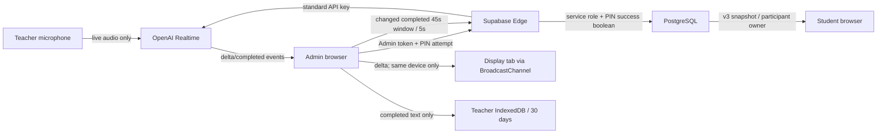

# Phase 4 requirements matrix and threat model

Date: 2026-07-15 (JST)

Status: local implementation. Production Supabase, hosted Edge secrets,
Cloudflare, public Web and feature flags remain unchanged.

## Requirements correspondence

| Requirement                                                  | Local implementation                                                                                                                             | Gate evidence                                                       |
| ------------------------------------------------------------ | ------------------------------------------------------------------------------------------------------------------------------------------------ | ------------------------------------------------------------------- |
| Separate billing authorization for every paid OFF→ON/restart | `authorize-ai-start` verifies server-only `BILLING_PIN`; a two-minute, one-use grant is scoped to lecture, Admin session actor and exact actions | Phase 4 pgTAP grant scope/replay/expiry tests                       |
| Stop without PIN                                             | Local audio tracks close first; `stopFeature` invokes the actor-bound idempotent finish RPC without a grant                                      | pgTAP manual/repeated-stop tests                                    |
| Standard API key never reaches browser                       | Only `issue-realtime-client-secret` reads `OPENAI_API_KEY`; the browser receives the short-lived Realtime client secret                          | static secret-boundary and Edge helper tests                        |
| Cost and concurrency limits                                  | Grant consumption and operation admission occur in one DB transaction; Phase 2 budget/audio/token/concurrency limits remain authoritative        | Phase 2 regression plus Phase 4 budget-bypass test                  |
| Realtime teacher experience without Supabase delta load      | WebRTC deltas stay in the Admin process and use `BroadcastChannel` for the same-device display                                                   | static/load tests; no Realtime publication                          |
| Low-load student captions                                    | Only completed segments form a 45-second, maximum 1,000-character window; publish checks changes at five-second cadence                          | unit, pgTAP no-op version and load tests                            |
| No audio persistence                                         | Browser uses a live `MediaStream`; stop/failure closes every track. IndexedDB schema stores completed text segments only                         | static test and source review                                       |
| Local review transcript                                      | Completed segments only, ordered by first-seen item sequence, exportable as TXT/JSONL, manually deletable and automatically purged after 30 days | caption unit/static tests                                           |
| Lecture close / 90-minute stop                               | Server heartbeat and every write recheck the Phase 2 canonical lecture state; client hard-stop timer is an additional defense                    | Phase 2 96-test regression and Phase 4 heartbeat/closed-grant tests |
| Participant ownership                                        | v3 snapshot requires `auth.uid()` to own a participant in the exact lecture; v2 remains intact for old clients                                   | unrelated-user pgTAP test                                           |
| Expand-first compatibility                                   | New v3 snapshot and service RPCs are additive. Existing v1/v2 RPCs and Phase 0-3 tables remain available                                         | clean and Phase-3-data upgrade gates                                |
| Default OFF                                                  | `VITE_PHASE4_REALTIME_CAPTIONS=false` and `PHASE4_REALTIME_CAPTIONS_ENABLED=false` in the example                                                | static test                                                         |

## Trust boundaries

The browser is untrusted even after Admin login. Admin session possession alone
does not authorize an OFF→ON paid action. The service role, standard OpenAI key
and billing PIN remain inside Edge. PostgreSQL is authoritative for lecture
state, ownership, one-use grants, reserved/actual use and stop state.

## Threats and controls

| Threat                                    | Control                                                                                                                                      | Residual / production check                             |
| ----------------------------------------- | -------------------------------------------------------------------------------------------------------------------------------------------- | ------------------------------------------------------- |
| OpenAI key extraction from JS, logs or DB | server-only environment read; no browser import; static scan; token audit stores no secret                                                   | hosted bundle/log scan and secret rotation drill        |
| Billing PIN stored or replayed            | React memory only and cleared after every attempt; DB receives a boolean; no browser storage                                                 | PIN owner/rotation procedure still required             |
| Online PIN guessing                       | five attempts per lecture/10-minute window, then 15-minute server lock                                                                       | alerting and support unlock procedure at rollout        |
| Captured grant replay                     | SHA-256 nonce, two-minute expiry, actor/lecture/action scope, single atomic consumption                                                      | TLS and browser-compromise risk remain                  |
| Multiple tabs start duplicate sessions    | DB concurrency and budget admission; each start still needs a new grant                                                                      | production UX may add a visible active-tab owner lock   |
| Client clock modification                 | deadline and state checks use PostgreSQL time; browser timer is not authoritative                                                            | none within DB availability assumptions                 |
| Network/Cron/heartbeat failure            | client closes media fail-closed and never auto-reconnects; write RPCs reject stale state; 45-second DB reaper releases stranded reservations | hosted outage messaging/canary                          |
| Lecture closes during audio               | heartbeat/write guard stops acceptance; Phase 2 close cancels running operations; caption row is cleared                                     | measure close-to-track-stop latency in browser canary   |
| Cross-lecture or cross-user read          | v3 participant lookup on `auth.uid()` and target lecture; tables have no browser SELECT                                                      | hosted two-user test                                    |
| Supabase overload from transcript deltas  | zero delta rows, zero new Realtime subscriptions, one bounded caption row, changed-only writes                                               | observe five-second RPC/publish counts                  |
| Transcript/audio privacy                  | no audio file; completed text is teacher-local; bounded student window only; 30-day local purge                                              | institutional notice/consent text approval              |
| Cost drift after model price change       | price snapshot in ledger and server env; admission reserves against $2.50/90-minute limits                                                   | recheck official model price immediately before rollout |
| Malicious transcript content              | treated as data and plain React text; no HTML injection; Phase 5 prompts must delimit it as untrusted                                        | Phase 5 prompt-injection tests                          |

## Explicit exclusions

- No live paid OpenAI request was made in the local gate.
- No standard key, billing PIN, service-role key or ephemeral client secret is
  written to PostgreSQL, IndexedDB, browser storage, Git or test output.
- Phase 4 does not implement five-minute summaries, comment summaries, Poll
  suggestions or academic source answers. Their paid actions are reserved in
  the grant schema for Phase 5 without enabling them.
- Phase 4 does not change the Phase 3 PDF responsibility boundary.
