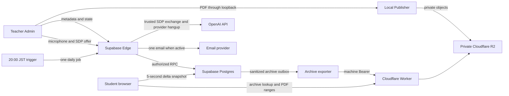

# Phase 6.6 integrated UX and operations design

Date: 2026-07-16 (JST)

Status: local implementation. Production rollout remains a separate gate.

## 1. Objective

Phase 6.6 turns the Phase 0-6.5 backend into one coherent teacher and student
experience without weakening the existing ownership, lifecycle, cost or
five-second synchronization contracts.

The design optimizes three goals together:

1. students should immediately understand what is happening and feel connected
   to the live class;
2. Supabase load must remain compatible with a 20-person Free-plan MVP and a
   weekly approximately 300-person Pro-plan lecture;
3. paid API work must remain explicit, bounded, independently stoppable and
   auditable.

## 2. Requirements

### 2.1 Teacher experience

- The lecture workspace is split into preparation, slides, participation and
  optional AI views. Only preparation is shown before a lecture exists;
  slides require a published visible PDF; participation and AI require an open
  lecture. These conditions come from the server-backed lecture/display state,
  not from an additional persisted UI flag.
- Preparation starts with a browser-local PDF choice, then title/create/start.
  The PDF is not uploaded until a teacher-owned lecture ID exists. A restored
  demo or non-owned lecture selection is ignored by Admin operations and never
  supplies the Admin heading, while the shared student/demo state itself is
  left intact.
- Switching views hides rather than unmounts active Presenter and AI controls,
  so an in-flight caption, summary, provider grant or Presenter session is not
  restarted by navigation.
- Show the two most recent lectures by default and reveal older lectures only
  on request.
- A closed lecture is never reopened in place. `もう一度開催する` confirms the
  action, creates a fresh lecture with a new ID and code, copies only the
  title, and starts it. The archived lecture, PDF and Polls remain unchanged.
- New lecture codes are cryptographically random six-digit strings. Existing
  legacy codes remain joinable during the compatibility period.
- Replace Publisher/R2/pairing terminology with one primary action:
  `学生に講義資料を公開する`.
- Run Publisher health and pairing checks inside that flow. Advanced
  diagnostics remain available only when needed.
- Show the actual currently published PDF and current page in the Admin screen.
- Present one automatic display layout; keep old display-mode values only for
  old-client compatibility.
- Show the current/open Poll and the five most recent Polls by default, with
  older history on demand.
- Rename teacher-facing “Billing PIN” copy to
  `API利用PIN（課金機能の開始用）`. Internal environment and database names
  remain unchanged.
- Realtime transcription has its own paid start action and is never started by
  material analysis, Poll generation or summary actions.
- Realtime start requires an explicit 10-minute, 30-minute or
  lecture-end duration. Client, Edge and database deadline checks converge on
  the earliest valid stop.
- The browser sends only a WebRTC SDP offer to the trusted Edge Function. The
  OpenAI API key and ephemeral provider credentials are never returned to the
  browser.
- Admin and classroom display snapshots use separate scoped credentials.
  Classroom credentials can read live data for at most 95 minutes; after that
  they can read only a minimal terminal lifecycle projection, never comments,
  PDF metadata or metrics.
- Comment hide/restore and pin/unpin actions are Admin-only, auditable and
  processed through a service-backed Edge Function. Browser roles receive no
  direct comment update grant.

### 2.2 Student experience

- Entering a live code joins Supabase; entering an exported closed-lecture code
  opens a Cloudflare-only read-only archive.
- Mobile semantic/DOM order is:
  PDF, active captions, latest five comments, comment composer, active Poll,
  useful five-minute recap, useful material summary, exit.
- Desktop uses CSS grid placement while retaining the mobile semantic order.
- Captions are absent from the DOM when no fresh caption is being delivered.
- The main screen shows only the latest five comments. Older comments use a
  separate cursor-paginated page with no continuous polling.
- Comment suggestion chips and the explicit “default anonymous” badge are
  removed.
- Nickname remains nullable and is written with the comment only. Attempts over
  ten characters show `10文字以内で入力してください`.
- Low-value or empty AI panels are not rendered.
- The lecture title subtitle is removed.
- `講義から退出する` stops polling and pending client work. Re-entering the
  code reuses the existing owned participant row.
- Lecture-ended copy uses `投票`, not implementation terminology.
- Join footer contains a quiet COMPASS copyright/developer credit.
- Classroom display uses the light theme and one automatic layout; active Poll
  content remains visible in fullscreen.
- Existing five-second snapshots provide connection state, page-change and new
  Poll feedback without adding requests or subscriptions.

### 2.3 Backend and operations

- Participant count is an approximate active-browser count. The existing
  five-second snapshot RPC refreshes the authenticated participant at most once
  per 45 seconds, expires inactive browsers after 90 seconds, and shares a
  15-second indexed count cache across the lecture.
- Visible comment count is cached in the same live row and returned as a small
  metric delta.
- Six-digit code lookup has server-side attempt limits and generic failure
  responses.
- Exactly one Poll may be open for a lecture. Lecture-row locking and a partial
  unique index protect concurrent Admin requests.
- Closed-lecture public data is sanitized into an outbox, exported by a
  machine-authenticated Edge Function and stored in private R2 under an HMAC
  code lookup key.
- Archive resolution requires allowed Origin, bounded JSON, two independent
  Worker rate limits, a per-IP failed-code Durable Object guard and server-side
  Turnstile validation. Successful users sharing a NAT are not penalized by
  another user's unknown-code attempts. Access tokens are short-lived and PDF
  access remains separately ticketed.
- Archive payloads contain no auth user ID, participant ID, Admin token,
  lecture code, code hash, Billing PIN, service-role key, raw PDF text, raw
  transcript or audio.
- A daily 20:00 JST machine-triggered Edge Function sends at most one operations
  digest for the day when a lecture or AI call occurred. It uses actual
  microusd where known and reserved microusd only for unfinished operations.
- Email delivery uses a stable per-day idempotency key and no AI call.
- Browser bundles contain no OpenAI key, Supabase service-role key, Worker
  ingest secret, Turnstile secret or email-provider key.

## 3. Architecture and responsibility boundaries

Supabase stores relational state, ownership, audit and small versioned
metadata. It does not store PDF bytes, audio, the full local transcript or
archive delivery traffic. Cloudflare stores and serves immutable PDF objects
and sanitized closed-lecture views. OpenAI receives only bounded text/audio
required by an explicitly started feature.

## 4. Participant count and synchronization

`lecture_participant_presence` stores only lecture ID, participant ID and the
server timestamp of the last accepted heartbeat. The authenticated v5 snapshot
may update only the caller's Phase 0-owned participant, only while the lecture
is open, and only when the prior timestamp is at least 45 seconds old. A
composite `(lecture_session_id, last_seen_at)` index supports the 90-second
active window.

This definition balances live presence and low load:

- no additional student request; the heartbeat is folded into the snapshot RPC;
- at most one indexed write per active browser every 45 seconds;
- no Realtime channel;
- one active-count refresh per lecture per 15-second cache window;
- temporary disconnects under 90 seconds do not make the class feel empty;
- the UI labels the live value as approximate.

The existing 90-minute request envelope remains:

| Scenario         | Five-second snapshots | Max presence writes | Shared count refreshes |
| ---------------- | --------------------: | ------------------: | ---------------------: |
| 20 participants  |                21,600 |               2,400 |                    360 |
| 300 participants |               324,000 |              36,000 |                    360 |

The initial comment row cap falls from 100 to 5 under the v5 protocol. Comment
history requests 50 rows only when a student explicitly opens history.

## 5. Lecture-code and Poll concurrency

New code generation uses a CSPRNG and retries uniqueness conflicts. The
database independently validates `^[0-9]{6}$` and calculates the stored hash;
the browser or Edge caller cannot supply a trusted hash.

`join_lecture_by_code_v2` uses authenticated identity, a rolling attempt
window, temporary lockout and a generic empty result for unknown, closed or
locked codes. The legacy RPC remains for old clients during expand-first
rollout.

Opening a Poll locks its lecture row, closes any previous open Poll, then opens
the requested Poll. The partial unique index is the final race backstop.

## 6. Closed-lecture archive

Closing a lecture requeues a versioned export. Claims use bounded
`FOR UPDATE SKIP LOCKED` batches and leases. Success is finalized only when the
Worker acknowledges the same source version and payload hash. A failed or lost
response is safe to retry.

The Worker:

- never stores the plain lecture code in an object key;
- validates the sanitized payload again;
- rejects private-field names recursively;
- validates Turnstile action `archive-lookup` and the configured hostname;
- issues a short-lived archive token;
- issues an even shorter existing PDF asset ticket;
- stops access at the canonical archive expiry;
- physically removes expired archive objects after a seven-day recovery buffer.

The archive is read-only. It does not recreate a Supabase participant or keep a
five-second live loop running. The MVP archive carries pinned-first/recent
visible comments up to 500 records; the UI states the cap when additional
comments exist. A later chunked R2 contract is required before promising
unbounded comment history.

The browser persists only the normalized lecture code for same-tab archive
recovery. The archive token and archive payload remain memory-only. Before a
PDF ticket is requested, an expired archive token is renewed through a fresh
Turnstile lookup; a single 401 is also renewed and retried once.

## 7. Daily operations digest

At 20:00 JST, a hosted scheduler invokes
`send-daily-operations-digest` with an independent 32-byte-or-longer trigger
secret. The function claims one date/recipient job, queries only the day’s
lecture starts and AI ledger rows, and either:

- records `skipped` without sending when there was no activity;
- records `sent` with the provider message ID;
- records `failed` and retries with bounded backoff.

The delivery idempotency key is
`compass-daily/<date>/<recipient-hash>`. `Reply-To` may be the owner’s address
even when the verified sending domain uses a service sender.

The database does not embed production URLs or scheduler secrets. Hosted
`pg_cron`/`pg_net` or an equivalent trusted scheduler is configured only at the
production rollout gate.

## 8. API cost policy

The existing `gpt-5.6-luna` choice remains appropriate for the bounded Phase 5
material analysis and Phase 6 structured educational summaries. It is the
cost-sensitive GPT-5.6 variant, and provider calls are already limited to one
Batch lane, strict token ceilings, evidence gates and information-poor skips.

Realtime transcription is the dominant controllable cost. The current official
`gpt-realtime-whisper` price snapshot is USD 0.017 per audio minute:

| Teacher selection           | Maximum provider reservation |
| --------------------------- | ---------------------------: |
| 10 minutes                  |                     USD 0.17 |
| 30 minutes                  |                     USD 0.51 |
| 90-minute lecture remainder |             at most USD 1.53 |

The actual reservation is the minimum of the teacher selection, remaining
lecture time, remaining audio allowance and remaining budget. Stop never
requires the API PIN. One provider call ID is stored per accepted caption
operation. Manual stop, selected-duration expiry, lecture close, hard stop and
heartbeat timeout all enqueue the same idempotent server-side hangup path.
Failed hangups use a lease and bounded exponential retry. A call prepared in
the database but never accepted by OpenAI is charged zero; an accepted call
that times out is charged only bounded server-observed elapsed time.

## 9. Failure behavior

| Failure                           | Required behavior                                                                                                              |
| --------------------------------- | ------------------------------------------------------------------------------------------------------------------------------ |
| Browser closes                    | DB deadline and server RPC guards remain authoritative                                                                         |
| Snapshot pauses                   | no writes are enabled by stale client state                                                                                    |
| Exit pressed                      | request epoch invalidates late responses and polling stops                                                                     |
| Stale caption remains in DB       | student/display hides it after the freshness window                                                                            |
| Worker archive lookup unavailable | the join preflight is capped at five seconds; live join continues and closed archive remains fail-closed                       |
| Anonymous Auth signup stalls      | the shared twelve-second deadline aborts the actual signup fetch; concurrent callers reuse it and a later retry starts cleanly |
| Exporter response lost            | lease/source-version/hash make retry idempotent                                                                                |
| Turnstile invalid or replayed     | Worker denies archive resolution                                                                                               |
| Repeated unknown archive codes    | per-IP failed-code guard blocks the attacker without counting successful shared-NAT lookups                                    |
| Email provider timeout            | job is failed and retried; idempotency prevents duplicate email                                                                |
| Realtime client timer fails       | Edge and DB reserved-duration checks stop work and enqueue provider hangup                                                     |
| Provider hangup fails             | leased outbox retries with exponential backoff; the browser remains stopped                                                    |
| Display credential expires        | only terminal lifecycle state may be returned; live payloads fail closed                                                       |
| Cron unavailable                  | deadline-aware read/write RPCs still reject expired live activity                                                              |

## 10. Migration and rollout

The migration is additive and expand-first:

1. keep all new frontend and server flags OFF;
2. apply both additive Phase 6.6 database migrations;
3. deploy machine Edge Functions with their flags OFF;
4. deploy Worker bindings and secrets;
5. configure archive-export and 20:00 JST scheduler calls;
6. deploy the frontend with Phase 6.6 OFF;
7. run Advisor, DB lint, two-user ownership, archive and duration-bound tests;
8. enable only for a controlled canary;
9. disable flags first on incident; preserve audit/outbox/ledger rows and repair
   forward.

No destructive down migration or emergency physical deletion is part of the
rollback.

## 11. Human and hosted gates

- real Publisher/R2 publication and archive lookup;
- real Turnstile hostname/action;
- real email sender-domain and 20:00 JST delivery;
- real microphone/WebRTC at 10 and 30 minutes;
- full 90-minute lecture;
- two students and two Admin sessions;
- keyboard, screen reader, contrast and reduced motion;
- 390 px phone, tablet, desktop and classroom fullscreen;
- measured 20-person canary followed by a modeled/measured 300-person review.

## 12. Current official references

- OpenAI GPT-Realtime-Whisper:
  https://developers.openai.com/api/docs/models/gpt-realtime-whisper
- OpenAI GPT-5.6 models:
  https://developers.openai.com/api/docs/models
- OpenAI Realtime WebRTC:
  https://developers.openai.com/api/docs/guides/realtime-webrtc
- OpenAI Realtime call hangup:
  https://developers.openai.com/api/reference/resources/realtime/subresources/calls/methods/hangup
- Cloudflare Turnstile server validation:
  https://developers.cloudflare.com/turnstile/get-started/server-side-validation/
- Cloudflare Workers rate limiting:
  https://developers.cloudflare.com/workers/runtime-apis/bindings/rate-limit/
- Cloudflare Durable Objects pricing:
  https://developers.cloudflare.com/durable-objects/platform/pricing/
- Supabase scheduled Edge Functions:
  https://supabase.com/docs/guides/functions/schedule-functions
- Resend email idempotency:
  https://resend.com/docs/dashboard/emails/idempotency-keys
