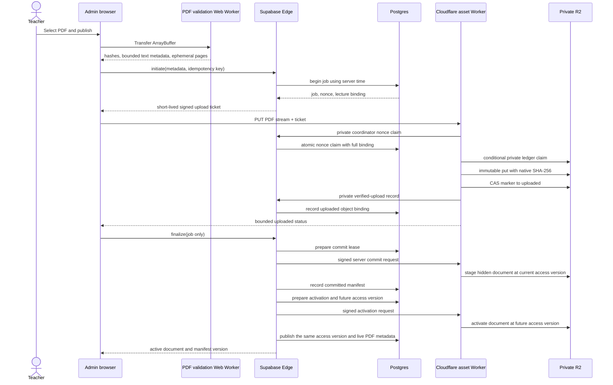

# Phase 7.26 browser-complete private PDF publication

Date: 2026-07-21
Status: implementation in progress
Flags: `VITE_PHASE7_26_BROWSER_PDF_PUBLISHING=false` and
`PHASE7_26_BROWSER_PDF_PUBLICATION_ENABLED=false`

## Responsibility split

## State model

| State | Canonical meaning | Student access |
| --- | --- | --- |
| `pending` | DB job/ticket exists; no verified R2 object is required. | Denied. |
| `uploaded` | Worker verified bytes and issued a receipt; object is absent from the committed manifest. | Denied. |
| `committed` | A hidden manifest entry exists at the current access version and DB recorded the commit. | Denied because the entry is hidden. |
| `active` | Worker exposed the entry only at a future access version and DB atomically published that same version with metadata/live state. | Allowed through existing short-lived lecture/document tickets. |
| `aborted` | Teacher/lifecycle aborted before activation. | Denied unless an older document remains independently active. |
| `expired` | Ticket/recovery deadline elapsed. | Denied; orphan cleanup is eligible. |
| `retired` | A formerly active publication was superseded. | Denied unless retained by an explicit archive policy. |

Transitions are forward-only. Repeating an already completed transition with
the exact actor, job, nonce digest, receipt and metadata returns the same
result. A mismatched replay fails.

## Failure and recovery behavior

- Before upload: the teacher may retry initiation with the same idempotency
  key; an expired job is replaced only through a new explicit attempt.
- During upload: an atomic DB nonce claim occurs before body ingestion. A
  private ledger lease and fenced attempt ID govern retry/recovery afterward.
- After object write: a marker written before upload makes a crash discoverable.
  Recovery either returns the stored upload receipt or cleans the orphan.
- During manifest CAS: the Worker reloads and retries a bounded number of
  times. Commit creates only a hidden entry at the current access version;
  activation requires the DB-reserved future access version.
- After Worker commit but before DB commit: finalize is replayable. The Worker
  returns the same commit receipt and DB advances once.
- Before active: lecture state is checked again. If activation cannot be
  recorded in DB, the Worker rollback removes the new entry and restores the
  previous access version/document instead of leaving it student-readable.
- Scheduled cleanup: expired markers are scanned in bounded pages. The object
  is deleted only after proving no committed manifest references its exact key.

## Database design

`lecture_pdf_publications` stores no PDF bytes or extracted text. It stores
the lecture/job/actor/idempotency binding, expected byte and hash metadata,
nonce/JTI digests, fenced operation leases, object/manifest versions and audit
timestamps. RLS is enabled with no browser policy. Tables have no
`anon/authenticated` grants. Service-role-only SECURITY INVOKER RPCs perform
each transition after the Edge function validates the Admin session.

Indexes cover the unique actor/idempotency key, nonce digest, lecture/status
lookup and due expiry lookup. The table is not added to Realtime.

## Worker design and CPU boundary

The Worker does not import PDF.js. It decodes small signed claims, checks exact
Origin/path/header binding, obtains the atomic DB nonce claim, reads only a
five-byte prefix while counting the stream, then passes the capped stream to
R2 with the expected native SHA-256. Job ledger and manifest changes use
conditional R2 writes. No operation walks PDF pages or extracts text
server-side.

## Browser extraction and AI compatibility

The browser validation Worker returns at most 20,000 normalized characters to
the Admin tab and transfers the PDF buffer rather than cloning it. An in-memory
cache can serve the existing Phase 5/6 AI context. After a reload, the Admin
client obtains a normal short-lived private download URL, re-validates the PDF
in a new Web Worker and compares all hashes before providing excerpts. Local
Publisher extraction remains the recovery fallback.

## Rollback

1. Disable both Phase 7.26 flags. Do not drop the additive schema.
2. The UI immediately returns to the existing Local Publisher path.
3. Disable only the new Worker upload/commit routes; existing manifest/read,
   archive and retention routes remain compatible.
4. Expire pending/uploaded jobs and run bounded orphan cleanup.
5. Keep active content-addressed documents and manifests; they remain readable
   by the existing Phase 3 delivery path.

No rollback step copies PDF bytes into Supabase or exposes R2 credentials.
