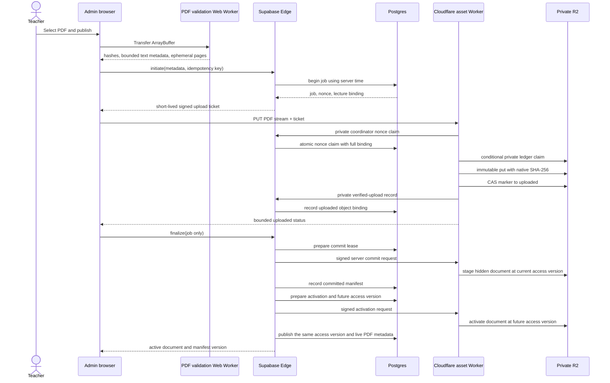

# Phase 7.26 browser-complete private PDF publication

Date: 2026-07-21
Status: automated local implementation and regression complete; Human, Hosted
and Production gates HOLD
Flags (all default OFF):

- frontend: `VITE_PHASE7_26_BROWSER_PDF_PUBLISHING=false`;
- Supabase Edge orchestration: `PHASE726_BROWSER_PDF_PUBLICATION_ENABLED=false`;
- Cloudflare upload/commit routes: `PHASE726_BROWSER_PDF_UPLOAD_ENABLED=false`.

## Responsibility split

## State model

| State | Canonical meaning | Student access |
| --- | --- | --- |
| `pending` | DB job/ticket exists; no verified R2 object is required. | Denied. |
| `uploaded` | Worker verified bytes and issued a receipt; object is absent from the committed manifest. | Denied. |
| `committed` | A hidden manifest entry exists at the current access version and DB recorded the commit. | Denied because the entry is hidden. |
| `active` | Worker exposed the entry only at a future access version and DB atomically published that same version with metadata/live state. | Allowed through existing short-lived lecture/document tickets. |
| `aborted` | Teacher/lifecycle aborted before activation. | Denied unless an older document remains independently active. |
| `expired` | Ticket/recovery deadline elapsed. | Denied; orphan cleanup is eligible. |
| `retired` | A formerly active publication was superseded. | Denied unless retained by an explicit archive policy. |

Transitions are forward-only. Repeating an already completed transition with
the exact actor, job, nonce digest, receipt and metadata returns the same
result. A mismatched replay fails.

## Failure and recovery behavior

- Before upload: the teacher may retry initiation with the same idempotency
  key; an expired job is replaced only through a new explicit attempt.
- During upload: an atomic DB nonce claim occurs before body ingestion. A
  private ledger lease and fenced attempt ID govern retry/recovery afterward.
- After object write: a marker written before upload makes a crash discoverable.
  Recovery either returns the stored upload receipt or cleans the orphan.
- During manifest CAS: a conflicting ETag fails closed and the caller retries
  from authoritative DB/ledger state. Commit creates only a hidden entry at
  the current access version; activation requires the DB-reserved future access
  version.
- After Worker commit but before DB commit: finalize is replayable. The Worker
  returns the same commit receipt and DB advances once.
- Before active: lecture state is checked again. An exact `active`/`retired`
  receipt is accepted. An authoritative `committed` result remains retryable
  and is never rolled back from an ambiguous finalizer. Only a DB-terminal
  `aborted`/`expired` publication may restore the previous manifest through the
  captured generation and exact manifest/ledger fences.
- Scheduled cleanup: expired markers are scanned in bounded pages. Cleanup
  first CAS-fences the job as `cleanup_pending` (including an absent-ledger
  sentinel). Ten minutes is only retry backoff; safety does not assume any
  issued request has ended. Every upload/commit/activate must re-read the exact
  ledger ETag immediately before each manifest CAS, so an indefinitely delayed
  request fails after the terminal fence. A later pass rechecks the full
  binding, CAS-removes only the exact non-visible/terminal manifest reference,
  and replaces mutable PDF bytes plus the operational ledger with permanent
  immutable sentinels. It does not physically delete those sentinel keys. Every
  due document, including a manifest-CAS conflict, consumes one cleanup budget
  unit, so work stays `O(limit)`. New v2 cleanup intent/audit keys injectively
  include the full object key; legacy v1 intents remain readable for recovery.

## Database design

`lecture_pdf_publications` stores no PDF bytes or extracted text. It stores
the lecture/job/actor/idempotency binding, expected byte and hash metadata,
nonce/JTI digests, fenced operation leases, object/manifest versions and audit
timestamps. RLS is enabled with no browser policy. Tables have no
`anon/authenticated` grants. Service-role-only SECURITY INVOKER RPCs perform
each transition after the Edge function validates the Admin session.

Indexes cover the unique actor/idempotency key, nonce digest, lecture/status
lookup and due expiry lookup. The table is not added to Realtime.

## Worker design and CPU boundary

The Worker does not import PDF.js. It decodes small signed claims, checks exact
Origin/path/header binding, obtains the atomic DB nonce claim, reads only a
five-byte prefix while counting the stream, then passes the capped stream to
R2 with the expected native SHA-256. Job ledger and manifest changes use
conditional R2 writes. No operation walks PDF pages or extracts text
server-side.

## Browser extraction and AI compatibility

The browser validation Worker returns at most 20,000 normalized characters to
the Admin tab and transfers the PDF buffer rather than cloning it. An in-memory
cache can serve the existing Phase 5/6 AI context. After a reload, the Admin
client obtains a normal short-lived private download URL, re-validates the PDF
in a new Web Worker and compares all hashes before providing excerpts. Local
Publisher extraction is available only after an ordered switch back to the
mutually exclusive Local recovery mode.

## Rollback

1. Disable the frontend flag first to prevent new browser publication. Do not
   start Local Publisher or restore its credential yet.
2. Keep Edge and Worker browser routes available while every in-flight browser
   job reaches `active`, `aborted`, `expired` or `retired`, then run all due
   cleanup to a terminal result.
3. Disable the Edge orchestration flag. This restores the Local registration
   API, but no Local writer is started yet.
4. Disable the Worker upload flag; existing manifest/read, archive and retention
   routes remain compatible.
5. Only after the browser inflight/cleanup audit is empty, reissue or re-enable
   the isolated Local R2 write credential and start Local Publisher.
6. Keep active content-addressed documents and manifests; they remain readable
   by the existing Phase 3 delivery path.

For browser activation, deploy every layer OFF, stop Local Publisher and revoke
or isolate its R2 write credential, then enable the Worker route, Edge
orchestration, and frontend flag in that order. While the Edge flag is ON it
rejects every Local `register` request with `409`, receipt or no receipt, and
the frontend renders no Local pairing/publication control. Never enable both
R2 writers; simultaneous fallback is unsupported and requires a future shared
DB reservation saga.

No rollback step copies PDF bytes into Supabase or exposes R2 credentials.

## Gate status

- Automated Local Gate: PASS in the dated local evidence record.
- Human local visual confirmation: HOLD until the operator records approval.
- Hosted/Production: HOLD until the real Edge -> Worker -> private R2 -> DB
  canary, 15 MiB resource measurement, two-Admin race, Local credential
  revocation, route protection, cleanup monitoring and ordered flag rollout are
  evidenced.

See `docs/PHASE7_26_LOCAL_GATE_2026-07-21.md` and
`docs/PHASE7_PRODUCTION_GATE_2026-07-21.md` for the current decision record.
