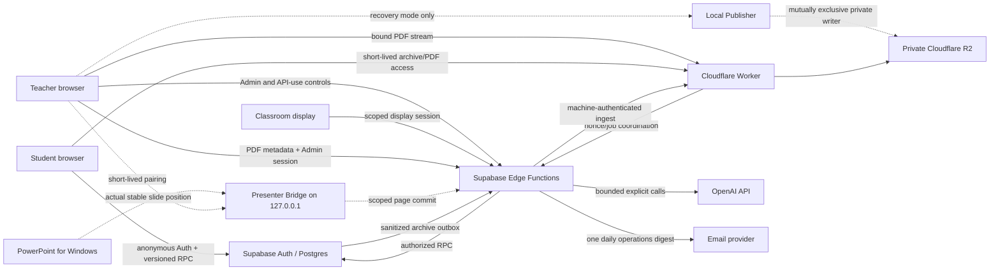

# COMPASS Interactive Architecture

Last reviewed: 2026-08-01
Applies to: repository implementation candidate through Phase 7.29; later
native, Human, Hosted and Production gates remain separately authoritative

## 1. Architectural goals

COMPASS Interactive combines a low-friction classroom experience with strict
ownership, bounded paid work and low recurring backend load.

The architecture is designed around these invariants:

1. the browser improves responsiveness but never decides authorization;
2. lecture expiry and paid-operation admission use server time;
3. students receive one compact versioned snapshot path rather than many
   subscriptions or periodic endpoints;
4. PDF bytes, audio and full local transcripts do not enter Supabase;
5. AI output is optional, quality-gated and teacher-controlled;
6. a closed lecture converges to read-only archive behavior and stops live work;
7. Demo behavior remains independent from all hosted services.

## 2. System map

## 3. Frontend and routes

The frontend is a Vite, React and TypeScript single-page application. Route
components are lazy-loaded and share `CompassStateProvider`.

| Route               | Responsibility                          | Important boundary                                             |
| ------------------- | --------------------------------------- | -------------------------------------------------------------- |
| `/join`             | Validate live or archived lecture entry | Six-digit code is an entry identifier, not an Admin credential |
| `/demo`             | Redirect to isolated Demo data          | No Supabase, OpenAI, Worker or Publisher network call          |
| `/lecture`          | Mobile-first student session            | Five-second snapshot while active; stop on exit/terminal state |
| `/lecture/comments` | Older comment history                   | Explicit cursor fetch; no periodic history polling             |
| `/lecture/archive`  | Closed lecture preview                  | Cloudflare read-only access; no live Supabase loop             |
| `/admin`            | Teacher operations                      | Admin session and separate paid-operation authorization        |
| `/display`          | Fullscreen classroom view               | Scoped display token, never an Admin token                     |

`scripts/create-route-entrypoints.mjs` copies the production `index.html` into
each route directory. Cloudflare Pages therefore does not need an unsafe or
ambiguous catch-all redirect.

## 4. Live lecture data flow

### 4.1 Participant identity

1. Supabase Anonymous Auth creates an authenticated user identity.
2. The join RPC validates the lecture code and creates or reuses the
   participant owned by `(select auth.uid())`.
3. All student writes derive ownership on the server. A participant UUID sent
   by a browser is never sufficient proof.
4. Cross-participant and cross-lecture access is denied by RLS and RPC checks.

### 4.2 Synchronization

- Phase 1 introduced versioned public and participant-specific snapshots.
- The foreground cadence is normally five seconds; background tabs slow down
  and failures use bounded backoff.
- Comments, likes, Poll results, PDF page, captions, summaries and small metrics
  converge through snapshot versions.
- No public application table is intended to be in the Supabase Realtime
  publication.
- Comment history is fetched only when requested.
- Phase 7.1 `mine` history resolves the current participant from `auth.uid()`
  inside the database; the client never supplies an owner participant ID.
- Presence heartbeat writes are folded into the authenticated snapshot and
  throttled independently from the five-second reads.

Optimistic UI is permitted for the caller's own comment, like and Poll action.
The server response or next snapshot remains authoritative.

## 5. Lecture lifecycle

`lecture_sessions` is the lifecycle root. Phase 2 added the canonical hard-stop
deadline, audit events, AI-control state and archive state.

- A lecture may be draft, open or closed; archive state is tracked separately.
- Start establishes a server-time deadline capped at 90 minutes.
- Manual close and automatic expiry call the same idempotent core transition.
- Read and write RPCs independently reject expired lectures, so a missing Cron
  run cannot preserve an invalid active state.
- Closing stops write admission, Poll answers and new AI operations.
- Clients that observe terminal state cancel polling, provider work and pending
  mutations, then converge to the ended/read-only UX.
- A closed lecture is not reopened in place. The teacher may create and start a
  new lecture that copies only safe metadata such as the title.

## 6. PDF publication and delivery

The PDF path intentionally avoids Supabase Storage and database byte traffic.

1. The teacher selects a PDF through the Admin flow. A dedicated browser Worker
   validates type, actual size, page and text limits without rendering or OCR.
2. Edge validates the tracked Admin session and lecture, then Postgres creates a
   server-time job/nonce and Edge signs a short-lived, fully bound upload ticket.
3. The browser streams bytes directly to the asset Worker; they never transit
   Supabase. The Worker independently validates ticket, exact Origin/path,
   actual bytes, `%PDF-` magic, native SHA-256, binding, expiry and nonce.
4. The Worker writes an immutable R2 object, stages a hidden manifest entry and
   exposes it only after DB and Worker agree on a future access version.
5. Supabase stores only job/document identifiers, audit/lifecycle state and
   synchronized page metadata. Uncommitted objects are never student-readable.
6. The Worker validates short-lived access and serves byte ranges directly from
   the private R2 bucket.

Local Publisher remains an offline compatibility/recovery path. It may hold the
bucket-scoped R2 writer and local extracted text only after browser publication
is disabled, all jobs/cleanup are terminal and the isolated credential is
deliberately restored. Browser extraction is ephemeral in memory. PDF addition
does not redeploy the main Pages application.

## 7. AI and captions

### 7.1 Admission

Paid work requires all of the following:

- an explicit teacher action;
- a valid API-use PIN grant, separate from the Admin PIN;
- an open, non-expired lecture;
- an enabled server-side feature flag;
- available per-lecture call and cost budget;
- an available Realtime or Batch concurrency lane;
- a unique idempotent operation identity.

Stop is intentionally easier than start and does not require the API-use PIN.

### 7.2 Realtime transcription

- The browser sends microphone media to the provider through the approved
  WebRTC flow; COMPASS does not persist audio.
- Realtime has its own explicit start CTA and selected duration.
- It is never started by PDF analysis, Poll generation or summary generation.
- The teacher sees local partial text; students receive bounded completed
  caption windows through the snapshot path.
- Client stop, selected duration, lecture close, hard stop and provider sweeper
  converge on the same idempotent hangup ledger.

### 7.3 Batch AI

- Phase 5 performs one bounded material analysis and proposes Poll drafts.
- Phase 6 combines the lecture recap and comment pulse for a five-minute window
  where possible, skips low-information windows and keeps immutable revisions.
- AI Poll proposals and summary revisions are not automatically published.
- Teacher correction creates a new revision rather than overwriting history.
- PDF text, comments and transcript input are bounded before a provider call.
- Phase 7.1 snapshots `auto / ja / en` when a summary window is inserted.
  Manual selection is authoritative; `auto` resolves from that window's
  teacher transcript, then current PDF text, with Japanese as the deterministic
  final fallback. Resolution is local and adds no model call.
- Phase 7.2 accepts only a teacher-selected academic question, verifies at most
  five PubMed records and corroborates DOI metadata through Crossref before one
  Luna structured-output call. A primary study must support every material
  point. Retrieved abstracts are transient; only bounded citation metadata,
  claim-source mapping and immutable hidden revisions are stored. Students and
  archives receive at most three teacher-approved projections through the
  existing snapshot/export paths.
- Phase 7.25 adds automatic five-minute candidates and a multidisciplinary
  Crossref/OpenAlex path for non-medical fields. Every visible material claim
  still requires a verified primary source; low-value/unsupported candidates
  are suppressed. Before review, output carries an explicit teacher-unconfirmed
  label and remains approve/hide/correct capable.

### 7.4 Lecture join QR

Admin and Display generate an SVG from the same-origin canonical
`/join?code=######` URL. The QR contains no token, lecture UUID, Admin state or
secret, calls no external QR service and is not stored in Supabase or R2. It is
rendered only for the currently selected open Admin lecture and an open Display.

The application model router and the Codex model used to develop the repository
are separate concerns. Runtime application calls remain governed by the AI
budget and model policy in `PROJECT_GUIDE.md` and `docs/ROADMAP.md`.

## 8. Closed-lecture archive

Phase 6.6 exports a sanitized, bounded view rather than keeping student clients
attached to live Supabase state.

- Supabase prepares an idempotent archive export outbox record.
- A machine-authenticated Edge Function claims bounded batches.
- The Worker revalidates the payload and stores private R2 archive objects.
- Archive lookup uses Origin controls, Turnstile, rate limits and short-lived
  access.
- PDF access remains separately ticketed.
- The archive contains no auth UID, participant ID, Admin token, PIN, lecture
  code, code hash, raw PDF text, raw transcript or audio.
- At expiry, access fails closed before eventual physical deletion.

Phase 6.8 can issue a seven-day, lecture-scoped resume token after an owned live
join. The browser exchanges it in a request body, never a URL, and the Worker
resolves a private public-ID index before issuing the existing short-lived
archive/PDF credentials. Code plus Turnstile remains the compatibility fallback.
The capability is default-OFF until the database, Edge and Worker deployment
sequence and hosted CSP gate pass.

## 9. Daily operations digest

At most once per active day, a trusted scheduler may call the digest Edge
Function. It reports bounded lecture and AI usage metadata, uses an idempotency
key and makes no AI call. No email-provider credential or scheduler secret is
available to the browser or database client.

## 10. Trust zones and secret placement

| Zone                        | May contain                                                               | Must not contain                                            |
| --------------------------- | ------------------------------------------------------------------------- | ----------------------------------------------------------- |
| Browser                     | Supabase URL/publishable key, Turnstile site key, public Worker URL       | service role, OpenAI key, PINs, R2 secret, Turnstile secret |
| Supabase Edge secrets       | OpenAI key, Admin/API-use PIN material, service role, trigger secrets     | values returned to browser or committed to Git              |
| Local Publisher environment | recovery-only bucket-scoped R2 credential and signing material            | values in frontend variables or simultaneous browser mode   |
| Cloudflare Worker secrets   | archive/publication verification keys, JWK/coordinator material, bindings | plaintext lecture codes or Supabase service role            |
| PostgreSQL                  | ownership, lifecycle, audit, bounded metadata                             | PDF/audio bytes, raw local transcript, plaintext secrets    |

See `docs/SECURITY.md` for the enforceable security contract and remaining
hosted/human Phase 6.8 evidence.

## 11. Migration and compatibility policy

- Migrations are append-only and expand-first.
- New capabilities deploy with frontend and server flags OFF.
- Legacy RPCs remain until the minimum supported client no longer calls them.
- A rollback normally disables flags and restores the previous frontend/Edge
  version; it does not drop newly added columns or destroy audit records.
- Every database phase must pass a clean reset and an upgrade fixture.
- All public tables require RLS and explicit grants; `authenticated` alone is
  not an ownership rule.

## 12. Current structural debt

Phase 6.9 split the largest Admin, state and Supabase repository responsibilities
behind stable interfaces and characterization tests. Remaining debt is managed
through bundle budgets, generated DB types and characterization/E2E gates; a
future split must not redesign the UI, add requests or weaken lifecycle/RLS
behavior.

## 13. Authoritative sources

1. `supabase/migrations/` and `supabase/config.toml` for database and Edge
   runtime state.
2. `src/App.tsx`, repositories and feature flags for frontend behavior.
3. `cloudflare/asset-worker/` and `publisher/` for PDF/archive delivery.
4. `docs/ROADMAP.md` for future work and gates.
5. Phase gate reports for historical test evidence.

If an older document conflicts with those sources, treat it as historical and
open a documentation correction before implementing a new phase.

## 14. Phase 7.28 operational boundaries

Phase 7.28A retires only the one-off Journal Club creation surface. Its
frontend and Edge creation flags default OFF; historical lectures, Polls and
archives remain readable through the established paths.

Phase 7.28B adds one private, claimed Display Realtime identity per lecture.
Committed PDF page changes and bounded caption deltas accelerate through a
private topic; the durable five-second snapshot remains authoritative and is
the fallback. A claim binds the first anonymous-auth UID to a hashed token JTI.
Students receive no binding, Realtime subscription or new periodic request.
The caption relay accepts at most 12 KiB and 4,000 characters per request and
never carries audio. The DB runtime gate is the first rollback switch. Its
`feature_disabled` transition permits only the same claimed UID to continue on
the signed snapshot/PDF fallback, and a service-role-only DB RPC revalidates the
gate, binding lifetime, lecture lifecycle/hard stop and issuing Admin session
on every fallback request. Later Admin revoke, lecture close/hard stop or link
replacement permanently rewrites that binding's terminal reason. Every other
registered-token failure remains closed even when the Edge flag is OFF.

Phase 7.28C adds a lecture/Admin-session/actor-bound AI master authorization
with two scopes: eligible AI excluding captions, or including captions. It
stores no PIN and performs no provider call. Every explicit feature start still
requires a new short-lived single-use child grant and the existing budget,
lane, lifecycle and idempotency admission. Status and free revoke remain
available while paid admission is disabled.

## 15. Phase 7.29 Presenter Bridge boundary

Phase 7.29 adds an optional Windows-native operating boundary without changing
the student or Display transport contracts. PowerPoint COM events only request
a reconciliation; the canonical source is a stable observation of the actual
`View.Slide.SlideID` and absolute slide index. A 200 ms local monitor covers
missing, early, duplicate, back and jump events. Same-page observations do not
advance the existing live-state version.

The initial mapping is intentionally narrow: a normal all-slide, windowed show,
no hidden slides, Custom Show or Presenter View, equal PPTX/PDF counts, and an
explicit teacher confirmation after seeing both document identities and the
PDF first page. Ordered Slide IDs and the PPTX digest are frozen for the active
connection; a structural or save mutation revokes synchronization rather than
guessing a mapping.

The per-user Bridge binds only `127.0.0.1:43124`; Local Publisher remains on
`43123`. Exact Host/Origin and bounded-request checks protect loopback. The
browser sends no Admin token, PIN or service credential to the Bridge. Pairing
and active capabilities are short-lived, single-purpose and bound to Origin,
lecture, deck and installation. PowerPoint/PPTX/PDF bytes never enter Supabase.

Database and Edge admission use independent default-OFF gates. At most one
unrevoked Presenter binding may fence a lecture's manual page writes. Explicit
handover, runtime disable, expiry, lecture close, Admin revoke, disconnect or
document mutation terminalizes it and returns the teacher to the established
manual control. The final commit still flows through the existing live-state
mutation, so Phase 7.28 Display acceleration remains unchanged and students
continue the five-second snapshot with no Presenter request, table or Realtime
subscription.
