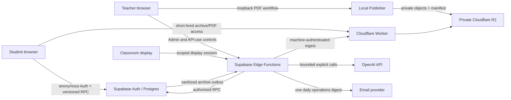

# COMPASS Interactive Architecture

Last reviewed: 2026-07-18
Applies to: repository implementation through Phase 6.6 and the Phase 6.7
documentation baseline

## 1. Architectural goals

COMPASS Interactive combines a low-friction classroom experience with strict
ownership, bounded paid work and low recurring backend load.

The architecture is designed around these invariants:

1. the browser improves responsiveness but never decides authorization;
2. lecture expiry and paid-operation admission use server time;
3. students receive one compact versioned snapshot path rather than many
   subscriptions or periodic endpoints;
4. PDF bytes, audio and full local transcripts do not enter Supabase;
5. AI output is optional, quality-gated and teacher-controlled;
6. a closed lecture converges to read-only archive behavior and stops live work;
7. Demo behavior remains independent from all hosted services.

## 2. System map

## 3. Frontend and routes

The frontend is a Vite, React and TypeScript single-page application. Route
components are lazy-loaded and share `CompassStateProvider`.

| Route               | Responsibility                          | Important boundary                                             |
| ------------------- | --------------------------------------- | -------------------------------------------------------------- |
| `/join`             | Validate live or archived lecture entry | Six-digit code is an entry identifier, not an Admin credential |
| `/demo`             | Redirect to isolated Demo data          | No Supabase, OpenAI, Worker or Publisher network call          |
| `/lecture`          | Mobile-first student session            | Five-second snapshot while active; stop on exit/terminal state |
| `/lecture/comments` | Older comment history                   | Explicit cursor fetch; no periodic history polling             |
| `/lecture/archive`  | Closed lecture preview                  | Cloudflare read-only access; no live Supabase loop             |
| `/admin`            | Teacher operations                      | Admin session and separate paid-operation authorization        |
| `/display`          | Fullscreen classroom view               | Scoped display token, never an Admin token                     |

`scripts/create-route-entrypoints.mjs` copies the production `index.html` into
each route directory. Cloudflare Pages therefore does not need an unsafe or
ambiguous catch-all redirect.

## 4. Live lecture data flow

### 4.1 Participant identity

1. Supabase Anonymous Auth creates an authenticated user identity.
2. The join RPC validates the lecture code and creates or reuses the
   participant owned by `(select auth.uid())`.
3. All student writes derive ownership on the server. A participant UUID sent
   by a browser is never sufficient proof.
4. Cross-participant and cross-lecture access is denied by RLS and RPC checks.

### 4.2 Synchronization

- Phase 1 introduced versioned public and participant-specific snapshots.
- The foreground cadence is normally five seconds; background tabs slow down
  and failures use bounded backoff.
- Comments, likes, Poll results, PDF page, captions, summaries and small metrics
  converge through snapshot versions.
- No public application table is intended to be in the Supabase Realtime
  publication.
- Comment history is fetched only when requested.
- Presence heartbeat writes are folded into the authenticated snapshot and
  throttled independently from the five-second reads.

Optimistic UI is permitted for the caller's own comment, like and Poll action.
The server response or next snapshot remains authoritative.

## 5. Lecture lifecycle

`lecture_sessions` is the lifecycle root. Phase 2 added the canonical hard-stop
deadline, audit events, AI-control state and archive state.

- A lecture may be draft, open or closed; archive state is tracked separately.
- Start establishes a server-time deadline capped at 90 minutes.
- Manual close and automatic expiry call the same idempotent core transition.
- Read and write RPCs independently reject expired lectures, so a missing Cron
  run cannot preserve an invalid active state.
- Closing stops write admission, Poll answers and new AI operations.
- Clients that observe terminal state cancel polling, provider work and pending
  mutations, then converge to the ended/read-only UX.
- A closed lecture is not reopened in place. The teacher may create and start a
  new lecture that copies only safe metadata such as the title.

## 6. PDF publication and delivery

The PDF path intentionally avoids Supabase Storage and database byte traffic.

1. The teacher selects a PDF through the Admin flow.
2. The loopback Publisher validates type, size, page and text limits.
3. Text extraction is local and image OCR is not performed.
4. The Publisher writes an immutable PDF object and a versioned manifest to a
   private R2 bucket.
5. Supabase stores only lecture/document identifiers, state and synchronized
   page metadata.
6. The Worker validates short-lived access and serves byte ranges directly from
   R2.

Publisher R2 credentials, extracted text and local transcript files remain on
the teacher machine. PDF addition does not redeploy the main Pages application.

## 7. AI and captions

### 7.1 Admission

Paid work requires all of the following:

- an explicit teacher action;
- a valid API-use PIN grant, separate from the Admin PIN;
- an open, non-expired lecture;
- an enabled server-side feature flag;
- available per-lecture call and cost budget;
- an available Realtime or Batch concurrency lane;
- a unique idempotent operation identity.

Stop is intentionally easier than start and does not require the API-use PIN.

### 7.2 Realtime transcription

- The browser sends microphone media to the provider through the approved
  WebRTC flow; COMPASS does not persist audio.
- Realtime has its own explicit start CTA and selected duration.
- It is never started by PDF analysis, Poll generation or summary generation.
- The teacher sees local partial text; students receive bounded completed
  caption windows through the snapshot path.
- Client stop, selected duration, lecture close, hard stop and provider sweeper
  converge on the same idempotent hangup ledger.

### 7.3 Batch AI

- Phase 5 performs one bounded material analysis and proposes Poll drafts.
- Phase 6 combines the lecture recap and comment pulse for a five-minute window
  where possible, skips low-information windows and keeps immutable revisions.
- AI Poll proposals and summary revisions are not automatically published.
- Teacher correction creates a new revision rather than overwriting history.
- PDF text, comments and transcript input are bounded before a provider call.

The application model router and the Codex model used to develop the repository
are separate concerns. Runtime application calls remain governed by the AI
budget and model policy in `PROJECT_GUIDE.md` and `docs/ROADMAP.md`.

## 8. Closed-lecture archive

Phase 6.6 exports a sanitized, bounded view rather than keeping student clients
attached to live Supabase state.

- Supabase prepares an idempotent archive export outbox record.
- A machine-authenticated Edge Function claims bounded batches.
- The Worker revalidates the payload and stores private R2 archive objects.
- Archive lookup uses Origin controls, Turnstile, rate limits and short-lived
  access.
- PDF access remains separately ticketed.
- The archive contains no auth UID, participant ID, Admin token, PIN, lecture
  code, code hash, raw PDF text, raw transcript or audio.
- At expiry, access fails closed before eventual physical deletion.

Phase 6.8 will add a higher-entropy short-lived resume token. Until that phase
passes, the current archive-session behavior remains the implemented contract.

## 9. Daily operations digest

At most once per active day, a trusted scheduler may call the digest Edge
Function. It reports bounded lecture and AI usage metadata, uses an idempotency
key and makes no AI call. No email-provider credential or scheduler secret is
available to the browser or database client.

## 10. Trust zones and secret placement

| Zone                        | May contain                                                           | Must not contain                                            |
| --------------------------- | --------------------------------------------------------------------- | ----------------------------------------------------------- |
| Browser                     | Supabase URL/publishable key, Turnstile site key, public Worker URL   | service role, OpenAI key, PINs, R2 secret, Turnstile secret |
| Supabase Edge secrets       | OpenAI key, Admin/API-use PIN material, service role, trigger secrets | values returned to browser or committed to Git              |
| Local Publisher environment | bucket-scoped R2 credential, Publisher signing material               | values in frontend variables or R2 objects                  |
| Cloudflare Worker secrets   | archive ingest/verification secrets and bindings                      | plaintext lecture codes or Supabase service role            |
| PostgreSQL                  | ownership, lifecycle, audit, bounded metadata                         | PDF/audio bytes, raw local transcript, plaintext secrets    |

See `docs/SECURITY.md` for the enforceable security contract and Phase 6.8 gaps.

## 11. Migration and compatibility policy

- Migrations are append-only and expand-first.
- New capabilities deploy with frontend and server flags OFF.
- Legacy RPCs remain until the minimum supported client no longer calls them.
- A rollback normally disables flags and restores the previous frontend/Edge
  version; it does not drop newly added columns or destroy audit records.
- Every database phase must pass a clean reset and an upgrade fixture.
- All public tables require RLS and explicit grants; `authenticated` alone is
  not an ownership rule.

## 12. Current structural debt

The code works, but `AdminPage`, `CompassStateContext` and the larger Supabase
repositories hold too many responsibilities. Phase 6.9 will split them behind
stable interfaces and characterization tests. The split must not redesign the
UI, add requests or weaken lifecycle/RLS behavior.

## 13. Authoritative sources

1. `supabase/migrations/` and `supabase/config.toml` for database and Edge
   runtime state.
2. `src/App.tsx`, repositories and feature flags for frontend behavior.
3. `cloudflare/asset-worker/` and `publisher/` for PDF/archive delivery.
4. `docs/ROADMAP.md` for future work and gates.
5. Phase gate reports for historical test evidence.

If an older document conflicts with those sources, treat it as historical and
open a documentation correction before implementing a new phase.
